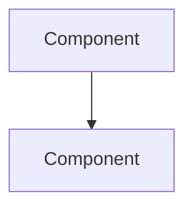

# Technical Documentation Workflow

Generate, update, and maintain professional-grade technical documentation through systematic source analysis and structured content generation.

## When to Use

- **New Feature**: Creating documentation for new systems or APIs
- **Code Drift**: Documentation is outdated compared to source
- **Missing Docs**: No documentation exists for public interfaces
- **Handoff**: Preparing documentation for team transition
- **Incident Response**: Creating runbooks from post-mortems
- **Compliance**: Documentation required for audit or security review

## Prerequisites

- Source code is accessible and readable
- Docstrings or type hints exist (or can be inferred)
- Target documentation location is determined
- Output format is known (Markdown default)

## Steps

### 1. Scope Definition (2-3 min)

**Concrete Actions:**
- Read the first 100 lines of each source file to understand structure
- Check `existing_docs` for current state (if UPDATE mode)
- Determine which public APIs need documentation

**Success Criteria:**
- Source files are accessible
- At least 3 public interfaces identified
- Documentation location confirmed

**Anti-Pattern:** Don't start writing without checking existing docs first

### 2. Source Analysis (5-10 min)

**Concrete Actions:**
- Extract all function/class signatures with types
- Parse docstrings into structured sections (Args, Returns, Raises)
- Identify all HTTP endpoints with methods and paths
- Map imports/dependencies between modules

**Success Criteria:**
- 100% of public functions identified
- All parameters have types documented
- All exceptions/errors catalogued

**Tool Integration:**
```
semantic_search(subject) → find related entities
graph_traverse(start_node=subject, depth=2) → map dependencies
```

### 3. Gap Detection (3-5 min)

**Concrete Actions:**
- Compare extracted signatures against `existing_docs`
- List undocumented public APIs
- Flag outdated parameter names or types
- Identify missing error cases

**Success Criteria:**
- Gap list includes line numbers from source
- Each gap has severity: P0 (critical), P1 (should have), P2 (nice to have)
- No false positives

### 4. Structure Generation (2-3 min)

**Concrete Actions:**
- Apply `doc_type` template (see Output Standards below)
- Order sections by audience priority:
  - DEVELOPER: Quick start → API reference → Examples
  - ARCHITECT: Overview → Diagram → Component deep-dives
  - DEVOPS: Prerequisites → Deployment → Troubleshooting
- Generate table of contents with anchor links

**Success Criteria:**
- All template sections present
- TOC links work in preview
- Section ordering matches audience needs

### 5. Content Writing (15-30 min)

**Concrete Actions:**
- Write H1 title and 2-sentence overview
- Document each function/endpoint with:
  - Signature (with types)
  - 1-sentence purpose
  - Parameter table (name, type, required, description)
  - Return type and description
  - Error responses with HTTP codes
- Add working code examples that compile
- Create mermaid diagrams for architectures

**Success Criteria:**
- Every public API has complete documentation
- Code examples execute without errors
- All parameters documented
- All error cases covered

**Anti-Patterns:**
- Don't copy docstrings verbatim—summarize and enhance
- Don't skip error handling documentation
- Don't use outdated or hypothetical examples

### 6. Validation (5-10 min)

**Concrete Actions:**
- Copy each code example to test file and run it
- Click every internal link to verify anchor exists
- Cross-check all API paths against router/controller files
- Verify all environment variables exist in config

**Success Criteria:**
- 100% of code examples execute successfully
- 0 broken internal links
- All API paths match source exactly
- Validation score ≥ 0.8

**Tool Integration:**
```
self_correct(validation_issues) → auto-fix common errors
```

### 7. Delivery (2-3 min)

**Concrete Actions:**
- Write file to `docs/` or appropriate subdirectory
- Update `README.md` or `docs/index.md` with link
- Set file permissions to readable
- Add entry to CHANGELOG if applicable

**Success Criteria:**
- File saved at correct path
- Link from index works
- Git shows clean diff (no unintended changes)

## Output Format Standards

### API Reference
```markdown
# {Subject} API

## Endpoints

### {METHOD} {path}
{1-sentence description}

**Parameters:**
| Name | Type | Required | Description |
|------|------|----------|-------------|

**Request Body:**
```json
{schema}
```

**Response:** `{status_code}`
```json
{example}
```

**Errors:**
| Code | Condition |
|------|-----------|
```

### Architecture Documentation
```markdown
# {Subject} Architecture

## Overview
{2-paragraph system description}

## System Diagram


## Components
| Component | Purpose | Tech Stack |
|-----------|---------|------------|

## Data Flow
{Numbered sequence with diagram}

## Integration Points
{External systems table}
```

### Deployment Guide
```markdown
# Deploy {Subject}

## Prerequisites
- [ ] {Checklist item}

## Environment Setup
```bash
{Copy-paste commands}
```

## Configuration
| Variable | Required | Default | Description |
|----------|----------|---------|-------------|

## Verification
```bash
{Health check command}
```

## Troubleshooting
| Symptom | Cause | Fix |
|---------|-------|-----|
```

### Runbook
```markdown
# {Alert Name} Runbook

## Symptoms
{What triggers this runbook}

## Impact
{Severity and blast radius}

## Immediate Actions
1. {Step with command}
2. {Step with command}

## Escalation
{When and how to escalate}

## Post-Incident
{Follow-up tasks}
```

## Integration with Value Fabric

This workflow leverages:
- **semantic_search** → Find related entities and capabilities
- **graph_traverse** → Map component dependencies
- **multi_hop_reason** → Explain complex architectural decisions
- **self_correct** → Auto-fix validation issues

## Success Metrics

- **Accuracy**: ≥ 95% of documented APIs match source
- **Completeness**: 100% of public APIs documented
- **Freshness**: Last updated date within 30 days of code change
- **Usability**: Code examples execute without modification

## Exit Criteria

Documentation is complete when:
- [ ] All public interfaces documented
- [ ] All code examples tested and working
- [ ] No broken links
- [ ] Appropriate for target audience
- [ ] Validation score ≥ 0.8
- [ ] Saved in correct location
- [ ] Indexed from main docs

## Common Failures & Recovery

| Failure | Cause | Fix |
|---------|-------|-----|
| No specs found | Source has no docstrings | Infer from types, or flag for manual docs |
| Validation fails | Code changed after doc written | Re-run in UPDATE mode |
| Broken examples | Outdated syntax | Refresh from current source |
| Wrong audience level | Too technical/simple | Adjust examples and terminology |

## Example Commands

```
/technical_documentation doc_type=API_REFERENCE subject="Layer 5 Ground Truth" source_files=["services/layer5-ground-truth/src/api/router.py"] target_audience=DEVELOPER

/technical_documentation doc_type=DEPLOYMENT subject="Layer 2 Extraction" source_files=["services/layer2-extraction/docker-compose.yml", "services/layer2-extraction/.env.example"] existing_docs="docs/deployment/layer2.md" update_mode=UPDATE

/technical_documentation doc_type=RUNBOOK subject="Neo4j Connection Failures" source_files=["services/layer3-knowledge/src/db/connection.py", "alerts/database-connection-error.yml"] target_audience=DEVOPS
```
