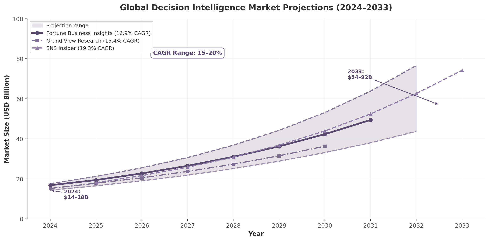

# 1. Introduction: The Decision Analysis Revolution

Every day, enterprise leaders face choices that resist simple answers. A pharmaceutical executive must select which drug candidates to advance, weighing clinical efficacy, regulatory risk, manufacturing cost, time-to-market, and portfolio balance simultaneously. A municipal government must choose between transit infrastructure investments, trading off ridership projections, environmental impact, land use, equity across neighborhoods, and long-term maintenance liability. A technology product committee must prioritize features for the next release, reconciling customer demand signals, engineering capacity, competitive positioning, technical debt, and revenue potential. These decisions share a defining characteristic: they are multi-criteria, multi-stakeholder, and high-consequence. They are precisely the class of problems that Value Tree Analysis (VTA) was designed to address—and they are increasingly the decisions that modern enterprise software has failed to serve well.

This whitepaper presents a comprehensive translation of VTA from its academic, analyst-driven origins into a modern, cloud-native, AI-assisted SaaS workflow. The foundational text for this translation is a 2002 academic document on Value Tree Analysis published by the Helsinki University of Technology—a 71-page treatise that codifies the methodological state of the art at the turn of the millennium[^1^]. That document, like the broader decision analysis tradition from which it emerges, offers a rigorous, validated framework for structuring complex decisions. It also reveals, in retrospect, why VTA never achieved enterprise-scale adoption: it was designed as a consultant-led, manually executed, desktop-bound process requiring trained analysts to guide every step. The infrastructure simply did not exist to make structured multi-criteria decision analysis accessible to the teams who needed it most.

The situation has changed fundamentally. Cloud computing, real-time collaboration, interactive visualization, and—most significantly—generative AI have created the conditions for a paradigm shift. Where the 2002 VTA document assumed a trained decision analyst as the "operating system" prompting, validating, and structuring each phase, AI agents can now fulfill that role, making VTA accessible to any team with a SaaS subscription[^2^]. The result is not a marginal improvement in usability but a categorical transformation in who can apply rigorous decision methodology and when.

## 1.1 The Legacy of Value Tree Analysis

### 1.1.1 Origins in von Neumann–Morgenstern Utility Theory and Keeney–Raiffa Decision Analysis

The intellectual lineage of Value Tree Analysis traces to the foundational work in expected utility theory. In 1944, John von Neumann and Oskar Morgenstern published *Theory of Games and Economic Behavior*, which established that rational choice under uncertainty could be represented as the maximization of expected utility—a cardinal function unique up to positive affine transformations[^298^]. Their axiomatic framework (completeness, transitivity, continuity, and independence) provided the mathematical foundation for all subsequent prescriptive decision theory.

The transition from theory to operational methodology occurred in 1976, when Ralph Keeney and Howard Raiffa published *Decisions with Multiple Objectives: Preferences and Value Tradeoffs*[^300^][^303^]. Keeney and Raiffa synthesized decades of research into a practical framework for decomposing complex decisions into hierarchical objective structures, eliciting preference functions over individual attributes, and recombining those functions through additive or multiplicative value models to produce actionable rankings. Their work introduced the concept of mutual preferential independence—the condition under which an additive value function validly represents overall preferences—and provided the theoretical justification for the value tree structure that gives VTA its name.

The influence of this tradition on the 2002 VTA document is direct and explicit. The document's treatment of value functions, preference independence, strategic equivalence, and decomposition all derive from the Keeney–Raiffa framework[^1^]. Its distinction between ordinal and measurable value functions, its specification of the additive model under mutual preferential independence, and its discussion of the multiplicative and multilinear alternatives when independence conditions fail—all reflect the theoretical edifice constructed between 1944 and 1992, the year Keeney published *Value-Focused Thinking*.

### 1.1.2 The 2002 VTA Framework: Problem Structuring, Preference Elicitation, Sensitivity Analysis, and Group Decision-Making

The 2002 VTA document organizes the decision analysis process into nine chapters that collectively describe a complete methodology. Chapter 1 introduces the decision analysis process with its characteristic phases: problem structuring, preference elicitation, sensitivity analysis, and communication. Chapter 2 establishes the theoretical foundations—concepts and notation, axiomatic foundations, strategic equivalence, mathematical representation, decomposition, and preference independence. Chapter 3 addresses problem structuring in detail: defining the decision context, identifying and generating objectives, generating alternatives, hierarchical modeling, attribute specification, and checking the value tree against completeness, operationality, decomposability, nonredundancy, and minimum size criteria. Chapter 4 covers preference elicitation comprehensively—value function elicitation through direct rating, category estimation, ratio estimation, difference standard sequences, and bisection; weight elicitation through SMART, rank-based methods, and SWING; and the treatment of imprecise preferences through PRIME. Chapter 5 addresses sensitivity analysis, including dominance and one-way sensitivity analysis. Chapter 6 examines behavioral issues: splitting bias, range effects, hierarchy effects, and reference point effects. Chapter 7 discusses communicating results. Chapter 8 treats group decision-making. Chapter 9 surveys then-available software tools[^1^].

This structure is notable for its completeness. The document does not merely describe mathematical techniques; it provides procedural guidance for facilitators, discusses the cognitive biases that threaten validity, addresses the political dynamics of group contexts, and even includes a detailed job selection case study with four alternatives evaluated across multiple criteria. It represents, in effect, a comprehensive product specification for structured decision support—written two decades before the enabling infrastructure would exist to implement it as software.

### 1.1.3 Limitations of the Manual, Analyst-Driven Model

The 2002 VTA document also makes clear why the methodology remained confined to a small community of practitioners. Every step assumes a trained decision analyst as the central orchestrator. Problem structuring requires a facilitator who "often has an important role as a facilitator in guiding and stimulating the process"[^1^]. Preference elicitation demands an iterative dialogue between analyst and decision-maker to check consistency and refine judgments. Sensitivity analysis is presented as a separate, technically demanding step. Group decision-making requires managing "the affective, political, and process dynamics in the group" through skilled facilitation. The software tools referenced—Web-HIPRE, PRIME Decisions—are desktop applications with no collaboration capabilities, no enterprise integration, and no modern user experience.

The practical barriers were substantial: cost (engaging a trained decision analyst for weeks), accessibility (desktop software requiring installation and expertise), time (decision cycles measured in weeks to months), and expertise dependency (teams unable to apply the methodology without external support). These barriers limited VTA to organizations with sufficient scale and sophistication to afford dedicated decision analysis capability—primarily government agencies, large consultancies, and research institutions. The vast majority of multi-criteria business decisions were made through intuition, simple spreadsheets, or unstructured debate.

## 1.2 The Rise of Decision Intelligence

### 1.2.1 Market Valuation and Growth Trajectory

The landscape has shifted dramatically. Gartner's 2024 Market Guide for Decision Intelligence Platforms formalized Decision Intelligence (DI) as a distinct software category, defining Decision Intelligence Platforms (DIPs) as software combining "explicit decision modeling, AI, analytics and related capabilities to support, augment or automate decision making"[^54^][^46^]. This recognition catalyzed significant market attention and investment.

Multiple independent market research firms project the global Decision Intelligence market at $14–18 billion in 2024, growing to $54–92 billion by 2033 at compound annual growth rates (CAGR) ranging from 15% to 20%[^7^][^8^][^1^][^3^][^4^]. IMARC Group values the 2024 market at $14.3 billion with a projected 15.12% CAGR to $54.2 billion by 2033[^7^]. Fortune Business Insights estimates $16.79 billion in 2024, growing at 16.9% CAGR to $57.75 billion by 2032[^3^]. Grand View Research projects $15.22 billion in 2024 reaching $36.34 billion by 2030 at 15.4% CAGR[^4^]. SNS Insider estimates $18.08 billion (2025) growing to $74.23 billion by 2033 at 19.31% CAGR[^1^]. Straits Research projects the most aggressive trajectory: $17.62 billion (2024) to $92.3 billion by 2033 at 20.2% CAGR[^8^].

*Figure 1.1: Global Decision Intelligence market projections from multiple independent research firms, 2024–2033. The shaded band represents the range between conservative (IMARC) and aggressive (Straits Research) forecasts. Data sources: IMARC Group[^7^], Fortune Business Insights[^3^], Grand View Research[^4^], SNS Insider[^1^], Straits Research[^8^].*

The convergence of these independent estimates around a 15–20% CAGR trajectory suggests strong structural demand rather than speculative projection. Gartner reinforces this outlook by predicting that by 2027, 50% of business decisions will be augmented or automated by AI agents using decision intelligence[^48^].

### 1.2.2 The Gap: BI Tools with Analytics but No Structured Methodology; MCDA Tools with Methodology but No Enterprise SaaS Delivery

Despite this market momentum, a critical gap persists. On one side, Business Intelligence (BI) platforms—Tableau, Power BI, Qlik—provide powerful data visualization and interactive parameter adjustment but lack the structured methodology for multi-criteria decision analysis. They can display what has happened and enable exploratory what-if analysis, but they do not guide users through problem structuring, preference elicitation, or systematic sensitivity analysis[^54^]. On the other side, Multi-Criteria Decision Analysis (MCDA) tools—Web-HIPRE, PRIME Decisions, Hiview, M-MACBETH—implement rigorous VTA methodology but remain desktop-bound, single-user applications with no enterprise-grade collaboration, security, or integration[^2^]. Modern platforms such as 1000minds (with patented PAPRIKA technology used by 890+ universities)[^279^] and Decision Lens exist but address narrow use cases rather than providing the comprehensive VTA workflow described in the 2002 document.

The result is a "missing middle": organizations have access to data infrastructure and analytics tooling, but lack a platform that combines academic-grade decision methodology with enterprise SaaS delivery. This gap explains why, despite decades of validated research, structured multi-criteria decision analysis remains outside the standard toolkit of most product managers, strategy teams, and operational leaders.

### 1.2.3 The Convergence Opportunity: Academic Rigor + Cloud Delivery + AI Assistance

Three enabling forces now converge to close this gap. First, cloud-native SaaS architecture provides the infrastructure for scalable, collaborative, multi-tenant decision platforms with enterprise security (SOC 2, GDPR, HIPAA) and API-first integration[^121^][^117^]. Second, real-time collaboration technologies—Conflict-free Replicated Data Types (CRDTs) as implemented in Yjs, Figma's multiplayer architecture—enable simultaneous editing of decision models by distributed stakeholders[^111^][^170^]. Third, and most transformative, generative AI can automate the analyst functions that previously made VTA inaccessible: AI agents can generate objectives from strategic documents, construct hierarchical value trees, detect behavioral biases, facilitate group alignment, and explain sensitivity results in natural language[^83^][^2^].

This convergence creates a unique product-market opportunity: a platform that packages the complete rigor of the 2002 VTA methodology with the accessibility and scale of modern SaaS, augmented by AI that inverts the workflow from analyst-dependent to self-service.

## 1.3 The VTA-to-SaaS Translation Framework

### 1.3.1 Mapping the 2002 VTA Document Chapters to SaaS Capability Modules

The 2002 VTA document's nine-chapter structure provides, in retrospect, a detailed product roadmap. Each chapter maps directly to a SaaS capability module that can be delivered as a cloud-native feature set. The following table presents this mapping explicitly, establishing the organizational framework for the remainder of this whitepaper.

| 2002 VTA Document Chapter | Core Methodology | SaaS Capability Module | Whitepaper Chapter |
|---|---|---|---|
| Ch 1: Introduction (Background, Uses, Parties, DA Process) | Decision analysis workflow; roles of DM, analyst, stakeholder | Decision Context Framing; Stakeholder Mapping & RACI | §2 Digital Problem Structuring Workflow |
| Ch 2: Theoretical Foundations (Axioms, Decomposition, Preference Independence) | Additive/multiplicative value models; mutual preferential independence | Value Model Engine; Model Validation Suite | §2 Digital Problem Structuring Workflow |
| Ch 3: Problem Structuring (Context, Objectives, Alternatives, Hierarchy, Attributes) | Context definition; objective generation; top-down/bottom-up hierarchy construction | AI-Assisted Decision Canvas; Interactive Value Tree Builder; Attribute Specification Wizard | §2 Digital Problem Structuring Workflow |
| Ch 4: Preference Elicitation (Value Functions, Weights, Imprecise Statements, AHP) | Direct rating, SMART, SWING, PRIME, AHP methods | Interactive Elicitation UI; Method Selection Engine; Interval-Based Preference Capture | §3 Digital Value Function Elicitation; §4 Digital Weight Elicitation |
| Ch 5: Sensitivity Analysis (Dominance, One-Way Analysis) | Parameter sensitivity; dominance checking | Real-Time Sensitivity Dashboard; Tornado Diagrams; What-If Scenario Explorer | §5 Real-Time Sensitivity Analysis |
| Ch 6: Behavioural Issues (Splitting Bias, Range Effect, Hierarchy Effect, Reference Point) | Cognitive bias detection; consistency checking | AI Bias Detection Engine; Consistency Alerts; Debiasing Recommendations | §6 AI-Powered Bias Detection & Decision Coaching |
| Ch 7: Communicating the Results | Result presentation; recommendation justification | Decision Dashboard; Auto-Generated Rationale Reports; Export & Presentation Mode | §7 Decision Dashboards & Reporting |
| Ch 8: Group Decision-Making | Weighted aggregation; imprecise group preferences; conflict resolution | Multi-Stakeholder Collaboration; Anonymous Voting; Preference Aggregation Engine | §8 Collaborative & Group Decision-Making |
| Ch 9: Software | Desktop tool comparison (Web-HIPRE, PRIME Decisions, Hiview) | Cloud-Native Platform Architecture; API Ecosystem; Enterprise Integrations | §9 Platform Architecture & Integration Strategy |

*Table 1.1: Mapping of the 2002 VTA document chapters to corresponding SaaS capability modules and whitepaper chapter coverage.*

This mapping reveals a key insight: the academic VTA document is not merely theoretical background but a detailed product specification written twenty years ahead of its technical implementation window[^2^]. The methods described—SMART, SWING, AHP, PRIME—are the feature set. The behavioral issues are the UX constraints. The software survey is the competitive analysis. Product development can follow the document's structure as a phased roadmap, translating each methodological chapter into a software capability module.

### 1.3.2 The "Decision Stack" Architecture: Context → Hierarchy → Elicitation → Analysis → Collaboration

The translation from VTA methodology to SaaS architecture suggests a five-layer "Decision Stack" that organizes the platform's capabilities into a coherent whole. This stack is analogous to the data stack that emerged from combining separate ETL, warehouse, and BI tools—but applied to the decision-making domain[^2^].

The **Context Layer** translates VTA's decision context definition ("the setting in which the decision occurs, framed by the administrative, political and social structures") into digital decision framing canvases, stakeholder mapping with power-interest matrices, and RACI/RAPID decision-rights frameworks[^1^][^88^]. The **Hierarchy Layer** transforms problem structuring into an interactive, collaborative value tree builder where AI assists in objective generation and hierarchy construction[^100^][^103^]. The **Elicitation Layer** digitizes the full suite of preference elicitation methods—direct rating, category estimation, SMART, SWING, and PRIME interval-based statements—through guided interactive UIs[^279^]. The **Analysis Layer** provides real-time sensitivity analysis with reactive parameter binding, dominance checking, and what-if scenario exploration. The **Collaboration Layer** enables multi-stakeholder participation through real-time collaborative editing, anonymous preference voting, weighted aggregation, and decision rationale documentation[^141^][^142^].

A VTA SaaS platform that integrates all five layers occupies a unique position as the vertical integrator of this Decision Stack. Current point solutions address individual layers—Miro provides context canvases, BI tools provide analysis, voting tools provide collaboration—but none integrates the full stack, creating precisely the integration fatigue that the unified data stack was built to solve.

### 1.3.3 How AI Inverts the Workflow from Analyst-Driven to Self-Service

The most profound transformation in translating VTA to SaaS is the inversion of the workflow from analyst-driven to self-service. In the original 2002 model, the trained decision analyst served as the "operating system" of the process—prompting the decision-maker with structured questions, validating consistency, detecting biases, managing group dynamics, and communicating results[^1^]. Every step required analyst involvement; without it, the methodology could not be executed.

AI agents now fulfill each of these analyst functions autonomously. Generative AI can extract objectives from strategic documents and construct draft value hierarchies[^83^]. Interactive UIs guide users through preference elicitation with built-in consistency checking. Machine learning models detect splitting bias, range effects, and reference point anomalies in real time. Natural language generation explains sensitivity results and decision recommendations in accessible prose. Collaboration AI facilitates multi-stakeholder alignment by identifying areas of agreement and surfacing genuine disagreements for focused discussion[^2^].

This is not an incremental usability improvement—it is a paradigm shift. The Total Addressable Market (TAM) expands from organizations that can afford trained decision analysts to any team with a SaaS subscription. Decision cycles compress from weeks to hours because the methodology is always available, not scheduled through consultant engagement. Most importantly, decision quality improves not by replacing human judgment but by making rigorous structured methodology the default rather than the exception. As this whitepaper will demonstrate, every chapter of the 2002 VTA document finds its digital expression in a modern SaaS architecture—and the result is a platform that makes rigorous decision analysis as accessible as spreadsheet modeling.
