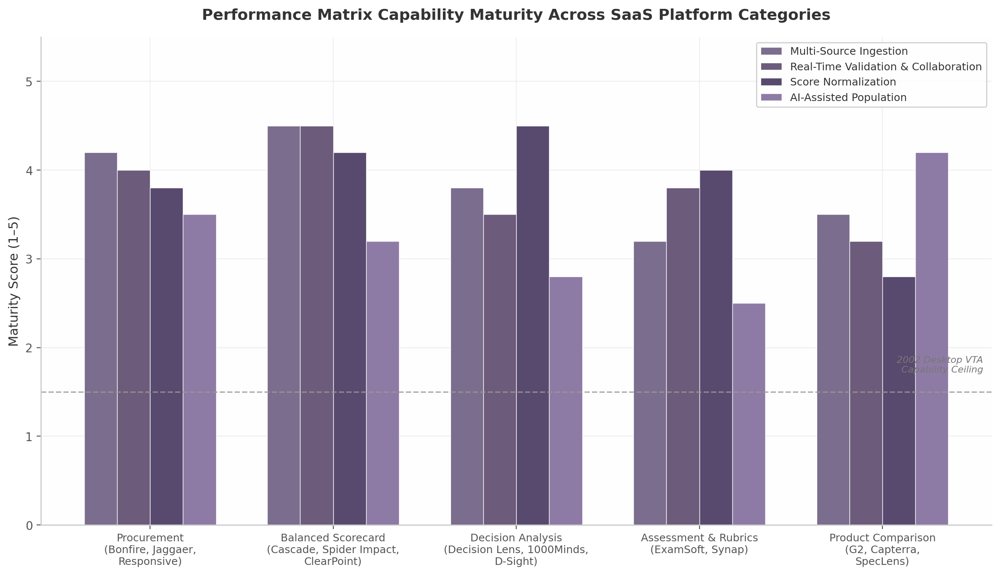

## 3. Digital Attribute Specification & Performance Matrix

The preceding chapter traced how digital problem-structuring transforms raw stakeholder input into a navigable value-tree hierarchy. Once that hierarchy exists, each leaf-level objective must be paired with a *measure*—an attribute that can distinguish one alternative from another on the dimension the objective captures. In the 2002 VTA framework, this step was labor-intensive and analyst-dependent: attributes were classified as natural, constructed, or proxy; each required manual scale definition, range setting, and quality validation against five desirable properties (completeness, operationality, decomposability, nonredundancy, and minimum size) [^40^]. A SaaS platform must automate and augment each of these operations without relaxing methodological rigor.

This chapter examines how modern cloud architecture—API integrations, guided rubric builders, AI inference engines, and real-time collaborative grids—translates the attribute-specification and performance-matrix phases into self-service digital workflows.

### 3.1 Attribute Definition Engine

The 2002 VTA document defines an attribute as the measurable construct that maps decision alternatives into a consequence space: formally, attribute $X_i(a) = x_i$ indicates the level to which objective $O_i$ is achieved for alternative $a$. The original taxonomy recognizes three attribute types, each demanding a distinct digital treatment [^40^].

#### 3.1.1 Natural Attributes: API-Driven Import from ERP, CRM, HRIS, and BI Systems

Natural attributes are measured on scales that carry an objective, universally understood interpretation—salary in euros per month, latency in milliseconds, headcount, carbon emissions in tonnes. In manual VTA, these values were entered by hand from organisational reports, a process that introduced transcription errors and guaranteed data staleness. In a digital workflow, natural attributes should be sourced automatically.

Modern SaaS platforms achieve this through pre-built connectors to enterprise systems. Balanced scorecard platforms such as Cascade offer more than 1,000 integrations that pull live KPIs from BI tools, ERP modules, and CRM databases [^48^]. Spider Impact, a methodology-agnostic scorecard engine, ingests metrics from external data warehouses and automatically rolls up weighted KPIs to strategic objectives [^108^]. The pattern is straightforward: once a user maps a leaf-level VTA objective (e.g., "minimise operational cost") to a data field in SAP or Salesforce, the platform refreshes the performance matrix cell on a scheduled or event-driven basis. The consequence is that natural-attribute columns in the performance matrix become *live streams* rather than static snapshots.

For a VTA SaaS platform, the architecture implication is an API-first ingestion layer with OAuth-secured connectors to the major enterprise systems, supplemented by a webhook framework for custom data feeds. The platform should also expose a data-mapping UI—analogous to BI "join" interfaces—where non-technical users link tree nodes to external fields without engineering support.

#### 3.1.2 Constructed Attributes: Guided Rubric Builder with Scale Definition

Constructed attributes are invented scales for objectives that have no natural unit of measurement—"positive impact on working environment" scored from 0 to 5, or "strategic alignment" rated on a Likert scale. The 2002 document stresses that constructed attributes are inherently subjective and must be anchored with clear verbal descriptors at each level so that different evaluators apply the scale consistently [^40^].

Digital platforms address this challenge through interactive rubric builders. In assessment software, ExamSoft's ExamSCORE allows evaluators to define point-based grading scales with objective descriptors per criterion and "auto-fail" thresholds for critical items [^37^]. Synap extends this model to audio, video, and written responses, supporting weighted scoring, partial credit, negative marking, and multi-scorer evaluation with anonymous grading to reduce bias [^26^]. The common pattern is a two-dimensional grid: criteria (or VTA attributes) as columns, achievement levels as rows, each cell containing a precise verbal descriptor that anchors the score.

A VTA SaaS platform should provide a guided rubric wizard triggered whenever a user creates a leaf-level objective with no obvious natural metric. The wizard would (1) suggest scale types (0–5 integer, 1–10, Likert, custom) based on the objective's semantic content; (2) prompt for verbal anchors at each level (e.g., "5 = transformative impact on team morale"); (3) enforce consistency checks such as mutually exclusive level definitions; and (4) store the rubric as a reusable template for future decisions in the same domain. This converts the subjective art of constructed-attribute design into a reproducible, auditable workflow.

#### 3.1.3 Proxy Attributes: AI-Suggested Proxy Metrics Based on Objective Descriptions

Proxy attributes do not directly measure the fundamental objective but serve as an indirect indicator when direct measurement is impractical. The 2002 document offers the classic example: a firm's objective of "prestige or power" may be approximated by "share of market" as a proxy attribute [^40^]. The danger with proxies is that their relationship to the true objective can be weak, opaque, or contested.

In a digital environment, AI can assist by surfacing candidate proxy metrics and quantifying their relevance. SpecLens, an AI-powered procurement platform, extracts vendor specifications from unstructured documents (PDF, Word, Excel, PowerPoint) and maps them to structured comparison matrices with confidence scores and source citations [^25^]. Taloflow filters technology solutions against more than 100,000 curated data points to produce fit/coverage matrices that highlight trade-offs between competing options [^33^]. Translating this capability to VTA, an AI engine could analyse an objective description such as "enhance organisational agility" and propose proxy metrics drawn from a knowledge base—cycle time, deployment frequency, employee Net Promoter Score—each annotated with a relevance score and a link to the source literature or dataset.

The platform should present AI-suggested proxies as *draft recommendations* requiring human validation, not as autonomous assignments. This preserves the decision-maker's authority while reducing the cognitive load of metric invention.

#### 3.1.4 Attribute Quality Scoring: Comprehensive + Understandable + Measurable Validation

The 2002 document specifies that every attribute should satisfy three practical tests: it must be *comprehensive and understandable* (the decision-maker can unambiguously interpret what an attribute level means), and it must be *measurable* (preferences across attribute levels can be assessed without excessive time, money, or effort) [^40^]. These tests map directly onto the five desirable properties of the value tree—completeness, operationality, decomposability, nonredundancy, and minimum size—that the original framework recommends checking after construction.

A digital Attribute Definition Engine can automate much of this validation. *Completeness* can be verified by checking that every leaf node in the value tree has an associated attribute and that no orphan objectives exist. *Operationality* is enforced by the rubric builder's requirement for verbal anchors on constructed scales. *Decomposability* can be assessed through algorithmic checks for preferential independence—flagging attributes whose correlation exceeds a configurable threshold, since highly correlated attributes may violate the independence assumption underlying additive value models [^104^]. *Nonredundancy* is checked by detecting duplicate or near-duplicate attribute definitions through natural-language similarity analysis. *Minimum size* is addressed through a pruning suggestion engine that identifies attributes with near-zero variance across alternatives (i.e., they do not discriminate) and recommends consolidation or removal.

Table 1 summarises the mapping from manual VTA attribute management to its digital SaaS equivalent.

**Table 1: Attribute Type Mapping — Manual VTA (2002) to Digital SaaS Workflow**

| VTA Attribute Type | 2002 Manual Practice | Digital SaaS Capability | Enabling Technology |
|:---|:---|:---|:---|
| **Natural** | Hand-copy values from reports; static, error-prone | API-synced ingestion from ERP, CRM, HRIS, BI; live refresh | REST/OAuth connectors, webhook pipelines, data-mapping UI [^48^] |
| **Constructed** | Facilitator-led scale invention; verbal anchoring in workshop notes | Guided rubric builder with scale templates (0–5, Likert, custom), descriptor anchoring, auto-fail thresholds | Interactive grid UI, NLP descriptor suggestion, reusable template library [^37^] [^26^] |
| **Proxy** | Analyst intuition; literature review for indirect indicators | AI-suggested proxy metrics with relevance scores, source citations, and confidence ratings | NLP/LLM inference over curated knowledge base, confidence scoring [^25^] [^33^] |
| **Quality validation** | Manual checklist against 5 desirable properties; expert review | Automated completeness, redundancy, correlation, and variance checks with pruning recommendations | Graph traversal (orphan detection), embedding similarity (redundancy), statistical correlation (independence), variance analysis (minimum size) |

The significance of this digital translation is methodological fidelity at scale. In 2002, ensuring that a value tree satisfied all five desirable properties required hours of expert review. In a SaaS implementation, the platform enforces these constraints in real time, flagging violations as the user builds the tree and suggesting corrections before the performance matrix is populated. This shifts quality assurance from a retrospective audit to a continuous, embedded process.

### 3.2 Performance Matrix

Once attributes are defined, the next step is to record how each alternative performs on each attribute. The 2002 document calls this the *performance matrix* (also referred to as the consequence matrix): a table in which alternatives are rows, attributes are columns, and cell entries are the measured consequences [^40^]. In the Web-HIPRE screenshot reproduced in the original text, this matrix is a static grid; in a modern SaaS platform, it becomes a living, multi-user, multi-source analytical surface.

#### 3.2.1 Interactive Consequence Matrix: Alternatives as Rows, Attributes as Columns, Live-Editable Cells

The basic visual pattern is proven across multiple software categories. Procurement platforms Bonfire and Responsive (formerly RFP360) display vendor scorecards as interactive grids where evaluators enter scores cell-by-cell, with role-based filtering so each reviewer sees only the criteria assigned to them [^71^] [^45^]. Decision-matrix tools such as Decision Matrix Pro and Creately support real-time collaborative editing, comment threads per cell, permission controls, and version history [^57^]. The MCDA community confirms that the performance matrix remains "the most basic alternative approach" in multi-criteria analysis: each alternative as a row, each criterion as a column, performance scores typically normalised to 0–100 or expressed as discrete levels [^110^].

For a VTA SaaS platform, the performance matrix should adopt the "tree-first" UX pattern described in Chapter 2. When a user selects a leaf-level attribute from the value tree, the matrix view expands to show all alternatives scored on that attribute. Selecting an alternative row reveals its full consequence profile across all attributes. Cells are live-editable: clicking a cell opens the appropriate input mode—numeric keypad for natural attributes, rubric selector for constructed attributes, or AI-suggested proxy picker for proxy attributes. Changes propagate immediately to the aggregated value score, which updates in real time.

#### 3.2.2 Multi-Source Data Ingestion: Spreadsheet Upload, API Sync, Manual Entry, AI-Assisted Population

Performance-matrix population need not be a monolithic data-entry task. Modern platforms support four ingestion modes operating in parallel. *Spreadsheet upload* remains the most common migration path: procurement teams routinely import vendor evaluation data from Excel into Bonfire or Jaggaer. Responsive provides built-in algorithms that score individual questions from uploaded RFP responses, producing heat-map visualisations of question-by-question matches [^45^]. *API sync* continuously refreshes natural-attribute columns from connected enterprise systems, as described in Section 3.1.1. *Manual entry* is reserved for constructed attributes requiring human judgment. *AI-assisted population* represents the frontier: SpecLens reduces specification-comparison time from eight hours to under twenty minutes by automatically extracting vendor attributes from unstructured documents with 99% extraction accuracy [^25^].

The architectural implication is a pluggable ingestion framework where each cell in the matrix has a *source tag* (upload, API, manual, AI) and a *confidence score*. A user can audit any cell to see where its value originated, when it was last updated, and how reliable the platform judges it to be.

#### 3.2.3 Real-Time Validation: Range Checking, Consistency Alerts, Missing Data Highlighting

Data quality degrades rapidly in multi-scorer environments unless the platform enforces constraints at the point of entry. The 2002 VTA document acknowledges that human assessors give "conflicting statements about preferences" and recommends iterative consistency checking [^40^]. Digital platforms scale this through automated validation.

Range checking ensures entered scores fall within the defined scale; a score of 6 on a 0–5 rubric is rejected with an explanatory tooltip. Consistency alerts flag anomalous patterns: if one evaluator rates Vendor A "excellent" on "technical capability" while all other evaluators rate it "poor," the platform highlights the discrepancy and prompts for a written justification [^42^]. Missing-data highlighting uses visual cues—shaded cells, warning icons, or conditional formatting—to draw attention to empty cells before aggregation is attempted [^54^]. Responsive's "heat map" visualisation extends this concept by colour-coding entire scorecard sections based on score density, making gaps immediately visible [^45^].

In the VTA SaaS context, these validations are particularly critical because downstream sensitivity analysis and dominance checks depend on a complete, consistent matrix. A cell left empty or entered inconsistently can flip a dominance conclusion, producing an unreliable recommendation.

#### 3.2.4 Score Normalization: Automatic Scaling to [0,1] with Strategic Equivalence Preservation

Different attributes inevitably arrive on different scales: salary in thousands of euros, satisfaction on a 1–5 Likert scale, latency in milliseconds. The 2002 VTA framework resolves this through *strategic equivalence*: two value functions are strategically equivalent if they induce the same preference ordering, which means any positive affine transformation—scaling and shifting—preserves the decision logic. Formally, if $v$ is a value function, then $v' = \alpha v + \beta$ (where $\alpha > 0$) is strategically equivalent to $v$ [^40^]. This mathematical property is what permits automatic normalisation to a common [0,1] interval.

The digital platform should perform this normalisation transparently. When a natural attribute such as "salary" ranges from €2,000 to €4,000 across alternatives, the platform maps the worst level to 0 and the best to 1, interpolating intermediate values linearly (or according to the elicited single-attribute value function, if non-linear). Constructed attributes on 0–5 scales are divided by 5. The normalised matrix is displayed alongside the raw-values view, with a toggle control allowing users to switch between them.

Strategic equivalence also matters when value functions are non-linear. The job-selection example in the 2002 document shows that a person's preference for salary may exhibit diminishing returns: the difference between €1,500 and €2,000 may feel larger than the difference between €3,500 and €4,000, even though the absolute increment is identical. A digital platform should support direct assessment of the value-function form (linear, logarithmic, S-curve) through an interactive curve editor, with the fitted function then applied during normalisation [^40^]. This preserves the richness of preference data that would be lost by naïve linear scaling.

**Table 2: Performance Matrix Feature Comparison — Legacy Desktop VTA (2002) vs. Cloud-Native SaaS**

| Capability Dimension | Legacy Desktop VTA (Web-HIPRE Era) | Cloud-Native SaaS Platform | Impact on Decision Velocity |
|:---|:---|:---|:---|
| **Data ingestion** | Manual typing; copy-paste from spreadsheets | Multi-source: spreadsheet upload, API sync, manual entry, AI extraction [^25^] [^45^] | Data population time reduced from days to hours |
| **Collaboration** | Single-user files; email for review | Real-time multi-user editing, role-based cell access, comment threads [^57^] [^71^] | Parallel evaluation eliminates sequential handoffs |
| **Visualisation** | Static HTML table; no conditional formatting | Interactive grids, heat maps, speedometers, radar charts, metric cards [^45^] [^54^] [^106^] | Pattern detection at a glance; reduced cognitive load |
| **Validation** | Human review after data entry | Real-time range checks, consistency alerts, missing-data highlighting [^42^] [^54^] | Errors caught at entry, not during analysis |
| **Normalisation** | Manual calculation; spreadsheet formulas | Automatic scaling to [0,1] with strategic-equivalence preservation; non-linear curve editor | Zero-configuration comparability across heterogeneous scales |
| **Audit & compliance** | Local file versions; no change log | Full version history, cell-level source tags, decision rationale capture [^82^] | Defensible decisions for regulated procurement |
| **Sensitivity access** | Separate batch-mode analysis step | Reactive parameter binding: adjust weights/scores, see results instantly [^104^] | Trade-off exploration during live meetings |

The research across procurement, balanced-scorecard, and decision-analysis platforms reveals that no single category has fully integrated all seven capabilities with the specific methodological rigour required by VTA. Procurement software (Bonfire, Jaggaer, Responsive) excels at multi-scorer collaboration and weighted scoring but lacks value-tree decomposition and strategic-equivalence handling [^71^] [^45^]. Balanced-scorecard platforms (Cascade, Spider Impact, ClearPoint) are strong on API-driven data integration and visual rollup but treat attributes as flat KPIs rather than hierarchical consequences [^48^] [^108^]. Decision-analysis tools (Decision Lens, 1000Minds, D-Sight) preserve methodological correctness but have not converged on the procurement-grade collaboration and visual polish that enterprise buyers expect [^99^] [^38^]. The maturity gap analysis (Figure 1) illustrates this fragmentation.

*Figure 1. Maturity scores for four core performance-matrix capabilities across five SaaS platform categories. Scores are composite indices derived from feature-depth analysis of publicly available platform documentation (2024–2025). The dashed line indicates the approximate capability ceiling of 2002-era desktop VTA tools. Source: Author analysis.*

The strategic implication is that a purpose-built VTA SaaS platform must synthesise procurement-grade collaboration interfaces, balanced-scorecard-class data integration, and decision-analysis-level methodological correctness into a single unified surface. The performance matrix is where these three traditions converge: it is both the data-capture interface and the analytical substrate upon which preference elicitation, sensitivity analysis, and group deliberation depend. The next chapter examines how digital preference-elicitation engines transform the populated matrix into a quantified preference model through interactive weight-assignment and value-function construction workflows.
