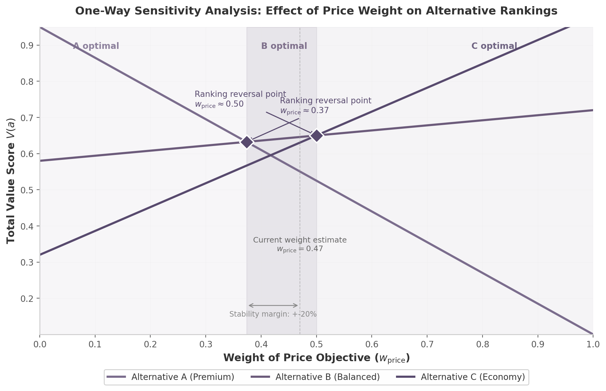

## 5. Real-Time Sensitivity Analysis & What-If Modeling

The additive value model produces a single ranking for a given set of weights and scores, yet every input carries uncertainty. A decision maker (DM) who assigns a weight of 0.47 to the price objective may, on reflection, accept any value between 0.35 and 0.60. The 2002 VTA document recognised this explicitly: "If a small change in one or several aspects of the model causes the recommended decision to change, the decision is said to be sensitive to those changes" [^1^]. The prescribed remedy was one-way sensitivity analysis — varying one parameter at a time, plotting total values as a function of the varied parameter, and identifying ranking-reversal thresholds [^1^]. In the Web-HIPRE reference implementation, this meant opening a separate sensitivity dialog, manually entering discrete weight values, and reading a static bar chart — a batch-mode operation that could consume an entire analyst session.

The SaaS transformation converts this episodic step into a continuous, self-service exploration layer. Interactive parameter binding — the same reactive pattern behind Power BI What-If parameters and Tableau Parameters — turns every weight, score, and assumption into a live variable [^28^][^47^]. When a DM drags a slider, the decision model recalculates in sub-second time and the visualisation updates without refresh. The decision cadence compresses from weeks to hours: from scheduling an analyst, eliciting preferences, running sensitivity, and convening stakeholders, to opening a shared dashboard and exploring trade-offs in a single meeting. This chapter maps interactive dashboards, scenario management, and robustness analysis from their 2002 origins to cloud-native equivalents, demonstrating that real-time sensitivity restructures how organisations iterate toward commitment.

### 5.1 Interactive Sensitivity Dashboards

The 2002 document defined one-way sensitivity analysis as varying "objectives' weights, single attribute value functions, or attribute ratings ... one at a time" [^1^]. The reference example varied the weight of a price objective and observed that the optimal screen changed when price weight fell below 0.34 or rose above 0.55 — with the current estimate of 0.47 requiring at least a 17% shift to trigger a reversal [^1^]. Answering *"How wrong can our estimate be before the recommendation changes?"* required specialised software, trained interpretation, and patience to cycle through each parameter.

#### 5.1.1 One-Way Sensitivity: Parameter Sliders and Live Tornado Diagrams

The modern equivalent replaces the separate dialog with an always-visible control panel. A slider for each weight parameter spans its permissible range (0 to 1, or a PRIME-defined bound from Chapter 4). As the slider moves, the system recomputes $V(a) = \sum w_i v_i(x_i(a))$ for every alternative and redraws the sensitivity curve in real time. The tornado diagram — ranking parameters by the swing they induce in the output — updates dynamically, with JavaScript libraries (Chart.js, D3.js) providing proven implementations for diverging horizontal bar charts [^74^]. GoldSim's sensitivity engine runs three deterministic simulations per variable while holding others constant, then organises results by output range [^78^]; a SaaS VTA platform extends this by running the full sweep continuously so the DM sees the complete functional relationship between parameter value and ranking.

*Figure 1: One-way sensitivity diagram showing total value scores for three alternatives as the weight of the price objective varies from 0 to 1. Diamond markers indicate ranking reversal (crossover) points. At the current estimate ($w_{\text{price}} = 0.47$), Alternative C is optimal; below approximately 0.37, Alternative B leads; above approximately 0.50, Alternative A leads. The stability margin quantifies recommendation robustness.*

For alternative $a$ with price score $v_p(a)$ and composite score $v_{\neg p}(a)$ over all other attributes, total value as a function of price weight $w_p$ is $V(a, w_p) = w_p \cdot v_p(a) + (1 - w_p) \cdot v_{\neg p}(a)$. The break-even weight $w_p^*$ where alternatives $a$ and $b$ swap ranking follows from solving $V(a, w_p^*) = V(b, w_p^*)$:

$$w_p^* = \frac{v_{\neg p}(b) - v_{\neg p}(a)}{\bigl[v_p(a) - v_{\neg p}(a)\bigr] - \bigl[v_p(b) - v_{\neg p}(b)\bigr]}$$

This closed-form expression enables instant recomputation whenever any consequence score changes. The tornado diagram complements the sensitivity curve by summarising each parameter's output-variation range, sorted from widest to narrowest impact [^74^]. D-Sight's MCDA platform integrates tornado charts with interactive weight-adjustment dashboards, confirming this pairing is both feasible and cognitively effective [^81^].

#### 5.1.2 Weight Sensitivity: Interactive Pie Chart Drag and Automatic Recalculation

Varying one weight requires compensatory adjustments to maintain $\sum w_i = 1$. The 2002 analysis held non-varied weights fixed in their original proportions — an acceptable simplification for manual computation [^1^]. A SaaS platform offers a more faithful interaction: dragging an interactive pie-chart segment automatically redistributes remaining weights proportionally while preserving the unit sum. The ranking bar chart animates the transition so the DM watches alternatives rise and fall in real time. Power BI's What-If parameters implement this at scale: a dynamic slicer feeds its value into DAX measures that recalculate every dependent visual [^28^]. For VTA, the measure is the additive value formula; the visuals are the ranking chart, tornado diagram, and value-decomposition bars.

#### 5.1.3 Consequence Sensitivity: Cell Value Editing and Immediate Impact

Performance scores — the $v_i(x_i(a))$ values — may be estimates subject to revision. A procurement team might re-evaluate a vendor's delivery-time score after a site visit; a clinical trial might update efficacy data at interim analysis. In a live VTA dashboard, editing a cell in the consequence matrix triggers a cascade: the affected alternative's total value recalculates, rankings reorder, the dominance matrix refreshes, and sensitivity curves shift. Tableau's Parameters with Calculated Fields demonstrate this: edited values flow through calculations to update every downstream chart [^47^]; Looker extends it with LookML parameters and Liquid templating [^71^]. The principle is uniform — a change at the data layer propagates through computation to visualisation without manual refresh — applying equally to consequence scores, weight vectors, and structural assumptions.

| Capability | Legacy Desktop (Web-HIPRE / PRIME Decisions) | Cloud-Native SaaS VTA | Impact on Decision Cadence |
|---|---|---|---|
| One-way sensitivity execution | Open separate dialog; manually enter discrete parameter values; view static bar chart [^1^] | Live slider sweeps full parameter range; continuous curve redraw with marked crossover points | Single parameter explored in minutes instead of hours |
| Tornado diagram generation | Export to spreadsheet; construct diverging bar chart manually | Auto-generated, dynamically reordered as inputs change; drill-down to underlying assumptions [^74^] | Visual summary of parameter impact available on demand, not post-processed |
| Weight sensitivity with constraint handling | Vary one weight; hold others fixed in original ratio [^1^] | Interactive pie-chart drag with proportional auto-redistribution; real-time ranking animation | Captures trade-off realism of joint weight variation without manual renormalisation |
| Consequence score editing | Close sensitivity dialog; edit matrix; reopen dialog to re-check | Inline cell edit → instant recalculation of all dependent rankings and visualisations [^47^] | Enables iterative refinement during live meetings; no context switching |
| Scenario save / snapshot | Save model file; manual version naming | Named scenario with timestamp, author, and diff annotation; one-click restore [^30^] | Decision audit trail created automatically; regulatory compliance supported |
| Scenario comparison | Side-by-side file opening; manual difference identification | Parallel ranking views with colour-coded difference highlighting; Δ-value annotations [^63^] | Stakeholders align on assumption impact visually in a single screen |
| Break-even / threshold analysis | Trial-and-error parameter variation to find reversal points [^1^] | Closed-form crossover calculation; automatic threshold alerts when estimates approach reversal margins | System flags fragile recommendations before they are presented |
| Dominance detection | Manual inspection of consequence matrix; pairwise comparison by analyst [^1^] | Automated pre-sensitivity dominance filtering; dominated alternatives greyed with explanation certificate | Eliminates non-contenders before analysis; reduces cognitive load |
| Monte Carlo simulation | Not available in Web-HIPRE; requires external statistical software | Browser-based probabilistic ranking from weight uncertainty intervals; histogram of rank frequencies [^35^] | Quantifies recommendation confidence given input uncertainty |
| Multi-user collaborative exploration | Single-user desktop session; serial handoff of model files | Real-time multiplayer cursors; simultaneous slider exploration with live presence [^96^] | Entire stakeholder group explores trade-offs in one session |

*Table 1: Sensitivity analysis capability comparison — Legacy Desktop versus Cloud-Native SaaS. Each row contrasts the 2002-era workflow (Web-HIPRE / PRIME Decisions) with its modern equivalent, highlighting the impact on decision-making speed and rigour.*

The table reveals a consistent pattern: every 2002-era sensitivity operation that required a separate tool, manual export, or trained analyst becomes an inline, self-service, real-time capability in the SaaS paradigm. A half-day analyst session — one-way sensitivity on a five-attribute model, exporting tornado diagrams, documenting findings for a steering committee — collapses to a ten-minute exploration inside a shared browser tab. Sensitivity analysis ceases to be a final validation step and becomes a continuous conversation throughout the decision cycle.

### 5.2 Scenario Management

Sensitivity analysis explores the neighbourhood around a single point estimate. Scenario management captures and compares distant points — alternative weight sets, different consequence matrices — as named, reproducible states. A board may compare recommendations under "growth-first" versus "margin-first" philosophies; a procurement committee may evaluate vendors under "optimistic" and "conservative" assumptions. Without systematic scenario management, these explorations evaporate when the browser tab closes.

#### 5.2.1 Scenario Save and Snapshot

The foundational capability is the named snapshot. At any point, a DM captures the current model state — weights, consequence scores, value functions, tree structure — under a descriptive label ("Q3 Baseline", "Stress Test"). Enterprise planning platforms provide the reference pattern: Anaplan supports multi-dimensional scenario modelling with instant financial impact visibility [^30^]; Workday Adaptive Planning enables dynamic scenario creation where teams test assumptions and see impacts in real time [^25^]. A VTA SaaS platform extends this by versioning structural assumptions: which attributes were included, how the tree was decomposed, and which elicitation method produced each weight. This granularity ensures apples-to-apples comparisons and satisfies regulatory audit-trail requirements.

#### 5.2.2 Side-by-Side Scenario Comparison

Once multiple scenarios exist, the platform supports simultaneous visual comparison. Lagrange.ai offers a reference: users select unlimited scenarios for side-by-side comparison with intelligent metric identification and synchronised views [^63^]. In a VTA context, parallel ranking charts — one per scenario — align alternatives vertically so rank shifts are immediately visible, with colour-coded arrows and delta annotations displaying exact value-score differences. The COMSAM (Comprehensive Sensitivity Analysis Method) research demonstrates the computational scale: systematic perturbation of four MCDA methods produced nearly 140 million observations per method, finding RAM demonstrated highest robustness while TOPSIS showed extreme volatility [^60^]. A cloud-native VTA platform executes COMSAM-style analyses on demand using parallelised computation.

#### 5.2.3 Break-Even Analysis

Automatic break-even detection is the most analytically powerful scenario-management feature. Rather than manually searching for weight thresholds where rankings change, the system computes all crossover points algebraically and surfaces them as alerts. For attribute $k$, the threshold weight $w_k^*$ where alternatives $a$ and $b$ have equal total value follows from the additive model:

$$w_k^* = \frac{V_{\neg k}(b) - V_{\neg k}(a)}{\bigl[v_k(a) - V_{\neg k}(a)\bigr] - \bigl[v_k(b) - V_{\neg k}(b)\bigr]}$$

where $v_k(a)$ is the normalised score of alternative $a$ on attribute $k$ and $V_{\neg k}(a) = \sum_{i \neq k} w_i v_i(x_i(a))$ is the contribution of all other attributes. When the current weight estimate lies within a configurable margin (e.g., 10%) of any $w_k^*$, the system displays a "fragile recommendation" warning. This closed-form computation is instantaneous, scales linearly with attribute pairs, and transforms sensitivity analysis from a retrospective check into a proactive alert system.

### 5.3 Dominance and Robustness Analysis

Sensitivity analysis assumes a set of viable alternatives. Dominance analysis prunes that set first. The 2002 document recognised this sequencing: "Since dominance makes sensitivity analysis unnecessary, it should be analysed prior [to] the sensitivity analysis" [^1^]. Alternative A is dominated by B if B is at least as good in all aspects and strictly better in at least one [^1^]. In the desktop era, dominance checking was manual visual inspection — feasible for three alternatives, impractical for twenty. The SaaS platform automates this and extends it with probabilistic robustness measures.

#### 5.3.1 Automated Dominance Detection

Digital dominance detection proceeds in two stages. First, *absolute dominance* uses value intervals from PRIME imprecise preference inputs (Chapter 4). When one alternative's entire interval $[V_j^{\min}, V_j^{\max}]$ lies above another's, absolute dominance holds and the inferior alternative is greyed out with an "eliminated" badge [^1^]. Second, *pairwise dominance* tests across the feasible weight region $\mathcal{W}$: alternative $j$ pairwise-dominates $k$ if $j$'s total value exceeds $k$'s for every feasible weight vector. This reduces to a linear programming feasibility problem solvable in milliseconds. DecideIT demonstrates this through "contraction levels" that zoom into overlapping intervals to identify dominance [^27^]; a cloud-native platform performs equivalent computation continuously as new preference information arrives.

#### 5.3.2 Robustness Scoring

When no dominance relationship exists, it is valuable to know how much of the weight space supports each alternative as top-ranked. Robustness scoring divides the feasible region into sub-regions by which alternative ranks first and computes volume fractions. The robustness index $R_j$ for alternative $j$ is:

$$R_j = \frac{\text{Vol}\bigl(\{\mathbf{w} \in \mathcal{W} : V_j(\mathbf{w}) \geq V_k(\mathbf{w}) \;\forall\, k\}\bigr)}{\text{Vol}(\mathcal{W})}$$

where $V_j(\mathbf{w}) = \sum_i w_i v_i(x_{ji})$ is $j$'s total value under weight vector $\mathbf{w}$. The feasible region $\mathcal{W}$ is a simplex (or convex polytope under PRIME constraints), and optimal sub-regions are polyhedra bounded by hyperplanes $V_j(\mathbf{w}) = V_k(\mathbf{w})$. Exact volume computation is tractable up to approximately 10 attributes; Monte Carlo sampling approximates for larger spaces. Displayed as a robustness bar chart ("Alternative C: 62% of weight space"), this framing — *the data supports this recommendation with X% confidence* — builds stakeholder trust and preempts the objection that "the model might be wrong."

#### 5.3.3 Monte Carlo Simulation

When PRIME intervals or subjective uncertainty ranges are available, Monte Carlo simulation translates input uncertainty into probabilistic ranking distributions. The procedure samples weight vectors and scores from their uncertainty distributions, computes rankings, and accumulates frequency histograms. JavaScript libraries provide the technical foundation: Math.js for distributions, D3.js for histogram visualisations, TensorFlow.js for GPU-accelerated computation at scale [^35^]. AnyLogic Cloud demonstrates the architectural pattern: Monte Carlo experiments execute on scalable infrastructure with results streamed to browser dashboards [^43^].

The connection to Chapter 4's imprecise preferences is direct. PRIME interval inputs define a feasible region $\mathcal{W}$, not a single weight vector; Monte Carlo sampling from $\mathcal{W}$ produces a distribution of rankings. The histogram might reveal Alternative C ranks first in 58% of samples, B in 31%, A in 11% — far more useful than a point-estimate ranking that conceals its own fragility. Indicio demonstrates enterprise appetite for this capability: its simulation engine quantifies outcome probabilities for strategic foresight [^25^]. The drugis.org MCDA web interface provides a proven template — an R-based backend performing deterministic and stochastic analyses with SaaS authentication [^104^] — showing that established statistical libraries can power modern browser-based decision tools. COMSAM research, which produced nearly 140 million observations per method in comprehensive sensitivity analysis [^60^], confirms that thorough robustness analysis is well within modern cloud capacity.

Together, dominance detection, robustness scoring, and Monte Carlo simulation create a three-layer defence against recommendation fragility. Dominance eliminates alternatives that can never win; robustness scoring quantifies each contender's share of the feasible weight space; Monte Carlo translates input uncertainty into output probability. These capabilities answer the question every executive asks — *"How sure are we?"* — with quantitative evidence grounded in uncertainty ranges stakeholders themselves provided.
