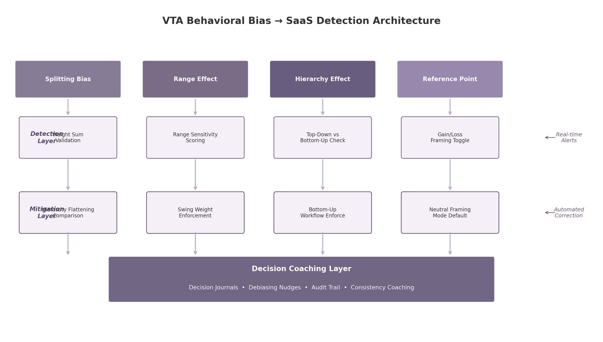

## 6. Behavioral Bias Detection & Mitigation

The 2002 VTA instructional document devotes its entire sixth section to a phenomenon that classical decision theory largely ignored: the systematic biases that distort preference elicitation in practice. Four decades of behavioral decision research have confirmed that even experienced decision-makers produce inconsistent, context-dependent weights when asked to quantify trade-offs [^52^]. In the original VTA workflow, these biases were identified after the fact — if at all — by a trained decision analyst reviewing elicitation results during structured interview sessions.

Modern SaaS architecture inverts this model. Rather than relying on human vigilance to catch biases after they have already influenced the decision model, the platform embeds real-time detection algorithms that flag deviations as they occur. This shift from retrospective diagnosis to preventive intervention transforms the platform from a passive calculator into an active decision coach — what Insight 4 from the cross-dimensional analysis identifies as the capability that most directly differentiates a modern decision platform from spreadsheets, survey tools, and business intelligence dashboards [^26^]. IBM AI Fairness 360 (AIF360) demonstrates that automated bias detection at scale is production-ready: its open-source toolkit deploys more than 70 fairness metrics and multiple mitigation algorithms across pre-processing, in-processing, and post-processing stages of decision pipelines [^26^]. What AIF360 achieves for machine-learning model fairness, a VTA SaaS platform can achieve for human preference fairness.

The architectural logic follows a three-layer pattern: automated detection identifies when a bias has likely occurred, consistency checking validates logical coherence against normative standards, and decision coaching sustains reflective practice over time.

### 6.1 Automated Bias Detection

The original VTA document identifies four behavioral biases as primary threats to valid preference elicitation: splitting bias, range effect, hierarchy effect, and reference point effect. Each has been replicated in controlled experiments and each produces measurable, predictable distortions in weight assignments. A SaaS platform can encode detection rules for all four.

#### 6.1.1 Splitting Bias Alert

Splitting bias is the most robustly documented of the four. In the classic experiment by Weber, Eisenfuhr, and von Winterfeldt (1988), subjects assigned swing weights to attributes simultaneously at a single level [^52^]. When a parent objective was subsequently decomposed into sub-objectives, the sum of the sub-attribute weights systematically exceeded the weight the parent had received before decomposition. The mechanism is well understood: decision-makers anchor on familiar numerical scales (often multiples of ten) and fail to proportionally reduce weights when the attribute set expands [^52^]. Poyhonen et al. (2001) subsequently demonstrated that the direction and magnitude of splitting bias depends on tree structure — in some configurations, decomposition can actually decrease weight [^52^].

A SaaS platform operationalizes splitting detection through continuous parent-child weight reconciliation. When a user decomposes an objective into sub-objectives, the system compares the pre-split parent weight against the post-split sum of child weights. If the deviation exceeds a threshold calibrated against the Weber et al. experimental distributions, the platform surfaces an immediate alert: "The combined weight of your sub-objectives (0.42) exceeds the original parent weight (0.30). This is a common pattern called splitting bias. Would you like to review your assignments?" A hierarchy-flattening comparison view lets the user toggle between hierarchical and flat weighting perspectives [^52^].

#### 6.1.2 Range Effect Detection

The range effect stems from a counter-intuitive property of human judgment: decision-makers do not sufficiently adjust their weights when underlying attribute ranges change [^55^]. Fischer's foundational 1995 experiments showed that direct importance weight methods were entirely range-insensitive, while swing weight and trade-off methods showed partial range sensitivity that still fell short of normative predictions [^55^]. In practical terms, a decision-maker may assign the same weight to "salary" whether the range spans EUR 1,500-3,000 or EUR 2,900-3,000 — even though the latter range implies salary differences are practically irrelevant.

The SaaS detection mechanism embeds explicit range visualization directly into the weight elicitation interface. When a user assigns a weight, the platform displays the attribute's range relative to all other attributes and computes a range-sensitivity score — the ratio of the assigned weight to the range-normalized expected weight. Attributes with narrow ranges that receive disproportionately high weights trigger amber alerts. Marttunen et al. (2017) found that explicitly presenting impact ranges during elicitation reduces range insensitivity, making this one of the most empirically supported debiasing techniques in the MCDA literature [^52^].

#### 6.1.3 Hierarchy Effect Monitoring

The hierarchy effect describes how the structural form of the objectives tree itself influences weight assignments. The 2002 VTA document cites evidence that top-down construction yields steeper trees with more layers, and that branches added higher in the tree receive disproportionately more weight [^52^]. Bottom-up weighting produces more accurate assignments because participants develop better understanding of alternatives' actual impact ranges when working from the attribute level upward [^52^].

A SaaS platform mitigates the hierarchy effect through workflow design. The default elicitation path enforces bottom-up weighting — requiring users to assign weights at the leaf-node level before aggregating upward — while supporting top-down override on request. When top-down weighting is used, the platform runs a parent-child coherence validation comparing directly assigned upper-level weights against mathematically implied weights from below. Discrepancies above a threshold trigger a side-by-side visual comparison.

#### 6.1.4 Reference Point Analysis

The reference point effect, rooted in Tversky and Kahneman's prospect theory, describes how the same outcome is evaluated differently depending on whether it is framed as a gain or a loss. Mellers and Yin's (2023) analysis found that reference-point theory predicted 83% of participants' choices, outperforming even prospect theory's 73% accuracy rate [^48^]. Svenningsen et al. (2021) demonstrated that framing climate policy outcomes as losses versus regained income significantly altered estimated preference structures [^53^].

For VTA, a decision-maker's weights for "cost reduction" and "revenue increase" may diverge even when describing the same financial outcome, depending on which frame the platform presents. The SaaS mitigation defaults to neutral framing that describes attributes in objective, non-valenced language ("change in operating expenditure" rather than "cost savings" or "cost increases"). A gain/loss perspective toggle allows users to view the same attribute from both frames, with the platform highlighting any weight discrepancies that arise from the switch.

*Figure 6.1: The three-layer detection architecture maps each classical VTA bias through a real-time detection mechanism to an automated mitigation intervention, with the decision coaching layer providing sustained behavioral support.*

### 6.2 Consistency Checking

Whereas automated bias detection targets specific psychological distortions, consistency checking addresses a more fundamental question: are the decision-maker's preferences internally coherent according to the axioms of rational choice? The 2002 VTA document establishes comparability, transitivity, and consistency as foundational axioms [^34^]. Violations of these axioms undermine the validity of any decision recommendation derived from the preference model.

#### 6.2.1 AHP Consistency Ratio

The Analytic Hierarchy Process includes a built-in consistency metric — the consistency ratio (CR) — measuring how far pairwise comparisons deviate from perfect logical coherence. In a fully consistent matrix, if attribute A is judged three times as important as B, and B twice as important as C, then A should be six times as important as C. When transitivity is violated across multiple triplets, the CR rises above the accepted threshold of 0.1 (or 0.2 for less critical decisions) [^44^].

In the 2002 VTA workflow, CR calculation was a batch-mode operation: the analyst entered all comparisons, computed the CR, and returned to the decision-maker for revision. The SaaS platform computes CR in real-time after every comparison entry. Interactive tools highlight the specific pairs contributing most to inconsistency within the preference matrix and suggest minimal adjustments to bring the CR into the acceptable range [^44^]. These guided suggestions reduce the cognitive burden of correction [^34^].

#### 6.2.2 Transitivity Validation

Preference cycles — where A is preferred to B, B to C, and yet C to A — represent the most flagrant violation of rational choice axioms. They are surprisingly common when comparisons are elicited across sessions or when multiple stakeholders contribute to the same matrix. The UK Government's MCDA guide notes that examining all possible pairs for redundancy and consistency is often less transparent and more time-consuming [^35^].

A SaaS platform automates transitivity validation across the entire comparison graph. After each new entry, the system checks all indirect paths for cycles and flags violations with a visual trace: "You rated A > B and B > C, but your new entry implies C > A." The platform can also compute the minimum comparison set needed for a fully transitive ordering, reducing elicitation burden while maintaining consistency guarantees [^34^].

#### 6.2.3 Weight Coherence Checking

Hierarchical weight roll-up provides an additional consistency check that is unique to value tree structures. In hierarchical weighting, the final attribute weight is the product of the weights at each level above it. If a user assigns 0.4 to "Environmental" at the top level and 0.6 to "Carbon Emissions" within Environmental, the implied final weight for Carbon Emissions is 0.24. Weight coherence checking validates these implied weights against any direct assessments the user may have provided at the attribute level. Discrepancies between the hierarchical derivation and direct assessment indicate either structural misunderstanding or genuine preference uncertainty — both of which the platform should surface for explicit resolution.

### 6.3 Decision Coaching

Bias detection and consistency checking operate primarily at the point of preference elicitation — they are real-time, event-driven interventions. Decision coaching extends this support across the entire decision lifecycle, building reflective capacity that improves decision quality beyond any single analysis. This is the layer that most clearly differentiates a decision platform from a decision calculator: it makes the user a better decision-maker over time.

#### 6.3.1 Decision Journal Prompts

Decision journals are structured records of the rationale, assumptions, and expectations underlying each significant decision. A 2024 study in *Behavioral Science & Policy* found that managers who maintained decision journals improved their forecasting accuracy by 19% over a 90-day period [^77^]. The mechanism is straightforward: structured rationale capture forces engagement of System 2 thinking — the deliberate, analytical mode essential for high-stakes decisions — helping decision-makers sidestep the cognitive shortcuts that produce biased judgments [^86^].

A VTA SaaS platform embeds decision journal prompts at each workflow step. When constructing the objectives hierarchy, the platform prompts: "Why did you include this objective? What would change if it were removed?" When assigning weights, it asks: "What real-world trade-off does this weight represent?" These prompts are timed to the specific cognitive operations where bias research has shown interventions to be most effective [^75^]. Captured rationales become searchable institutional memory, enabling organizations to review not just what decision was made, but why it was made.

#### 6.3.2 Debiasing Nudges

Nudge theory, as formalized by Thaler and Sunstein, defines a nudge as "any aspect of choice architecture that alters people's behavior in a predictable way without forbidding any options or significantly changing their economic incentives" [^32^]. Applied to VTA, debiasing nudges are contextual micro-interventions delivered at points of known bias risk. Research on behavioral UX in SaaS identifies three broad strategies for nudge deployment: increasing information (disclosure, warnings, reminders), improving efficiency (default rules, simplification), and leveraging social norms [^38^].

The key design principle is that nudges must constitute "good friction" — deliberate pauses that serve the decision-maker's interests rather than "sludge" that makes beneficial actions needlessly difficult [^78^]. When the platform detects that a user is about to finalize weights with an unresolved splitting bias alert, it inserts a confirmation step: "Your weights show a splitting pattern that may distort your results. Proceeding anyway is an option, but reviewing first is recommended." This is not a prohibition — it is a speed bump that prompts reflection before an action that would be difficult to undo. Similarly, when the platform detects high cognitive load indicators (rapid sequential weight changes, backtracking, extended session duration), it can offer a structured break prompt or switch to a simplified elicitation mode. Research shows users are 80% more likely to abandon complex tasks when cognitive load is high, making these interventions essential for both decision quality and user retention [^28^].

#### 6.3.3 Audit Trail

Complete decision traceability is the foundation of organizational learning. An AI audit trail — a detailed, immutable record of inputs, outputs, model behavior, and decision logic at every step — enables stakeholders to trace decisions back to the specific weight assignments, hierarchy structures, and preference statements from which recommendations were derived [^45^]. For regulated industries and high-stakes organizational decisions, this traceability is not a convenience but a compliance necessity.

The audit trail captures every preference change with a timestamp, the identity of the user making the change, the specific modification, and — critically — the rationale provided at the time of change. Over time, this record enables pattern identification: Which objectives are consistently revised upward during group sessions? Which weighting methods produce the most stable results across different decision contexts? The progressive disclosure design principle ensures that this rich metadata does not overwhelm the primary interface — concise recommendations are presented initially, with detailed audit trails available on demand [^40^].

The following table summarizes the complete mapping from the four classical VTA biases to their corresponding SaaS detection and mitigation features.

| VTA Bias | Empirical Source | Detection Mechanism | Mitigation Feature | Coaching Layer |
|---|---|---|---|---|
| Splitting bias | Weber et al. (1988); Poyhonen et al. (2001) [^52^] | Pre/post-split parent-child weight sum comparison | Hierarchy-flattening toggle; guided weight renormalization | Journal prompt: "Why did decomposition change this objective's importance?" |
| Range effect | Fischer (1995); Marttunen et al. (2017) [^55^] [^52^] | Range-sensitivity score: ratio of assigned weight to range-normalized expected weight | Explicit range visualization; swing weight method enforcement | Nudge: "Your weight for salary doesn't reflect its narrow range. Review?" |
| Hierarchy effect | Adelman et al. (1986); Stillwell et al. (1987) [^52^] | Top-down vs. bottom-up weight divergence metric | Default bottom-up workflow; side-by-side hierarchy comparison | Journal prompt: "Did tree structure influence your weight assignment?" |
| Reference point effect | Tversky & Kahneman (1991); Mellers & Yin (2023) [^48^] | Gain/loss frame weight discrepancy detection | Neutral framing default; dual-perspective toggle | Nudge: "Switching frames changed your weight by 23%. Review the difference?" |
| AHP inconsistency | Saaty (1986) [^44^] | Real-time CR calculation after each comparison entry | Visual matrix highlighting; minimal-adjustment suggestions | Journal prompt: "Which comparison felt most uncertain?" |
| Transitivity violation | French (1988) [^34^] | Graph-cycle detection across pairwise comparison matrix | Cycle path visualization; comparison revision workflow | Nudge: "Your preferences contain a logical cycle. Would you like to resolve it?" |

*Table 6.1: Complete mapping from classical VTA behavioral biases to SaaS detection mechanisms, mitigation features, and decision coaching interventions. Each row connects empirical research findings to specific platform capabilities.*

The architecture in this table represents a qualitative departure from how decision support has historically been delivered. The 2002 VTA document assumed that a trained decision analyst would serve as the bias-detection layer — reviewing results, probing inconsistencies, and coaching the decision-maker through structured interviews. That model, while methodologically sound, restricted VTA to organizations that could afford analyst expertise. By encoding the analyst's diagnostic and coaching functions into software, a SaaS platform democratizes access to decision quality assurance. It becomes the first decision platform that makes its users better decision-makers — not by replacing human judgment, but by systematically illuminating the cognitive patterns that distort it [^33^]. Evidence that human-AI collaborative teams outperform both purely human teams and AI-only systems supports this model: decision-makers can effectively discriminate between reliable and unreliable automated recommendations when those recommendations are transparently explained [^33^]. Automated alerts serve as inputs to human reflection, not substitutes for it — the decision-maker retains final authority over every weight assignment, now equipped with richer information about the biases influencing their judgment.

The implications for enterprise adoption are significant. Organizations in regulated environments face increasing scrutiny of the rationale underlying algorithmic and human-assisted decisions alike [^45^]. A VTA platform with built-in bias detection, consistency validation, and immutable audit trails provides not just better decisions, but defensible decisions — ones that can be reconstructed, explained, and justified to auditors, regulators, and stakeholders who were not present when the original choices were made. This compliance advantage compounds the direct quality improvement from bias mitigation, positioning the platform as decision infrastructure rather than merely a decision tool.
