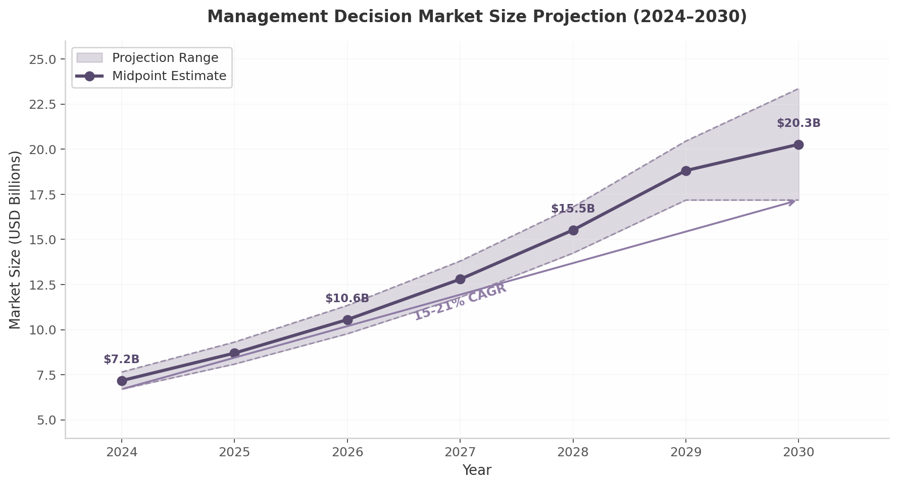

## 7. Collaborative Decision-Making at Scale

The original 2002 VTA learning package devotes a single brief section—Section 8, spanning fewer than three pages—to group decision-making. Its prescription is mathematically elegant but operationally stark: aggregate individual preference models through either a weighted arithmetic mean of individual value functions or imprecise preference statements that capture conflicting views as overlapping intervals. Both approaches assume a trained decision analyst is present in the room, that all stakeholders can convene simultaneously, and that disagreement is an anomaly to be averaged away or bracketed into intervals rather than explored as signal. The modern enterprise reality could hardly be more different. Decisions are rarely made by a single decision-maker (DM) in a closed conference room; they emerge from distributed networks of executives, analysts, domain experts, and external advisors operating across time zones, organizational boundaries, and competing incentive structures. The management decision software market, valued at $6.70 billion in 2025 and projected to reach $17–23 billion by 2030 at a compound annual growth rate (CAGR) of 15–21%, reflects this structural shift toward multi-stakeholder, digitally mediated decision processes [^245^] [^246^] [^254^]. Gartner's classification of Decision Intelligence as "transformational" in its 2025 AI Hype Cycle, alongside the publication of its inaugural Magic Quadrant for Decision Intelligence Platforms in January 2026, further validates that enterprise decision-making is undergoing a platform-level transformation [^277^] [^285^].

*Figure 7.1 — Management Decision Market Size Projection (2024–2030). Data sourced from Mordor Intelligence, market.us, and SkyQuest [^245^] [^246^] [^254^]. The shaded band reflects the range of analyst estimates; the solid line represents midpoint projections.*

Despite 88% of enterprises now regularly using AI-powered solutions in at least one business function, only 38% have established a fully data-driven culture [^246^]. This gap—between analytical capability and collaborative decision discipline—is precisely where modern VTA SaaS platforms must intervene. The sections that follow map the 2002 document's two group aggregation approaches onto a digital-native collaboration architecture capable of operating at enterprise scale across geographically dispersed, functionally heterogeneous stakeholder groups.

### 7.1 Multi-Stakeholder Workflow Orchestration

The 2002 document assumes that "the roles of the DM, analyst and stakeholder may overlap" and that "the analyst can be a separate person, or the DM can act as an analyst herself"—a fluid but small-group model that collapses under the weight of modern enterprise complexity. Contemporary strategic decisions routinely involve fifteen to thirty participants spanning finance, operations, legal, product, and external advisory roles. Orchestrating such groups requires explicit permission architectures, asynchronous workflow support, and configurable privacy controls that the 2002 framework never contemplated.

**Role-based access control (RBAC)** provides the foundational governance layer. IBM's implementation guidance describes hierarchical RBAC with role inheritance and constrained RBAC for separation-of-duties compliance—patterns essential for decision platforms where analysts construct models, subject matter experts contribute domain-specific weights, approvers hold sign-off authority, and observers monitor for audit purposes [^166^]. Loomio, a worker-owned collaborative decision-making platform with fifteen-plus years of operational experience, demonstrates the practical expression of this model through nested subgroups, open/closed/secret privacy settings, granular member permissions, and delegated voter roles that enable representative governance structures [^141^]. For a VTA SaaS deployment, these primitives translate into a four-tier permission model: *Decision Owner* (full model control, participant management, results authorization), *Analyst* (tree editing, weight configuration, sensitivity analysis access), *Contributor* (criteria-specific input, comment participation, voting rights), and *Viewer* (read-only access to finalized models and reports). Multi-tenant RBAC—supported by enterprise identity platforms such as Okta, Azure AD, and LoginRadius—becomes critical when decisions involve participants from multiple organizations, as is common in procurement committees, joint ventures, and regulatory consultations [^240^].

**Asynchronous decision workflows** represent the most significant operational departure from the synchronous workshop model implicit in the 2002 text. The document describes preference elicitation as an "iterative process" conducted through direct interaction between analyst and DM. Modern distributed teams cannot sustain this cadence. Platforms such as Slack Workflow Builder enable structured approval processes with forms, conditional routing, and real-time notifications; Bitrix24 combines open channels, Kanban views, and comments-on-tasks to create durable audit trails where "decisions and approvals live where the work happens" [^214^] [^231^]. Effective async decision-making requires intentional design: clear communication channel selection, explicit response-time expectations, documentation standards that preserve decision rationale, and feedback mechanisms that close loops without synchronous meetings [^230^]. For VTA SaaS specifically, staged elicitation rounds—where criteria identification, weight assignment, and alternative scoring occur as sequential, time-bounded activities with automated reminders and deadline management—enable a decision process that spans days rather than hours while maintaining analytical rigor. Loomio's support for scheduled poll opening, quorum requirements, and email-based participation demonstrates that stakeholders can engage meaningfully without real-time presence [^141^].

**Anonymous versus attributed input** addresses a behavioral dimension the 2002 document sidesteps entirely. The weighted arithmetic mean formula $V(a_j) = \sum k_i v_i(a_j)$, where $k_i$ represent DM power or expertise weights, assumes that individual preference models can be collected transparently without social distortion [^141^]. Empirical evidence contradicts this assumption. Loomio supports anonymous voting and hidden results "so participants vote based on their own judgement—free from social pressure," a configuration described as "perfect for sensitive decisions, board elections, and honest feedback" [^141^]. Similarly, 1000minds—a decision-making platform used by 890+ universities and research institutions—enables anonymous voting as part of its PAPRIKA preference elicitation process to "ensure that every individual can provide their input without worrying about backlash from the group or otherwise being subject to group biases" [^209^]. A configurable visibility model, in which stakeholders can toggle between anonymous and attributed input at the criterion level, allows sensitive weight judgments (compensation, risk tolerance, strategic priority) to remain blind while keeping methodological discussions transparent.

### 7.2 Group Preference Aggregation

The 2002 document presents two aggregation paradigms that remain theoretically sound but operationally transformable in a digital environment.

**Weighted arithmetic mean** (Approach 1) combines individual preference models through the formula $V(a_j) = \sum k_i v_i(a_j)$, where weights $k_i$ reflect the "level of expertise or power structures" of individual decision-makers. In a SaaS implementation, this formula becomes a real-time aggregation engine: individual stakeholders complete their own value tree assessments through guided elicitation interfaces, and the platform computes the weighted composite automatically. BigPulse, a shareholder voting platform, demonstrates that weighted voting can boost participation by 50–100% compared to in-person processes by enabling remote, convenient voting on any device [^234^]. The digital advantage lies not merely in computation speed but in the ability to explore weight sensitivity dynamically—adjusting $k_i$ values in real time to test how different power allocations affect alternative rankings, a capability impossible in the static, spreadsheet-driven workflows of 2002.

**Imprecise group preferences** (Approach 2) capture conflicting views through intervals containing group members' individual preference judgments. The document notes that "the result is unambiguous only if an alternative dominates the other alternatives in absolute sense"—that is, when value intervals do not overlap. This observation, brief in the original text, contains the seed of what the cross-dimension analysis identifies as a killer feature for enterprise adoption. Group decision-making is where legacy VTA breaks down: exact consensus is rarely achievable in enterprise contexts, and the ability to model disagreement as data rather than treat it as a failure addresses the primary pain point in multi-stakeholder decisions. The PRIME (Preference Ratios in Multiattribute Evaluation) method operationalizes this by allowing interval-based weight judgments—assigning a range $[L, U]$ rather than a point estimate—which are then processed through linear programming to produce value intervals, dominance structures, and decision rules (maximax, maximin, minimax regret, central values) [^209^]. When extended to group settings, individual interval judgments are aggregated into composite intervals whose width directly reflects inter-stakeholder disagreement. Wider intervals signal areas requiring further deliberation; narrow intervals with non-overlapping dominance indicate clear collective preference. This transforms disagreement from an obstacle into diagnostic information.

**Consensus tracking** visualizes convergence and divergence across elicitation rounds. The 2002 document suggests that "the DM's preference statements need to be refined to reduce the set of the nondominated alternatives"—an iterative process that, in manual workflows, requires reconvening stakeholders for additional elicitation sessions. A digital platform can track interval width reduction across rounds automatically, displaying convergence heatmaps that show which criteria have achieved stakeholder alignment and which remain contested. Research on Group Decision Support Systems (GDSS) consistently shows that such systems increase group performance more for larger groups than smaller ones, with parallel input being a major technological benefit [^250^]. Consensus tracking converts this parallelism into actionable intelligence: decision owners can see at a glance where to focus facilitation effort, and contributors can observe how their inputs shifted the collective position between rounds.

### 7.3 Facilitation and Communication

The 2002 document's Section 7 on communicating results observes that "graphs allow an easy way to present and understand complex relations" and that "values of several variables and their proportional magnitudes are more easily detected with bars than numbers." This understated guidance—essentially, "use charts"—belies the communication infrastructure that modern collaborative decision-making demands.

**In-app discussion** must be anchored to specific decision artifacts. The document warns that in group settings, "results should be presented in such a way that there is no room for unnecessary speculations or distorted interpretations." Threaded comment systems anchored to individual tree nodes and performance matrix cells achieve this by tying every piece of feedback to its exact analytical referent. Confluence's inline commenting architecture, which attaches discussions to specific words, sentences, or sections with @mentions, threaded replies, and resolution tracking, provides the interaction pattern [^258^] [^261^]. Loomio extends this model by archiving every discussion, vote, reason, and outcome in a searchable record with complete audit trails, enabling new participants to understand not just what was decided, but why [^141^]. For VTA SaaS, comment threads on criteria nodes allow stakeholders to question weight assignments, propose alternative value functions, or request evidence for specific performance scores—all within the context of the model itself rather than in disconnected email exchanges or meeting notes.

**Results presentation mode** must auto-generate executive summaries with key visualizations. The 2002 document's emphasis on graphical presentation—value intervals, composite priorities, sensitivity analysis overlays—translates into a one-click executive summary feature that distills a multi-stakeholder decision model into a board-ready narrative. This capability bridges the persistent gap between analytical depth and decision accessibility: 88% of enterprises use AI in some capacity, yet only 26% are considered mature in advanced analytics and AI usage [^246^]. A presentation mode that auto-generates narrative interpretations of dominance structures, sensitivity breakpoints, and weight distributions makes sophisticated decision analysis comprehensible to non-technical stakeholders without requiring a decision analyst to manually prepare slides.

**Export and sharing** complete the communication loop. The 2002 document's software section lists desktop tools (Web-HIPRE, PRIME Decisions) with no sharing mechanism beyond manual file transfer. Modern decision platforms require PDF report generation, PowerPoint export with embedded live visualizations, and shareable links with granular view permissions. Poll Everywhere's native PowerPoint integration and enterprise security certifications (SOC 2 Type 2, ISO 27001+27701) establish the compliance baseline that regulated industries require [^267^]. Real-time collaborative editing—exemplified by Figma's multiplayer architecture achieving 95% of edits synchronized within 600 milliseconds through property-level conflict resolution—enables simultaneous model refinement during live workshops while maintaining audit trails of every change [^268^] [^270^]. Digital whiteboard platforms Miro and Mural extend this paradigm with facilitator controls (private mode, timed voting, participant lock) and Smart Meetings features that let facilitators prepare timed agendas and capture outcomes automatically [^241^].

The following table maps the 2002 document's manual group decision processes against their digital SaaS equivalents, illustrating the full scope of capability expansion that contemporary collaboration infrastructure enables. Each row captures not merely a technology substitution but a fundamental restructuring of how multi-stakeholder decision work gets done.

| 2002 Manual Process | Digital SaaS Feature | Platform Reference | Operational Impact |
|:---|:---|:---|:---|
| In-person workshop with facilitator | Digital facilitation mode with presenter controls, timed agendas, breakout groups | Miro Smart Meetings, Mural Facilitator Dashboard [^241^] | Eliminates travel; supports 50+ participants; captures outcomes automatically |
| Anonymous paper ballot voting | Anonymous voting mode with blind results until poll closes | Loomio [^141^], 1000minds [^209^] | Reduces groupthink; enables honest input on sensitive criteria; boosts participation 50–100% [^234^] |
| Weighted arithmetic mean aggregation | Real-time weighted aggregation engine with dynamic $k_i$ exploration | Custom VTA engine; BigPulse weighted voting [^234^] | Instant recalculation; sensitivity analysis on power allocation; audit trail of weights |
| Imprecise preference intervals via PRIME | Interval input fields with linear programming backend, consensus heatmaps | PRIME Decisions (legacy desktop) → cloud-native equivalent | Captures disagreement as data; dominance checking at scale; convergence tracking across rounds |
| Individual DM value trees merged manually | Simultaneous collaborative editing with live cursors and conflict resolution | Figma multiplayer (<600ms sync) [^268^] | Parallel input from distributed teams; real-time model synchronization |
| Verbal group discussion of criteria | Threaded comments anchored to tree nodes and matrix cells with resolution tracking | Confluence inline comments [^258^], Loomio discussions [^141^] | Persistent audit trail; reduces misinterpretation; enables async participation |
| Static sensitivity charts in desktop software | Interactive real-time sensitivity overlays with executive summary auto-generation | Power BI What-If, Tableau Parameters | Board-ready visualizations; self-service exploration by non-technical stakeholders |
| Fixed workshop schedule with manual follow-up | Staged async elicitation rounds with deadline management and automated reminders | Slack Workflow Builder [^214^], Loomio async voting [^141^] | Decisions span days not hours; global team inclusion; automatic escalation |
| Role confusion in multi-stakeholder settings | RBAC with decision-specific roles: owner, analyst, contributor, viewer | Loomio nested groups [^141^], IBM RBAC guidance [^166^] | Separation of duties; compliance alignment; guest access for external advisors |
| Ephemeral meeting-based decisions | Searchable decision archive with full-text search and CSV/JSON export | Loomio archive [^141^], Confluence Spaces [^227^] | Institutional memory; regulatory audit; reusable decision templates |

*Table 7.1 — Collaboration Capability Mapping: 2002 Manual Process versus Digital SaaS Feature. The table compares the original VTA group decision workflow against modern platform capabilities, with platform references demonstrating production-proven implementations of each pattern.*

The operational impact column reveals a consistent pattern: digital transformation does not merely accelerate existing workflows—it restructures them. A process that in 2002 required a trained analyst, a conference room, and a full day of synchronous stakeholder attendance can now unfold over a week of asynchronous contributions from globally distributed participants, with automated aggregation, real-time consensus visualization, and permanent audit trails. Research on Group Decision Support Systems validates that digital tools disproportionately benefit larger decision groups—exactly where manual VTA becomes unwieldy—and that outcomes improve with trained facilitation, which SaaS platforms can provide through guided workflow templates and AI-assisted bias detection [^250^]. The market opportunity is substantial: with cloud deployment capturing 71–80% of management decision software share [^245^] [^246^], SaaS delivery models have already won the architectural debate. The remaining question is which platforms will integrate the methodological rigor of VTA—weighted arithmetic mean, imprecise preference intervals, dominance analysis—with the collaborative infrastructure that modern enterprises require. The answer lies in combining the analytical depth of 1000minds' PAPRIKA methodology, the participatory breadth of Loomio's governance models, and the real-time engineering excellence of Figma's multiplayer architecture into a unified decision intelligence platform.
