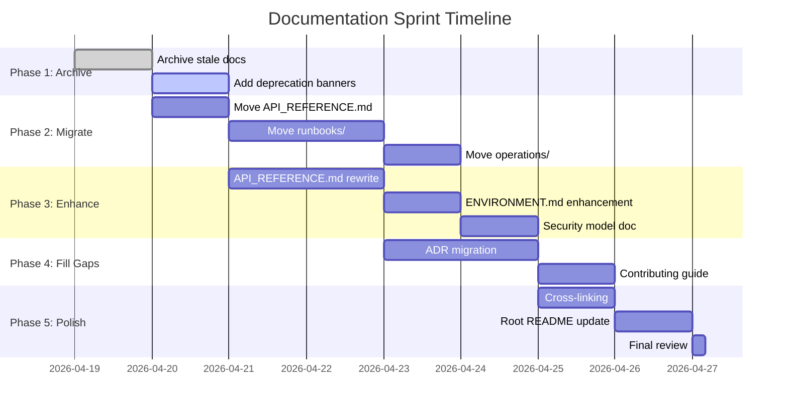

# Documentation Transformation - Next Steps Plan

> **Generated:** 2026-04-19  
> **Phase:** Execution  
> **Timeline:** 7-day sprint (2026-04-19 → 2026-04-26)

---

## Sprint Overview

This plan executes the remaining work to complete the documentation transformation from "best-in-class exemplars" to "complete best-in-class corpus."



---

## Phase 1: Complete Archival (Day 1-2)

### 1.1 Move Identified Files to Archive

**Files to move from repository root:**

| File | Destination | Action |
|------|-------------|--------|
| `LAYER2_GAP_ANALYSIS.md` | `docs/archive/2026-04-19/ARCHIVED_LAYER2_GAP_ANALYSIS.md` | Move |
| `Phase2_Readiness_Status.md` | `docs/archive/2026-04-19/ARCHIVED_Phase2_Readiness_Status.md` | Move |
| `HTTPX_FAST_PATH_PRODUCTION_SIGNOFF.md` | `docs/archive/2026-04-19/ARCHIVED_HTTPX_FAST_PATH_PRODUCTION_SIGNOFF.md` | Move |
| `MY_MODELS_PRODUCTION_SIGNOFF.md` | `docs/archive/2026-04-19/ARCHIVED_MY_MODELS_PRODUCTION_SIGNOFF.md` | Move |
| `MY_MODELS_PRODUCTION_READINESS.md` | `docs/archive/2026-04-19/ARCHIVED_MY_MODELS_PRODUCTION_READINESS.md` | Move |
| `TASK_42_IMPLEMENTATION_SUMMARY.md` | `docs/archive/2026-04-19/ARCHIVED_TASK_42_IMPLEMENTATION_SUMMARY.md` | Move |
| `TASK_42_VERIFICATION_REPORT.md` | `docs/archive/2026-04-19/ARCHIVED_TASK_42_VERIFICATION_REPORT.md` | Move |
| `TIER1_BLOCKERS_IMPLEMENTATION_SPEC.md` | `docs/archive/2026-04-19/ARCHIVED_TIER1_BLOCKERS_IMPLEMENTATION_SPEC.md` | Move |
| `TIER1_BLOCKERS_IMPLEMENTATION_COMPLETE.md` | `docs/archive/2026-04-19/ARCHIVED_TIER1_BLOCKERS_IMPLEMENTATION_COMPLETE.md` | Move |
| `DEPLOYMENT_REALITY_REPORT.md` | `docs/archive/2026-04-19/ARCHIVED_DEPLOYMENT_REALITY_REPORT.md` | Move |

**Command:**
```bash
# For each file
git mv <filename> docs/archive/2026-04-19/ARCHIVED_<filename>
```

### 1.2 Add Deprecation Banners

Each archived file needs a banner inserted after the title:

```markdown
> ⚠️ **ARCHIVED CONTENT** (Date: 2026-04-19)  
> This document refers to deprecated functionality. For current guidance, see [Archive Registry](./archive-registry.md).
```

**Checklist:**
- [ ] 10 files have ARCHIVED_ prefix
- [ ] 10 files have deprecation banners
- [ ] 10 files are in `docs/archive/2026-04-19/`
- [ ] Archive registry updated with all 10 entries

---

## Phase 2: Migrate Existing Documentation (Days 2-5)

### 2.1 API Reference Migration

**Source:** `docs/API_REFERENCE.md` (18,472 bytes)  
**Target:** Split into layer-specific files

| New File | Content | Source Lines |
|----------|---------|--------------|
| `docs/reference/layer1-api.md` | Ingestion endpoints | ~150 |
| `docs/reference/layer2-api.md` | Extraction endpoints | ~100 |
| `docs/reference/layer3-api.md` | Knowledge graph endpoints | ~200 |
| `docs/reference/layer4-api.md` | Agent/workflow endpoints | ~150 |
| `docs/reference/authentication.md` | Auth patterns (consolidated) | ~74 |

**Enhancement requirements for each:**
- [ ] Add YAML frontmatter
- [ ] Add Mermaid diagram (endpoint flow)
- [ ] Verify all code snippets
- [ ] Add cross-links to other layers
- [ ] Add troubleshooting subsection

### 2.2 Runbooks Migration

**Source:** `docs/runbooks/` (38 files)  
**Target:** `docs/troubleshooting/runbooks/`

**Migration strategy:**
- Keep all 38 runbooks (they're actively maintained)
- Reorganize into subcategories:
  - `infrastructure/` — postgres-down, redis-down, etc.
  - `application/` — agent-workflow-stall, slow-queries, etc.
  - `incident/` — postmortem templates, escalation policies

**Enhancement per runbook:**
- [ ] Add YAML frontmatter
- [ ] Add decision flowchart (Mermaid)
- [ ] Add "When to use this runbook" section
- [ ] Link to monitoring alerts

### 2.3 Operations Documentation Migration

**Source:** `docs/operations/` (11 files)  
**Target:** `docs/how-to-guides/operations/`

| Source File | New Location | Enhancement |
|-------------|--------------|-------------|
| `COMMAND_REFERENCE.md` | `how-to-guides/operations/cli-reference.md` | Add examples |
| `VAULT_SETUP.md` | `how-to-guides/operations/vault-setup.md` | Add diagram |
| `SLOs.md` | `explanations/slo-framework.md` | Add rationale |
| `SECURITY_HARDENING.md` | `core-concepts/security-hardening.md` | Merge with security-model |
| `ALERTMANAGER.md` | `how-to-guides/operations/alerting-setup.md` | Add config examples |
| `escalation-policy-and-drills.md` | `troubleshooting/escalation-policy.md` | Add runbook links |

---

## Phase 3: Enhance Priority Documentation (Days 5-7)

### 3.1 P0: Security Model Document

**New file:** `docs/core-concepts/security-model.md`

**Required content:**
- Authentication flows (JWT, API key, OIDC)
- RBAC model (roles, permissions)
- Tenant isolation mechanisms
- Audit trail architecture
- Threat model diagram (Mermaid)

**Source material:**
- `docs/SECURITY.md`
- `docs/SECURITY_TRIAGE_RUBRIC.md`
- `docs/secrets-management.md`
- `value-fabric/shared/identity/` code

### 3.2 P1: Environment Setup Guide

**Enhance:** `docs/ENVIRONMENT.md` → `docs/getting-started/environment.md`

**Add:**
- Mermaid diagram of environment variables flow
- Table of all required vs optional variables
- Validation checklist
- Common misconfigurations

### 3.3 P1: Ontology System Guide

**New file:** `docs/core-concepts/ontology-system.md`

**Required content:**
- Entity taxonomy diagram
- Relationship types
- Extraction confidence model
- Ontology evolution guidelines

**Source material:**
- `docs/ontology_proposal/` (5 files)
- `value-fabric/layer2-extraction/src/models/ontology.py`

---

## Phase 4: Fill Structural Gaps (Days 7-8)

### 4.1 Architecture Decision Records

**Create:** `docs/explanations/adr/`

| ADR | Topic | Source |
|-----|-------|--------|
| `001-four-layer-architecture.md` | Why 4 layers? | Current docs |
| `002-neo4j-for-knowledge-graph.md` | Why Neo4j? | Architecture discussions |
| `003-postgresql-pgvector.md` | Why not dedicated vector DB? | Performance discussions |
| `004-langgraph-for-agents.md` | Why LangGraph? | Agent framework choice |
| `005-hybrid-retrieval.md` | Why GraphRAG pattern? | L3 design |

**Template for each:**
```markdown
---
title: "ADR-XXX: Title"
category: "explanation"
---

# ADR-XXX: [Title]

## Status
Accepted | Deprecated | Superseded by ADR-YYY

## Context
What is the issue we're deciding?

## Decision
What did we decide?

## Consequences
Positive and negative outcomes.
```

### 4.2 Contributing Guide

**Create:** `docs/contributing/guidelines.md`

**Sections:**
1. Code of Conduct
2. Development workflow
3. Pull request process
4. Documentation standards
5. Testing requirements
6. Commit message conventions

**Source material:**
- `CONTRIBUTING.md` (root)
- `.github/pull_request_template.md`
- AGENTS.md rules

---

## Phase 5: Cross-Cutting Polish (Day 9)

### 5.1 Cross-Link All Documents

**Requirement:** Every doc links to 2-3 related docs

**Link matrix to complete:**

| Document | Needs Links To |
|----------|----------------|
| quickstart.md | installation, architecture, troubleshooting |
| architecture.md | quickstart, security-model, ontology-system |
| api-overview.md | layer1-api, layer2-api, layer3-api, layer4-api |
| troubleshooting/index.md | All runbooks, FAQ |
| setup-local-dev.md | quickstart, contributing/guidelines |

### 5.2 Root README.md Update

**Update:** `README.md` documentation section

**Current:**
```markdown
| `docs/` | Architecture docs and runbooks |
```

**New:**
```markdown
## Documentation

- **[Quickstart](docs/getting-started/quickstart.md)** — Get running in 15 minutes
- **[Architecture](docs/core-concepts/architecture.md)** — System design and data flow
- **[API Reference](docs/reference/api-overview.md)** — Complete endpoint documentation
- **[Troubleshooting](docs/troubleshooting/index.md)** — Fix common issues
- **[Contributing](docs/contributing/guidelines.md)** — Development workflow

See [docs/README.md](docs/README.md) for complete documentation index.
```

---

## Success Criteria

### Completion Metrics

| Metric | Target | Verification |
|--------|--------|------------|
| Archived files moved | 10 | `ls docs/archive/2026-04-19/ \| wc -l` |
| Docs with YAML frontmatter | 100% of active docs | `grep -l "^---$" docs/**/*.md \| wc -l` |
| Docs with Mermaid diagrams | 80% | `grep -l "mermaid" docs/**/*.md \| wc -l` |
| Cross-links per doc | 2-3 | Manual spot check |
| Broken links | 0 | Link checker tool |
| Freshness < 30 days | 100% | Check `last-reviewed` dates |

### Quality Gates

- [ ] All P0 docs updated (quickstart, architecture, security-model)
- [ ] All archived docs have deprecation banners
- [ ] API reference complete for all 4 layers
- [ ] Troubleshooting index links to all runbooks
- [ ] Root README links to new docs structure
- [ ] `make verify-docs` passes (new target)

---

## Resource Requirements

### Time Estimates

| Phase | Days | Effort |
|-------|------|--------|
| 1: Archival | 2 | 8 hours |
| 2: Migration | 4 | 16 hours |
| 3: Enhancement | 3 | 12 hours |
| 4: Gap Fill | 2 | 8 hours |
| 5: Polish | 1 | 4 hours |
| **Total** | **12** | **48 hours** |

### Roles Needed

| Role | Responsibility | Time |
|------|---------------|------|
| Technical Writer | Content creation, editing | 24h |
| SME (Architecture) | Review architecture docs | 4h |
| SME (Security) | Review security docs | 2h |
| Developer | API doc accuracy, code snippets | 8h |
| DevOps | Operations docs validation | 4h |
| QA | Link checking, freshness audit | 6h |

---

## Risk Mitigation

| Risk | Likelihood | Impact | Mitigation |
|------|-----------|--------|------------|
| Links break during migration | High | Medium | Automated link checker, redirect file |
| Content outdated during rewrite | Medium | High | SME review at 50% and 100% |
| Team resists new structure | Low | High | Demo session, feedback period |
| Search engines lose indexing | Medium | Low | Redirects file, sitemap.xml |
| Docs become stale again | High | High | Freshness badges, quarterly review |

---

## Immediate Actions (Next 24 Hours)

### Today (2026-04-19)
- [ ] Execute file moves (10 archived docs)
- [ ] Add deprecation banners to all 10 files
- [ ] Update archive-registry.md with final entries
- [ ] Create redirect mappings file
- [ ] Commit archival changes

### Tomorrow (2026-04-20)
- [ ] Begin API_REFERENCE.md migration
- [ ] Set up link checker automation
- [ ] Create `make verify-docs` target
- [ ] Schedule SME review sessions

---

## Progress Tracking

Update this checklist as work progresses:

### Phase 1: Archive
- [ ] 10 files moved
- [ ] 10 banners added
- [ ] Registry updated
- [ ] Redirects file created

### Phase 2: Migrate
- [ ] API_REFERENCE.md split
- [ ] Runbooks reorganized
- [ ] Operations docs migrated
- [ ] All frontmatter added

### Phase 3: Enhance
- [ ] security-model.md written
- [ ] environment.md enhanced
- [ ] ontology-system.md written
- [ ] All diagrams added

### Phase 4: Fill Gaps
- [ ] 5 ADRs written
- [ ] contributing/guidelines.md written
- [ ] Code of Conduct linked

### Phase 5: Polish
- [ ] Cross-links verified
- [ ] Root README updated
- [ ] Link checker passes
- [ ] Final review complete

---

## Related Documents

- [Archive Registry](./archive/archive-registry.md) — Archived document tracking
- [Priority Update Log](./priority-update-log.md) — P0/P1/P2 status
- [Information Architecture](./README.md) — Documentation organization

---

*Plan Generated: 2026-04-19 | Next Review: 2026-04-20*
