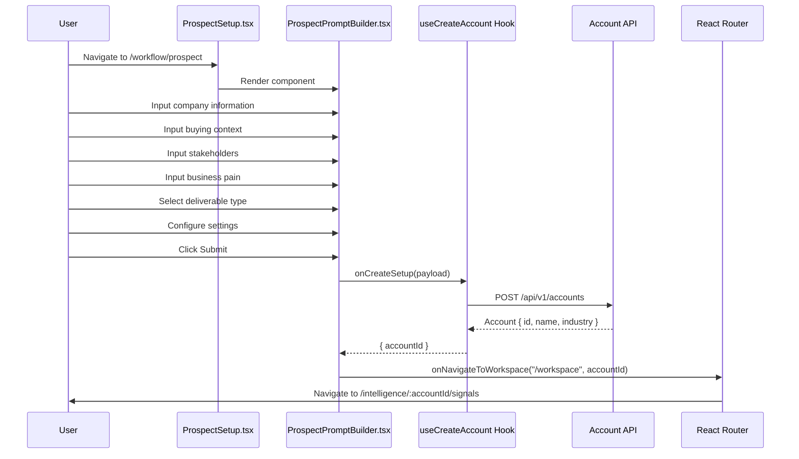
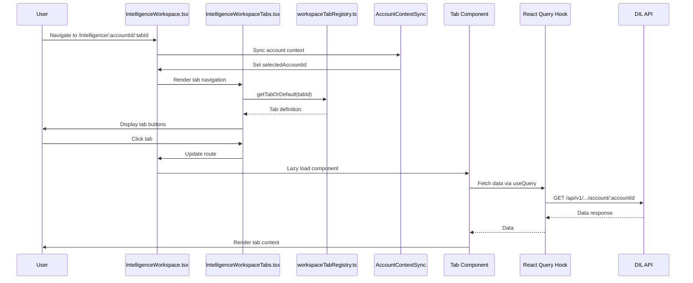
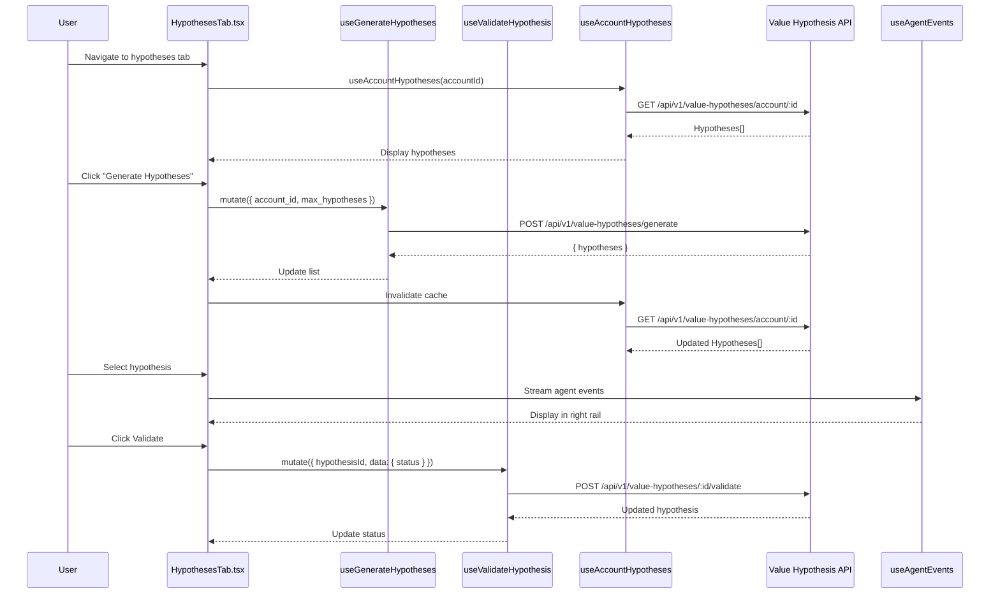
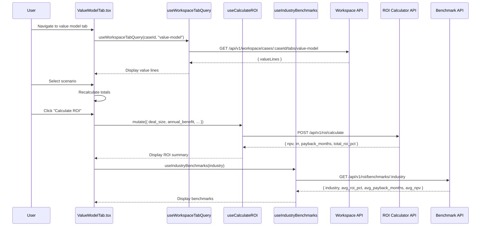

# Component Interaction Map

This document maps the relationships between frontend components, backend services, data stores, and API endpoints in the Value Fabric platform, focusing on the core user workflow from prospect input to value model building.

## Overview

The component interaction map shows how data flows through the system across the 6-layer architecture:

- **Layer 1**: Data Ingestion
- **Layer 2**: Extraction Pipeline
- **Layer 3**: Knowledge Graph & Semantic Layer
- **Layer 4**: Agentic Workflow Engine
- **Layer 5**: Ground Truth
- **Layer 6**: Benchmark Service

## Frontend Component Interactions

### Prospect Setup Flow



### Intelligence Workspace Flow



### Hypothesis Generation Flow



### Value Model Building Flow



## Backend Service Interactions

### Layer 4: Agentic Workflow Engine

**Port**: 8004  
**Primary Services**:

1. **Value Hypothesis Engine**
   - Generates AI-backed value hypotheses from account intelligence
   - Validates hypotheses with confidence scoring
   - Maps signals to products and capabilities

2. **Workspace Intelligence Service**
   - Orchestrates intelligence generation across tabs
   - Manages workspace case lifecycle
   - Coordinates agent workflows

**API Endpoints**:

```
POST /v1/value-hypotheses/generate
  Request: { account_id: string, max_hypotheses: number }
  Response: { hypotheses: ValueHypothesis[] }

GET /v1/value-hypotheses/account/:id
  Response: { hypotheses: ValueHypothesis[] }

POST /v1/value-hypotheses/:id/validate
  Request: { status: "validated" | "rejected" | "converted", validation_notes?: string }
  Response: { id: string, status: string, updated_at: string }

POST /v1/workspace/cases/:caseId/intelligence
  Request: { tab_id: string, options: GenerationOptions }
  Response: { case_id: string, status: "generating" | "complete" }
```

**Dependencies**:
- Layer 3 Knowledge Graph (Neo4j) for product and signal data
- Layer 2 Extraction Pipeline for account enrichment
- PostgreSQL for hypothesis persistence

### Data Intelligence Layer (DIL)

**Services**:

1. **ROI Calculator Service** (Layer 3)
   - Calculates NPV, IRR, payback period
   - Provides scenario analysis
   - Benchmarks against industry data

2. **Value Hypothesis Engine** (Layer 4)
   - (See Layer 4 above)

3. **Evidence Library Service** (Layer 3)
   - Manages evidence points
   - Links evidence to hypotheses and drivers
   - Provides evidence for value claims

**API Endpoints**:

```
POST /api/v1/roi/calculate
  Request: {
    deal_size: number,
    annual_benefit: number,
    implementation_cost: number,
    discount_rate: number,
    time_horizon_years: number,
    account_id?: string
  }
  Response: {
    npv: number,
    irr: number,
    payback_months: number,
    total_roi_pct: number,
    scenario_results: ScenarioResult[]
  }

GET /api/v1/roi/benchmarks/:industry
  Response: {
    industry: string,
    sample_size: number,
    avg_roi_pct: number,
    avg_payback_months: number,
    avg_npv: number
  }

GET /api/v1/roi/templates
  Response: { templates: ROITemplate[] }

GET /api/v1/evidence
  Response: { evidence: Evidence[] }

GET /api/v1/evidence/by-product/:productId
  Response: { evidence: Evidence[] }
```

**Dependencies**:
- Layer 6 Benchmark Service for industry data
- Layer 5 Ground Truth for validated ROI calculations
- PostgreSQL for evidence and ROI calculation storage

### Layer 3: Knowledge Graph

**Port**: 8003  
**Primary Graphs**:

1. **Product Portfolio Graph**
   - Products and capabilities
   - Signal-to-product mappings
   - Value driver relationships

2. **Evidence Library Graph**
   - Evidence nodes
   - Product-evidence relationships
   - Industry-evidence relationships

**API Endpoints**:

```
GET /api/v1/products
  Response: { products: Product[] }

POST /api/v1/products/match-signals
  Request: { signals: string[] }
  Response: { matches: ProductMatch[] }

GET /api/v1/capabilities
  Response: { capabilities: Capability[] }

GET /api/v1/value-drivers
  Response: { drivers: ValueDriver[] }

GET /api/v1/evidence
  Response: { evidence: Evidence[] }

GET /api/v1/evidence/by-product/:productId
  Response: { evidence: Evidence[] }
```

**Dependencies**:
- Neo4j graph database
- Layer 2 Extraction Pipeline for signal extraction

## Data Store Interactions

### PostgreSQL Schema

**Tables**:

```sql
-- Accounts (Layer 1, 2, 4, 5, 6)
CREATE TABLE accounts (
  id UUID PRIMARY KEY,
  name VARCHAR(255) NOT NULL,
  domain VARCHAR(255),
  industry VARCHAR(100),
  stage VARCHAR(50),
  annual_revenue DECIMAL,
  enrichment_input TEXT,
  created_at TIMESTAMP,
  updated_at TIMESTAMP
);

-- Workspace Cases (Layer 4)
CREATE TABLE workspace_cases (
  id UUID PRIMARY KEY,
  account_id UUID REFERENCES accounts(id),
  name VARCHAR(255),
  status VARCHAR(50),
  created_at TIMESTAMP,
  updated_at TIMESTAMP
);

-- Value Hypotheses (Layer 4)
CREATE TABLE value_hypotheses (
  id UUID PRIMARY KEY,
  account_id UUID REFERENCES accounts(id),
  value_driver VARCHAR(255),
  hypothesis_text TEXT,
  confidence DECIMAL(3, 2),
  product_id VARCHAR(100),
  status VARCHAR(50),
  signal_ids TEXT[],
  evidence_ids TEXT[],
  validation_notes TEXT,
  created_at TIMESTAMP,
  updated_at TIMESTAMP
);

-- ROI Calculations (Layer 3, 5)
CREATE TABLE roi_calculations (
  id UUID PRIMARY KEY,
  account_id UUID REFERENCES accounts(id),
  case_id UUID REFERENCES workspace_cases(id),
  deal_size DECIMAL,
  annual_benefit DECIMAL,
  implementation_cost DECIMAL,
  discount_rate DECIMAL,
  time_horizon_years INTEGER,
  npv DECIMAL,
  irr DECIMAL,
  payback_months INTEGER,
  total_roi_pct DECIMAL,
  scenario VARCHAR(50),
  created_at TIMESTAMP
);

-- Workspace Tab Data (Layer 4)
CREATE TABLE workspace_tab_data (
  id UUID PRIMARY KEY,
  case_id UUID REFERENCES workspace_cases(id),
  tab_id VARCHAR(50),
  data JSONB,
  created_at TIMESTAMP,
  updated_at TIMESTAMP
);
```

**Row-Level Security (RLS)**:
- All tables enforce tenant isolation via RLS policies
- `tenant_id` column implicitly filtered by application context
- Users can only access data from their tenant

### Neo4j Graph Schema

**Node Types**:

```cypher
// Product nodes
(:Product {
  id: string,
  name: string,
  category: string,
  description: string
})

// Capability nodes
(:Capability {
  id: string,
  name: string,
  category: string
})

// Signal nodes
(:Signal {
  id: string,
  text: string,
  category: string,
  source: string
})

// Value Driver nodes
(:ValueDriver {
  id: string,
  name: string,
  category: string,
  description: string
})

// Evidence nodes
(:Evidence {
  id: string,
  text: string,
  source: string,
  industry: string,
  year: integer
})

// Industry nodes
(:Industry {
  name: string,
  sector: string
})
```

**Relationship Types**:

```cypher
(:Product)-[:HAS_CAPABILITY]->(:Capability)
(:Product)-[:ENABLES]->(:ValueDriver)
(:Signal)-[:TRIGGERS]->(:ValueDriver)
(:Product)-[:SUPPORTED_BY]->(:Evidence)
(:ValueDriver)-[:CONTRIBUTES_TO]->(:Product)
(:Evidence)-[:APPLIES_TO]->(:Industry)
(:Capability)-[:ADDRESSES]->(:Signal)
```

**Indexes**:

```cypher
CREATE INDEX product_id FOR (p:Product) ON (p.id);
CREATE INDEX signal_text FOR (s:Signal) ON (s.text);
CREATE INDEX value_driver_name FOR (v:ValueDriver) ON (v.name);
CREATE INDEX evidence_industry FOR (e:Evidence) ON (e.industry);
```

## Data Flow Summary

### Prospect Input → Account Creation

```
User Input (ProspectPromptBuilder)
  → ProspectSetupPromptPayload
  → useCreateAccount hook
  → POST /api/v1/accounts
  → PostgreSQL accounts table
  → Account { id, name, industry, stage }
  → accountId
  → Router navigation
  → /intelligence/:accountId/signals
```

### Account → Intelligence Generation

```
Account ID
  → AccountContextSync
  → IntelligenceWorkspace
  → Tab selection
  → workspaceTabRegistry
  → Lazy load tab component
  → React Query hook
  → DIL API call
  → Layer 4/3 service
  → PostgreSQL / Neo4j query
  → Data response
  → Tab render
```

### Hypothesis Generation

```
Generate button click
  → useGenerateHypotheses hook
  → POST /api/v1/value-hypotheses/generate
  → Layer 4 Value Hypothesis Engine
  → Neo4j: Query signals, products, value drivers
  → LLM: Generate hypotheses
  → Confidence scoring
  → Signal→product mapping
  → PostgreSQL: Insert value_hypotheses
  → Response: { hypotheses }
  → React Query cache invalidation
  → HypothesesTab re-render
```

### Value Model Building

```
Value lines from workspace
  → useWorkspaceTabQuery hook
  → GET /api/v1/workspace/cases/:caseId/tabs/value-model
  → PostgreSQL workspace_tab_data
  → ValueModelTab render
  → Calculate ROI button
  → useCalculateROI hook
  → POST /api/v1/roi/calculate
  → Layer 3 ROI Calculator Service
  → Financial calculations
  → PostgreSQL: Insert roi_calculations
  → Response: { npv, irr, payback_months, total_roi_pct }
  → ROI summary card render
  → Industry from account
  → useIndustryBenchmarks hook
  → GET /api/v1/roi/benchmarks/:industry
  → Layer 6 Benchmark Service
  → Industry data
  → Benchmark card render
```

## Timing and Dependencies

### Critical Path Timing

1. **Prospect Input**: 2-5 minutes
   - User input: 1-3 minutes
   - Account creation: <1 second
   - Navigation: <1 second

2. **Intelligence Generation**: 1-3 minutes per tab
   - Signals: <30 seconds
   - Enrichment: 30-60 seconds
   - Stakeholders: 30-60 seconds

3. **Hypothesis Generation**: 30-90 seconds
   - API call: 20-60 seconds
   - LLM generation: 10-30 seconds
   - Database write: <1 second

4. **Value Model Building**: 10-30 seconds
   - Value lines load: <5 seconds
   - ROI calculation: 5-15 seconds
   - Benchmark fetch: <5 seconds

### Dependency Chain

```
Prospect Input
  ↓ (requires)
Account Creation
  ↓ (requires)
Account ID
  ↓ (requires)
Intelligence Workspace
  ↓ (requires)
Enrichment Data
  ↓ (requires)
Signals Detection
  ↓ (requires)
Hypothesis Generation
  ↓ (requires)
Validated Hypotheses
  ↓ (requires)
Value Lines
  ↓ (requires)
ROI Calculation
  ↓ (requires)
Industry Benchmarks
  ↓ (optional)
Value Model Complete
```

### Parallel Operations

The following operations can run in parallel:

- Multiple tab data fetching (Signals, Enrichment, Stakeholders)
- Hypothesis generation for multiple accounts
- ROI calculation with different scenarios
- Benchmark fetching for multiple industries

## Error Handling

### Frontend Error Handling

**Prospect Setup**:
- Network errors: Retry with exponential backoff
- Validation errors: Display inline error messages
- Account creation failure: Show error toast with retry option

**Intelligence Workspace**:
- Tab load failure: Show error state with retry
- Data fetch timeout: Show loading state with timeout message
- Agent event stream failure: Fallback to static content

**Hypotheses Tab**:
- Generation failure: Show error with "Retry" button
- Validation failure: Show error with "Retry" button
- Cache stale: Auto-invalidate and refetch

**Value Model Tab**:
- Value lines load failure: Show error state
- ROI calculation failure: Show error with "Recalculate" button
- Benchmark fetch failure: Show "Benchmarks unavailable" message

### Backend Error Handling

**Layer 4 API**:
- 400 Bad Request: Return validation error details
- 404 Not Found: Return resource not found error
- 429 Rate Limit: Return retry-after header
- 500 Internal Error: Log error, return generic error message

**DIL API**:
- Invalid input: Return 400 with field-level errors
- Service unavailable: Return 503 with retry-after
- Calculation timeout: Return 408 with partial results

**Database Errors**:
- Connection failure: Retry with circuit breaker
- Query timeout: Return 504 with query hint
- Constraint violation: Return 409 with conflict details

## Related Documentation

- [Core User Workflow](../workflows/core-user-workflow.md)
- [Data Intelligence Layer Architecture](../../value-fabric/docs/data-intelligence-layer.md)
- [System Architecture Overview](system-overview.md)
- [API Reference](../API_REFERENCE.md)
