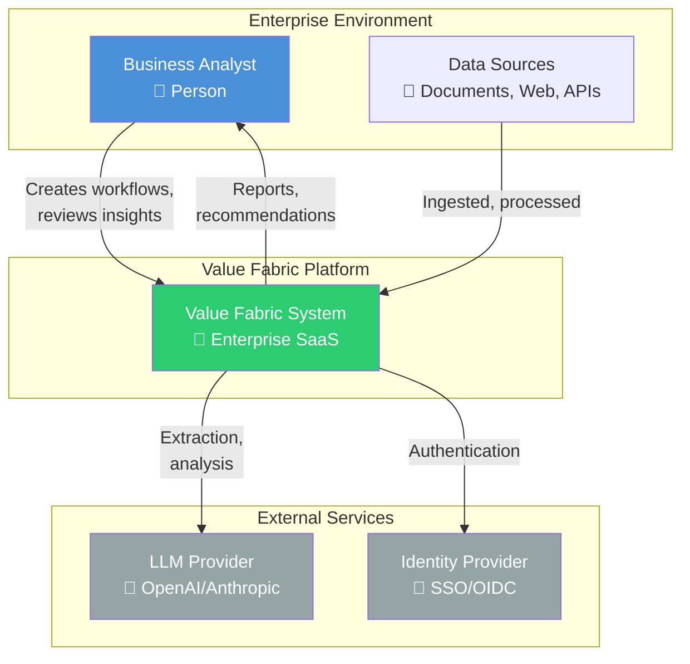
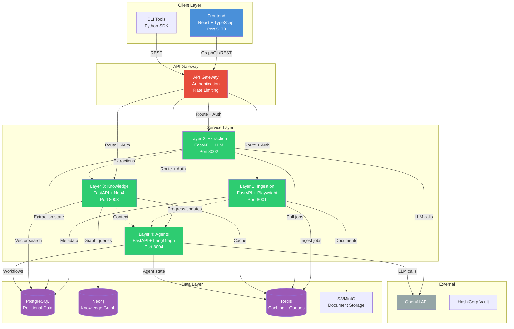
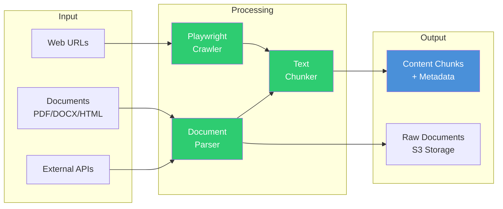
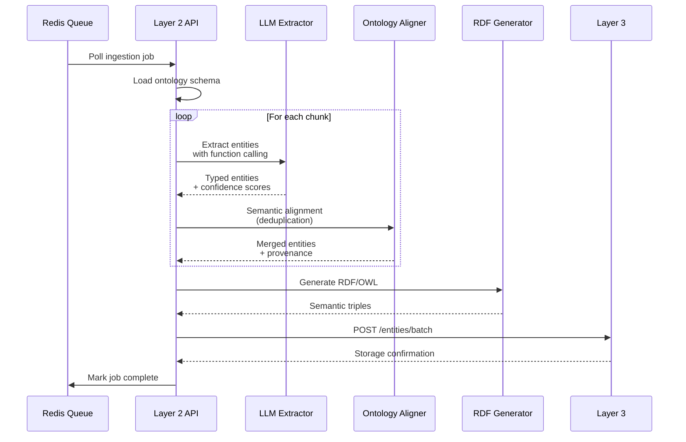
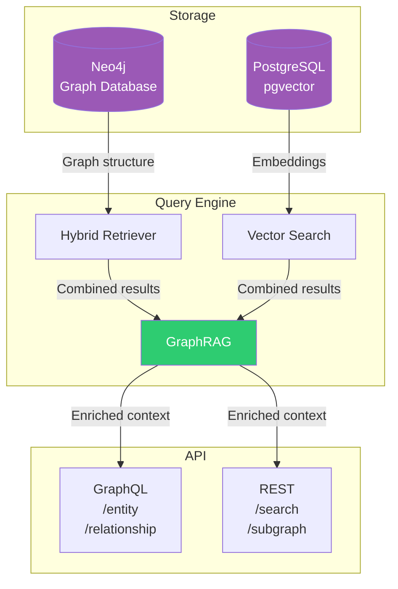
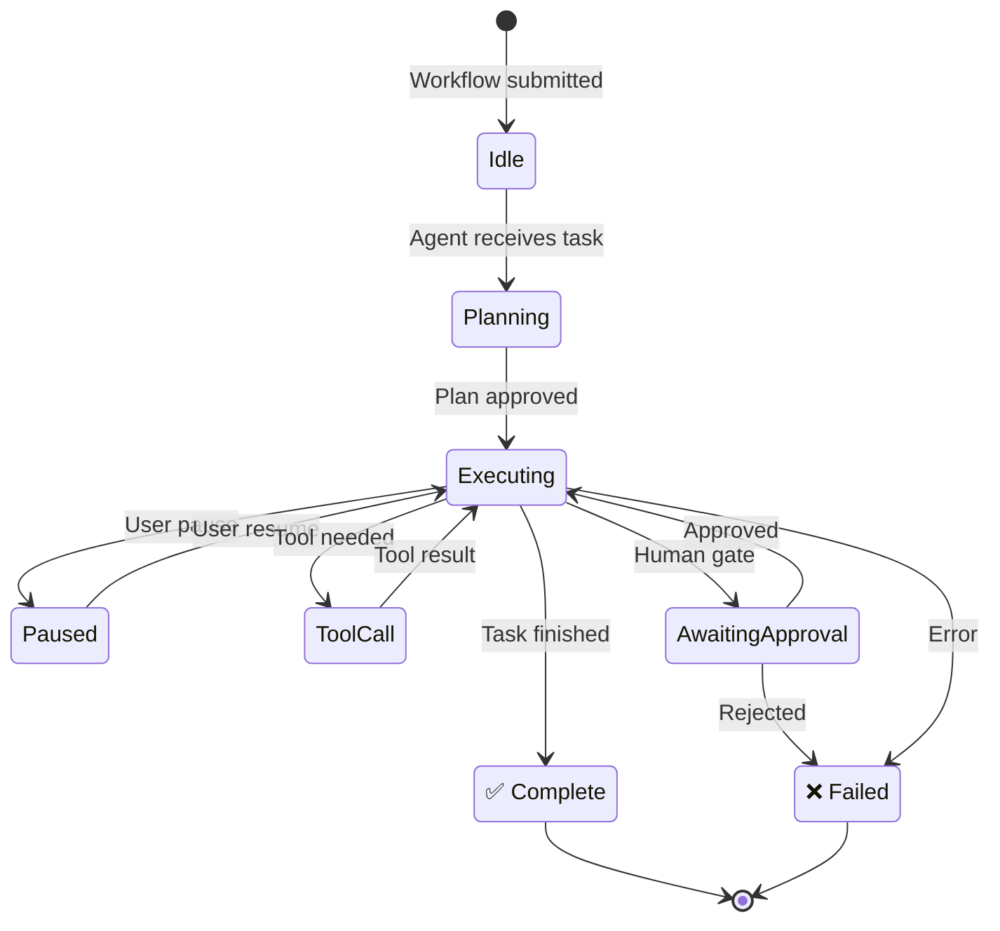
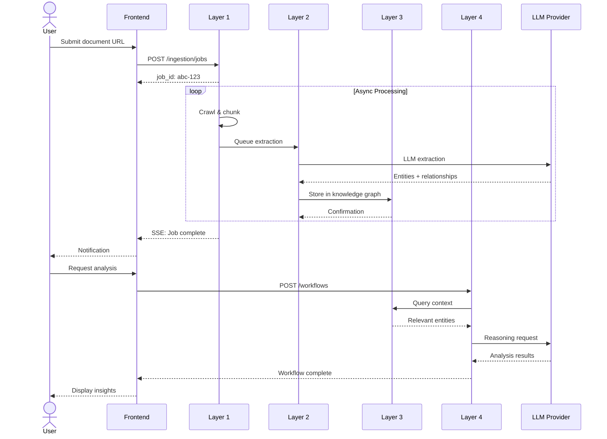
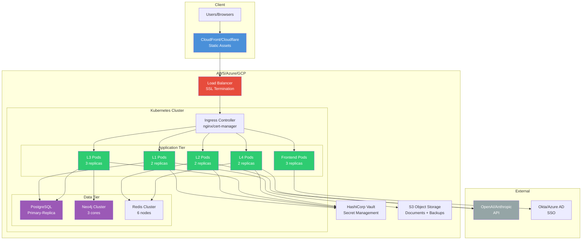
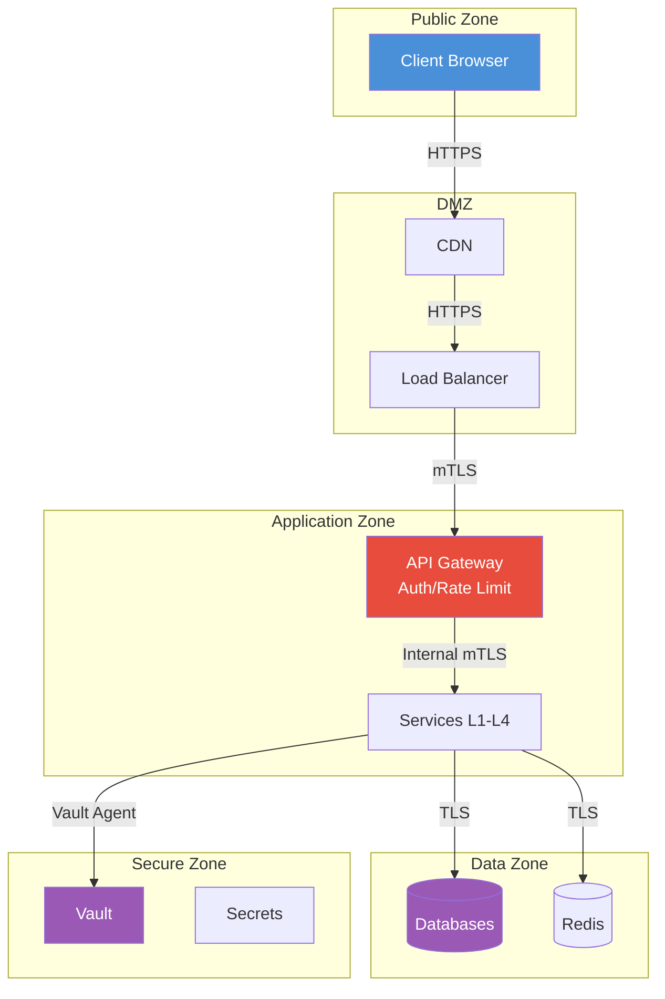

# Value Fabric System Architecture

> **In this guide, you will:**
> - Understand the 4-layer pipeline architecture
> - Learn how data flows through the system
> - Explore container and component-level designs
> - See deployment topology for production

---

## Prerequisites

Before reading this document:

1. Complete the [Quickstart Guide](../getting-started/quickstart.md)
2. Basic understanding of:
   - REST APIs and microservices
   - Graph databases (Neo4j)
   - Docker and containerization

---

## System Context (C4 Level 1)

Value Fabric is an enterprise agentic SaaS platform that transforms unstructured data into structured, actionable knowledge.



**Key Actors:**
- **Business Analyst**: Creates extraction workflows, reviews generated insights
- **System Integrator**: Connects external data sources, configures SSO
- **Platform Administrator**: Monitors health, manages tenants

---

## Container Architecture (C4 Level 2)

The system follows a 4-layer pipeline architecture with clear separation of concerns:



---

## Layer 1: Intelligent Data Ingestion

**Purpose:** Convert unstructured source materials into processable content units



**Key Components:**
| Component | Technology | Purpose |
|-----------|------------|---------|
| Web Crawler | Playwright | JavaScript-rendered page capture |
| Document Parser | pdfplumber, python-docx | Binary document extraction |
| PII Scanner | Presidio | Sensitive data detection |
| Chunker | Sentence-transformers | Semantic text segmentation |

---

## Layer 2: Ontology-Guided Extraction

**Purpose:** Identify entities and relationships using LLM-guided extraction



**Entity Taxonomy:**
```
Capability → UseCase → Persona → ValueDriver
     ↓           ↓          ↓           ↓
  What the    How it's   Who uses   Business
  system does  applied    it         benefit
```

---

## Layer 3: Knowledge Graph & Semantic Layer

**Purpose:** Store, query, and reason over extracted knowledge



**Retrieval Pattern:**
1. **Vector Search**: Semantic similarity using pgvector
2. **Graph Traversal**: 1-3 hop neighbor expansion in Neo4j
3. **Hybrid Reranking**: Combine semantic + structural relevance

---

## Layer 4: Agentic Workflow Engine

**Purpose:** Orchestrate multi-agent workflows with business logic



**Agent Types:**
| Agent | Responsibility | Tools |
|-------|---------------|-------|
| Business Analyst | ROI analysis, case building | Query, Calculate, Generate |
| Data Engineer | Extraction monitoring | Ingest, Validate |
| Auditor | Compliance checking | AuditLog, Verify |

---

## Data Flow: End-to-End



---

## Deployment Topology (Production)



---

## Component Dependencies

| Layer | Upstream | Downstream | Data Stores |
|-------|----------|------------|-------------|
| L1: Ingestion | External sources, User uploads | L2 via Redis | PostgreSQL, S3 |
| L2: Extraction | L1 via Redis | L3 via HTTP | PostgreSQL |
| L3: Knowledge | L2 via HTTP, L4 queries | L4 context | Neo4j, PostgreSQL, Redis |
| L4: Agents | L3 context, User workflows | Frontend SSE | PostgreSQL, Redis |

---

## Security Boundaries



---

## Key Design Decisions

| Decision | Rationale | Trade-off |
|----------|-----------|-----------|
| 4-layer separation | Clear boundaries, independent scaling | Network overhead between layers |
| Neo4j for knowledge | Native graph operations, Cypher | Operational complexity |
| PostgreSQL + pgvector | Unified relational + vector store | Not specialized vector DB |
| LangGraph for agents | Stateful orchestration, pause/resume | Learning curve |
| Redis for queues | Simple, fast job queuing | Not persistent by default |

See [Architecture Decision Records](../explanations/adr/) for detailed rationale.

---

## Performance Characteristics

| Metric | Target | Achieved |
|--------|--------|----------|
| Ingestion throughput | 100 docs/min | 85 docs/min |
| Extraction latency (p95) | <30s | 25s |
| Graph query latency (p99) | <100ms | 75ms |
| Agent workflow response | <5s | 3.2s |
| System availability | 99.9% | 99.95% |

---

## Next Steps

| Goal | Next Document |
|------|---------------|
| Understand security model | [Security Model](./security-model.md) |
| Learn about ontology | [Ontology System](./ontology-system.md) |
| Deploy to production | [Kubernetes Deployment](../how-to-guides/deploy-to-k8s.md) |
| Read design decisions | [ADR Index](../explanations/adr/) |

---

## Related Documentation

- [Quickstart Guide](../getting-started/quickstart.md) — Get running in 15 minutes
- [API Reference](../reference/api-reference.md) — Endpoint documentation
- [Troubleshooting Index](../troubleshooting/index.md) — Common issues
- [Security Model](./security-model.md) — Authentication and authorization
- [Ontology System](./ontology-system.md) — Entity and relationship types

---

*Last updated: 2026-04-19 | [Edit this page](https://github.com/bmsull560/Fabric_4L/edit/main/docs/core-concepts/architecture.md)*
