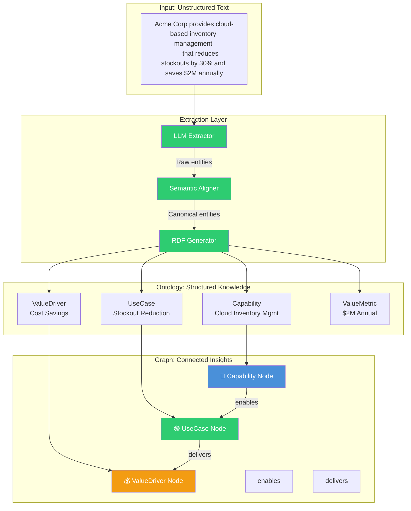
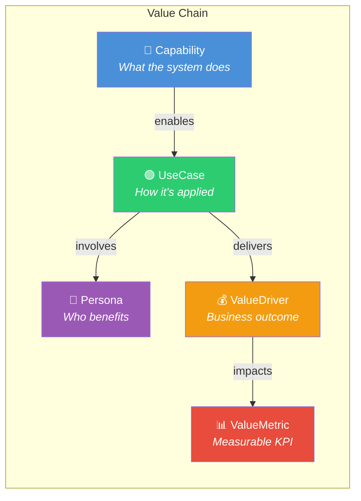
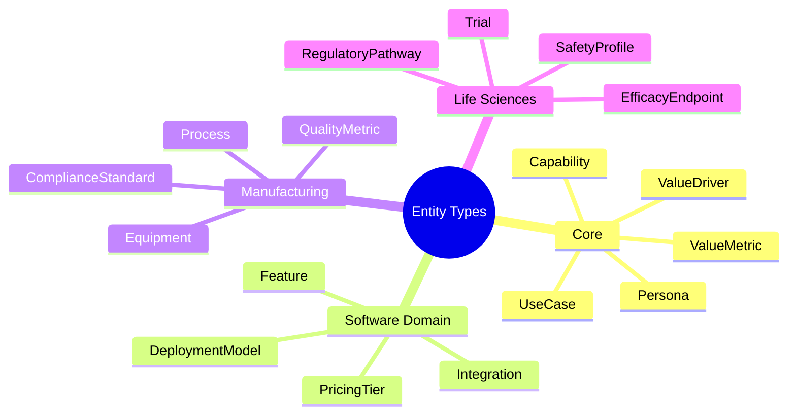
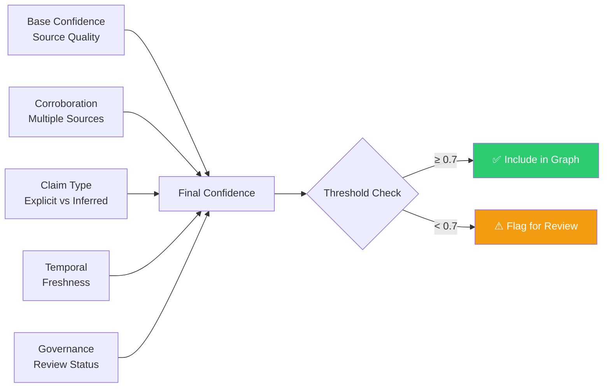
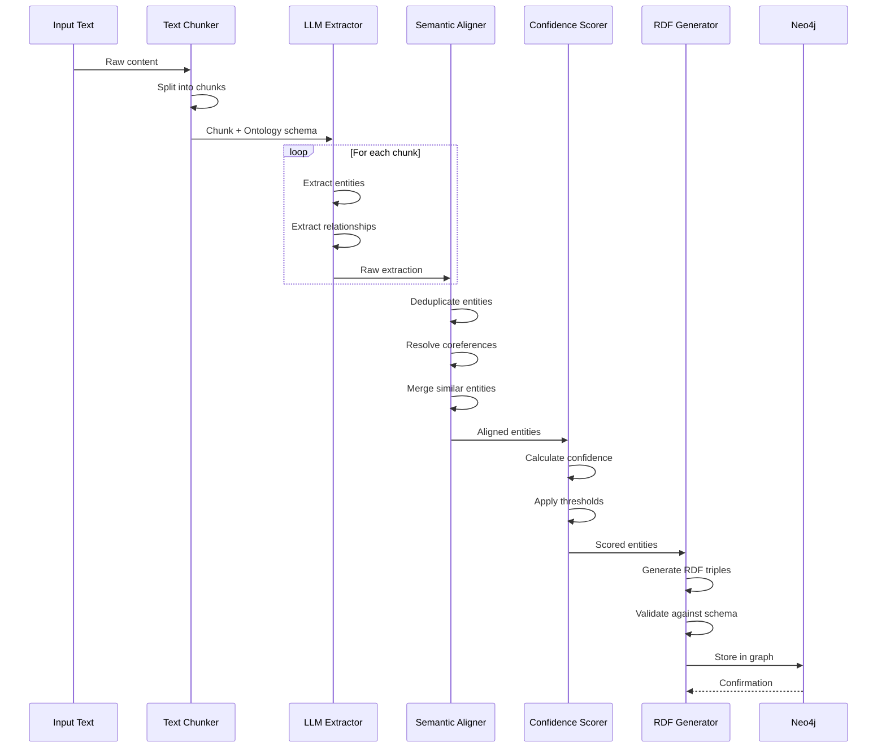

# Value Fabric Ontology System

> **In this guide, you will:**
> - Understand the entity taxonomy and relationships
> - Learn how extraction maps text to structured knowledge
> - Explore confidence scoring and provenance tracking
> - See how to extend the ontology for custom domains

---

## Prerequisites

Before reading this document:

1. Complete the [Quickstart Guide](../getting-started/quickstart.md)
2. Review the [Architecture Overview](./architecture.md)
3. Basic understanding of graph databases and entity extraction

---

## Ontology Overview

The Value Fabric ontology defines a canonical schema for representing business value. It serves as the bridge between unstructured text and structured knowledge.



---

## Entity Taxonomy

### Core Business Ontology

The foundation of Value Fabric's knowledge representation:



| Entity Type | Description | Example | Properties |
|-------------|-------------|---------|------------|
| **Capability** | Technical ability of the system | "Real-time inventory tracking" | category, maturity, technology |
| **UseCase** | Business scenario where capability is applied | "Reduce stockouts in retail" | industry, department, process |
| **Persona** | Role that benefits from the use case | "Supply Chain Manager" | seniority, department, goals |
| **ValueDriver** | Business outcome or benefit | "Cost reduction" | impact_type, timeframe |
| **ValueMetric** | Measurable KPI | "$2M annual savings" | unit, baseline, target |

### Extended Entity Types

Domain-specific extensions via Value Packs:



---

## Relationship Schema

### Core Relationships

| Relationship | Domain | Range | Cardinality | Description |
|--------------|--------|-------|-------------|-------------|
| `enables` | Capability | UseCase | 1:N | Technical foundation for business application |
| `delivers` | UseCase | ValueDriver | 1:N | Business outcome from execution |
| `involves` | UseCase | Persona | N:M | Stakeholders participating |
| `impacts` | ValueDriver | ValueMetric | 1:N | Measurable KPI affected |
| `implements` | Feature | Capability | 1:1 | Product feature realizing capability |
| `targets` | Solution | Industry | N:M | Market focus |
| `requires` | UseCase | Capability | N:M | Dependencies |
| `measures` | ValueMetric | Process | 1:1 | What is being measured |

### Relationship Examples

```cypher
// Neo4j Cypher representation
CREATE (c:Capability {
  id: "cap-001",
  canonicalName: "Cloud Inventory Management",
  confidence: 0.92
})

CREATE (u:UseCase {
  id: "uc-001",
  canonicalName: "Stockout Reduction",
  confidence: 0.88
})

CREATE (c)-[:ENABLES {
  confidence: 0.85,
  provenance: "extraction-001"
}]->(u)
```

---

## Confidence Scoring

### Confidence Model

Every extracted entity includes a confidence score (0.0 - 1.0):



### Confidence Factors

| Factor | Weight | Description |
|--------|--------|-------------|
| **Base Weight** | 0.4 | Source page authority (homepage vs blog) |
| **Corroboration** | +0.15 | Multiple sources confirm same entity |
| **Claim Type** | 0.1-0.2 | Explicit metric (1.0) vs inferred (0.6) |
| **Temporal** | -0.0 to -0.15 | Content age penalty |
| **Governance** | ±0.1 | Human review approval/rejection |

### Confidence Thresholds

| Threshold | Action | Use Case |
|-----------|--------|----------|
| ≥ 0.90 | Auto-accept | High-confidence metrics from official sources |
| 0.70 - 0.89 | Accept with review | Standard extraction results |
| 0.50 - 0.69 | Flag for review | Lower confidence, needs verification |
| < 0.50 | Reject | Likely hallucination or noise |

---

## Provenance Tracking

### Provenance Chain

Every entity maintains complete lineage:

```json
{
  "provenance": {
    "origin_url": "https://acme.com/solutions/inventory",
    "extraction_timestamp": "2025-01-01T00:00:00Z",
    "extractor_version": "l2-extractor-v2.3.1",
    "llm_model": "gpt-4-turbo",
    "llm_prompt_version": "ontology-v1.2",
    "source_type": "WEBSITE_EXTRACTED",
    "content_hash": "sha256:abc123...",
    "chunk_index": 3,
    "total_chunks": 12,
    "human_reviewed": true,
    "review_date": "2025-01-02T00:00:00Z",
    "reviewer_id": "user-123"
  }
}
```

### Source Types

| Source | Trust Level | Use Case |
|--------|-------------|----------|
| `WEBSITE_EXTRACTED` | Medium | Primary vendor content |
| `CRM_IMPORT` | High | Customer-verified data |
| `USER_INPUT` | High | Expert manual entry |
| `INFERRED` | Low | AI-derived connections |
| `BENCHMARK` | High | Industry standard data |
| `ANALYST_REPORT` | High | Third-party validation |

---

## Extraction Pipeline

### From Text to Graph



### Extraction Configuration

```json
{
  "extraction_config": {
    "ontology_id": "value-fabric-core-v1.2",
    "entity_types": ["Capability", "UseCase", "ValueDriver"],
    "relationship_types": ["enables", "delivers"],
    "min_confidence": 0.7,
    "chunk_size": 2000,
    "chunk_overlap": 200,
    "extraction_model": "gpt-4-turbo",
    "enable_coreference_resolution": true,
    "enable_semantic_alignment": true
  }
}
```

---

## Extending the Ontology

### Custom Value Packs

Organizations can extend the ontology for their domain:

```json
{
  "value_pack": {
    "name": "Healthcare Provider Pack",
    "extends": "value-fabric-core-v1.2",
    "entity_types": [
      {
        "name": "ClinicalProcess",
        "extends": "UseCase",
        "properties": {
          "specialty": "string",
          "setting": ["inpatient", "outpatient", "emergency"]
        }
      },
      {
        "name": "OutcomeMeasure",
        "extends": "ValueMetric",
        "properties": {
          "metric_type": ["clinical", "operational", "financial"],
          "timeframe": "string"
        }
      }
    ],
    "relationships": [
      {
        "name": "improves",
        "domain": "ClinicalProcess",
        "range": "OutcomeMeasure"
      }
    ]
  }
}
```

### Ontology Versioning

| Version | Status | Changes |
|---------|--------|---------|
| v1.0 | Stable | Initial release |
| v1.1 | Stable | Added Persona entity |
| v1.2 | Current | Extended ValueMetric properties |
| v2.0 | Beta | Industry-specific packs |

---

## Querying the Ontology

### Graph Traversal Examples

```cypher
// Find capabilities that enable cost reduction
MATCH (c:Capability)-[:ENABLES]->(:UseCase)-[:DELIVERS]->(vd:ValueDriver)
WHERE vd.canonicalName CONTAINS "cost"
RETURN c.canonicalName, c.confidence
ORDER BY c.confidence DESC

// Find value paths for a specific persona
MATCH path = (c:Capability)-[:ENABLES*1..3]->(vd:ValueDriver)
MATCH (uc:UseCase)-[:INVOLVES]->(p:Persona)
WHERE p.canonicalName = "Supply Chain Manager"
RETURN path, reduce(total = 0, r in relationships(path) | total + r.confidence) as path_confidence

// Find corroborated entities
MATCH (e)
WHERE e.provenance.corroboration_count > 1
RETURN e.canonicalName, e.provenance.sources
```

### Hybrid Search

Combining semantic and graph search:

```python
from value_fabric import Client

client = Client(api_key="...", tenant_id="...")

# Hybrid search
results = client.knowledge.search_hybrid(
    query="reduce operational costs in manufacturing",
    options={
        "semantic_weight": 0.6,
        "graph_weight": 0.4,
        "include_paths": True
    }
)

# Results include both vector similarity and graph connections
for result in results:
    print(f"{result.entity.label}: {result.scores.combined:.2f}")
```

---

## Troubleshooting Extraction

### Low Confidence Issues

**Symptoms:** Extracted entities have confidence < 0.5

**Diagnostic Steps:**

```bash
# Check extraction logs
docker compose logs l2 | grep "extraction_id=..."

# Verify ontology loaded
curl http://localhost:8002/api/v1/ontologies \
  -H "Authorization: Bearer $TOKEN"

# Test with simpler input
curl -X POST http://localhost:8002/api/v1/extraction/extract \
  -H "Authorization: Bearer $TOKEN" \
  -d '{"content": "Simple clear text", "options": {"min_confidence": 0.5}}'
```

**Common Causes:**
- Input text too ambiguous
- Wrong ontology for domain
- LLM rate limiting affecting quality
- Missing context (single sentence vs paragraph)

### Missing Relationships

**Symptoms:** Entities extracted but not connected

**Solutions:**
- Increase chunk size for more context
- Enable relationship extraction in options
- Check relationship type whitelist
- Verify schema supports expected relationships

---

## Next Steps

- [Author Value Pack](../how-to-guides/author-value-pack.md) — Create custom ontologies
- [Layer 2 Extraction API](../reference/layer2-extraction-api.md) — API reference
- [Why Knowledge Graph](../explanations/why-knowledge-graph.md) — Design rationale
- [Extraction Quality](../troubleshooting/extraction-quality.md) — Debug issues

---

*Last updated: 2026-04-19 | [Edit this page](https://github.com/bmsull560/Fabric_4L/edit/main/docs/core-concepts/ontology-system.md)*
