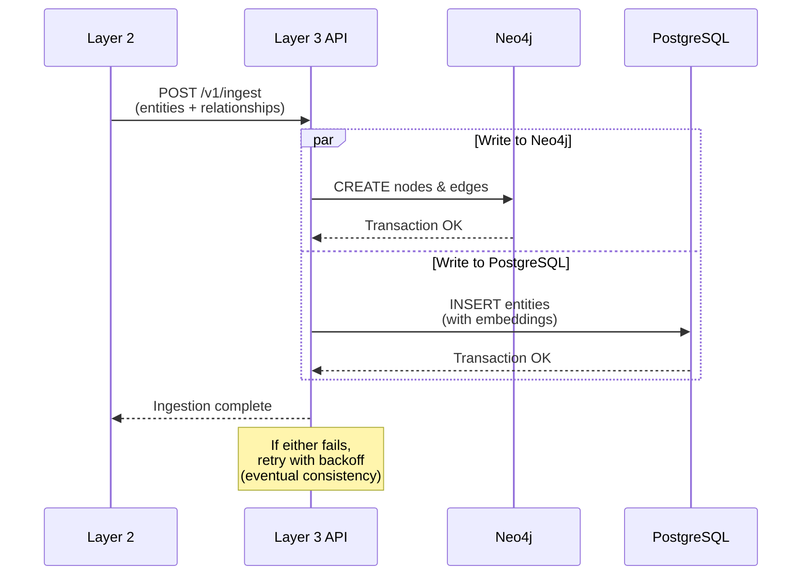

# ADR-002: Neo4j + pgvector Hybrid Graph Database

**Status:** ✅ Accepted

**Date:** 2025-02-01

**Deciders:** Data Team, Backend Leads

---

## Context

The Knowledge Graph (Layer 3) needs to support:
1. **Graph traversal queries** ("find all capabilities that enable use cases for supply chain")
2. **Semantic search** ("find entities similar to 'cost reduction' concept")
3. **Hybrid queries** (combine graph structure + semantic similarity)
4. **Value calculations** (aggregate metrics across graph paths)

Single-database solutions had clear trade-offs:

## Decision

We will use a **hybrid database architecture**:

```
┌─────────────────────────────────────────┐
│         Query Interface (GraphQL/REST) │
└─────────────────────────────────────────┘
                   │
                   ▼
┌─────────────────────────────────────────┐
│     Hybrid Query Engine (Layer 3 API)    │
│  ┌──────────────┐    ┌──────────────┐   │
│  │ Graph        │    │ Semantic     │   │
│  │ Traversal    │◄──►│ Vector       │   │
│  │ (Neo4j)      │    │ Search       │   │
│  └──────────────┘    └──────────────┘   │
│         │                   │           │
│         │   pgvector        │           │
│         │   extension       │           │
│         └─────────┬─────────┘           │
│                   │                     │
└───────────────────┼─────────────────────┘
                    │
         ┌──────────┴──────────┐
         ▼                     ▼
  ┌─────────────┐      ┌─────────────┐
  │ Neo4j       │      │ PostgreSQL  │
  │ (Graph      │      │ + pgvector  │
  │  structure) │      │ (Embeddings)│
  └─────────────┘      └─────────────┘
```

- **Neo4j**: Native graph storage, Cypher queries, relationship traversal
- **PostgreSQL + pgvector**: Entity metadata, embeddings, vector similarity search
- **Synchronization**: Entities written to both stores simultaneously via L3 API

## Consequences

### Positive
- ✅ **Best of both worlds**: Native graph operations + vector similarity
- ✅ **Proven technologies**: Both databases are production-ready
- ✅ **Flexible queries**: Can traverse relationships AND find semantically similar entities
- ✅ **Value calculations**: SQL aggregates work across graph paths via junction tables

### Negative
- ❌ **Data synchronization**: Must keep two stores in sync
- ❌ **Consistency complexity**: Write to Neo4j, then PostgreSQL (eventual consistency)
- ❌ **Operational overhead**: Two databases to backup, monitor, scale
- ❌ **Query complexity**: Hybrid queries require coordination layer

### Neutral
- 🔄 **Skill requirements**: Team needs Neo4j Cypher + PostgreSQL expertise
- 🔄 **Vendor relationships**: Two vendor contracts/support agreements

## Implementation Details

### Data Flow



### Query Patterns

| Query Type | Primary Store | Secondary Store | Example |
|------------|---------------|-----------------|---------|
| Graph traversal | Neo4j | — | `MATCH (c)-[:ENABLES]->(u)` |
| Semantic search | PostgreSQL | Neo4j (enrich) | `SELECT * ORDER BY embedding <-> query` |
| Hybrid | Both | Coordination | Find similar capabilities, then traverse |
| Value aggregation | PostgreSQL | Neo4j (path) | SUM metrics along graph paths |

### Consistency Strategy

- **Primary**: Neo4j (source of truth for graph structure)
- **Sync**: Asynchronous write to PostgreSQL
- **Recovery**: Nightly reconciliation job
- **Monitoring**: Lag metrics and mismatch alerts

## Alternatives Considered

### Single Neo4j (with vector plugin)
- **Pros:** Single database, native graph vectors
- **Cons:** Vector performance inferior to pgvector, lock-in to Neo4j ecosystem
- **Why rejected:** Benchmark showed 3x slower vector queries vs. pgvector

### Single PostgreSQL (Apache AGE extension)
- **Pros:** Single database, familiar SQL
- **Cons:** Graph queries are second-class, limited Cypher support
- **Why rejected:** Complex graph traversals required workarounds

### Dgraph (Native Graph)
- **Pros:** Designed for knowledge graphs, GraphQL+-, horizontal scaling
- **Cons:** Smaller community, newer technology, enterprise pricing
- **Why rejected:** Team expertise in Neo4j, Dgraph learning curve

### Weaviate / Pinecone (Vector-native)
- **Pros:** Purpose-built for vectors, excellent semantic search
- **Cons:** Poor graph traversal, requires external graph store anyway
- **Why rejected:** Would still need Neo4j for relationships, adding third store

## Related

- [Ontology System](../../core-concepts/ontology-system.md) — How entities map to both stores
- [Layer 3 API](../../reference/layer3-knowledge-api.md) — Hybrid query endpoints
- [Why Knowledge Graph](../why-knowledge-graph.md) — Problem we're solving

---

*Last updated: 2026-04-19 | Status: Accepted*
