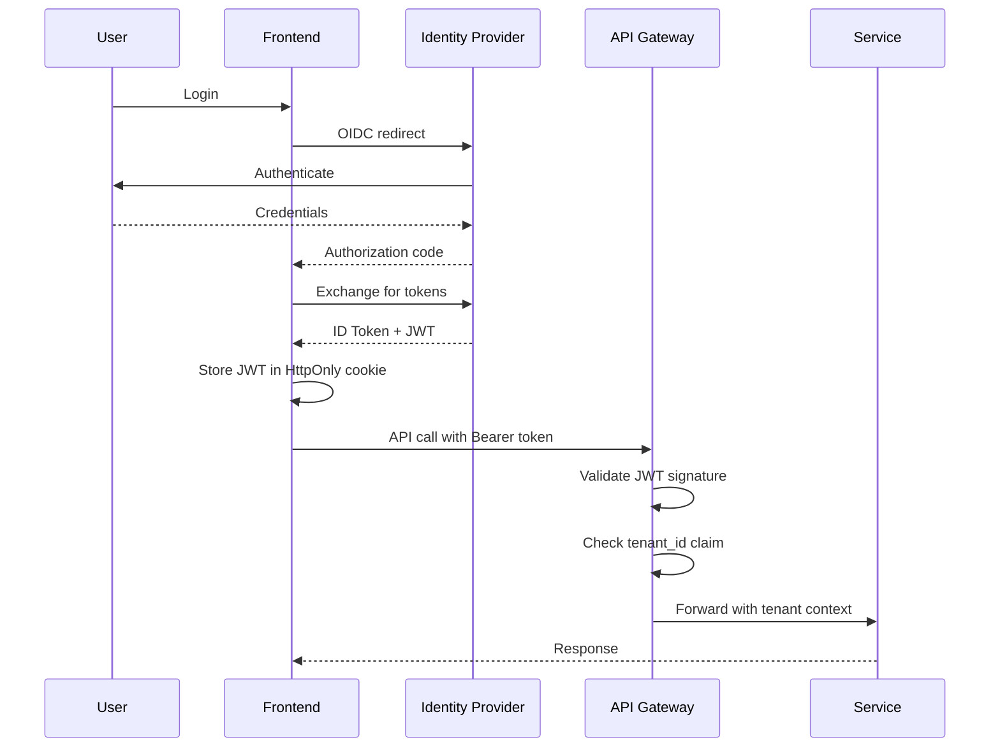

# ADR-003: JWT + API Key Authentication Strategy

**Status:** ✅ Accepted

**Date:** 2025-02-15

**Deciders:** Security Team, Platform Engineering

---

## Context

Value Fabric serves multiple user types:
1. **Interactive users** (analysts, admins) using the web UI
2. **Service integrations** (CRM webhooks, ETL pipelines)
3. **API consumers** (customer scripts, third-party tools)
4. **Internal services** (L1 calling L2, L2 calling L3)

We need an authentication strategy that:
- Supports SSO for enterprise customers (OIDC/SAML)
- Enables API access for automation
- Maintains tenant isolation
- Minimizes latency (no auth service calls per request)
- Allows revocation without session invalidation storms

## Decision

We will use a **dual authentication strategy**:

```
┌─────────────────────────────────────────────────────────┐
│                   Client Types                          │
├─────────────────────────────────────────────────────────┤
│  Web Browser ──► OIDC/SAML ──► JWT (short-lived)       │
│  CLI/Scripts ──► API Keys ──► HMAC validation          │
│  Services ──► mTLS + JWT (service account)             │
└─────────────────────────────────────────────────────────┘
                           │
                           ▼
              ┌──────────────────────────┐
              │    API Gateway           │
              │  - JWT validation        │
              │  - API key HMAC          │
              │  - Tenant isolation      │
              └──────────────────────────┘
```

### JWT for Interactive Sessions
- **Algorithm:** HS256 (symmetric, faster verification)
- **Lifetime:** 1 hour access token
- **Refresh:** Silent refresh via HttpOnly cookie
- **Claims:** `sub`, `tenant_id`, `roles`, `permissions`
- **Storage:** HttpOnly cookie (XSS protection)

### API Keys for Automation
- **Format:** `vf_live_<64-char-hex>` / `vf_test_<64-char-hex>`
- **Storage:** HMAC-SHA256 hash (not bcrypt, for throughput)
- **Validation:** Local HMAC computation (no external calls)
- **Metadata:** Rate limits, tenant scoping, expiration

## Consequences

### Positive
- ✅ **SSO integration:** OIDC/SAML flows work seamlessly with JWT
- ✅ **Performance:** No auth service round-trips (stateless validation)
- ✅ **Revocation:** API keys revoked by deleting hash from database
- ✅ **Flexibility:** Two patterns optimized for their use cases
- ✅ **Auditability:** Both methods emit identical audit events

### Negative
- ❌ **Key rotation:** API keys require manual rotation (90-day policy)
- ❌ **Secret management:** JWT secret must be synchronized across services
- ❌ **Token size:** JWTs are larger than opaque tokens (~500 bytes)
- ❌ **Compromise window:** 1-hour JWT lifetime if stolen

### Neutral
- 🔄 **Key generation:** Cryptographically secure random generation required
- 🔄 **Monitoring:** Separate metrics for JWT vs. API key usage

## Implementation

### JWT Flow



### API Key Flow

```python
# Validation logic (simplified)
def validate_api_key(api_key: str) -> TenantContext:
    # Parse prefix
    if not api_key.startswith(('vf_live_', 'vf_test_')):
        raise InvalidKeyError()
    
    # Hash the provided key
    provided_hash = hmac_sha256(api_key, pepper=HMAC_SECRET)
    
    # Lookup in database
    key_record = db.query(
        "SELECT tenant_id, permissions FROM api_keys WHERE key_hash = ?",
        provided_hash
    )
    
    if not key_record or key_record.revoked:
        raise InvalidKeyError()
    
    if key_record.expires_at < now():
        raise ExpiredKeyError()
    
    return TenantContext(
        tenant_id=key_record.tenant_id,
        permissions=key_record.permissions
    )
```

## Alternatives Considered

### OAuth 2.0 / OpenID Connect Only
- **Pros:** Industry standard, refresh tokens, broad library support
- **Cons:** Requires auth server, network dependency, higher latency
- **Why rejected:** API-to-API calls need lower latency than OAuth introspection

### Mutual TLS (mTLS) Everywhere
- **Pros:** Strong authentication, automatic via service mesh
- **Cons:** Certificate management complexity, harder for API consumers
- **Why rejected:** API consumers (customers) can't easily use mTLS

### Session Cookies (Server-side sessions)
- **Pros:** Immediate revocation, smaller payload
- **Cons:** Shared session store required, Redis dependency for auth
- **Why rejected:** Stateless JWTs simplify horizontal scaling

### API Gateway Token (Kong/AWS API Gateway)
- **Pros:** Vendor-managed, built-in features
- **Cons:** Vendor lock-in, harder to test locally
- **Why rejected:** Self-hosted for data sovereignty requirements

## Security Considerations

| Threat | Mitigation |
|--------|------------|
| JWT theft | Short lifetime (1h), HttpOnly cookies, TLS |
| API key leak | HMAC storage (not plaintext), rotation policy |
| Secret compromise | 180-day JWT secret rotation, separate per environment |
| Replay attacks | `jti` claim for token binding (future) |
| Cross-tenant access | `tenant_id` claim enforced at every layer |

## Related

- [Security Model](../../core-concepts/security-model.md) — Deep dive on implementation
- [Configure SSO](../../how-to-guides/configure-sso.md) — OIDC/SAML setup guide
- [Layer 4 Agents API](../../reference/layer4-agents-api.md) — Authentication examples

---

*Last updated: 2026-04-19 | Status: Accepted*
