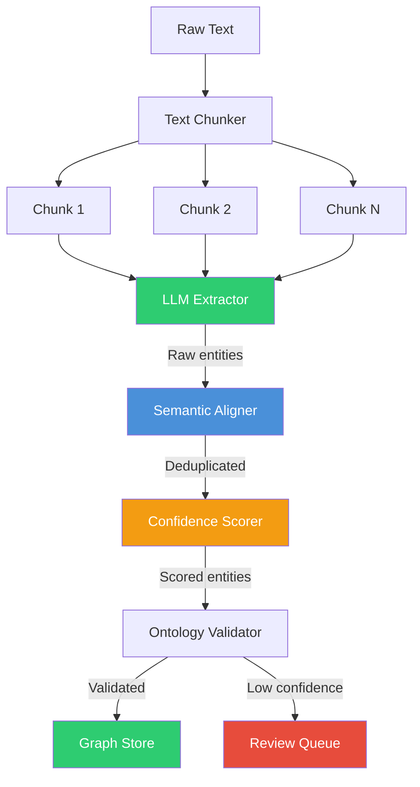

# ADR-004: Ontology-Guided LLM Extraction

**Status:** ✅ Accepted

**Date:** 2025-03-01

**Deciders:** ML Team, Data Engineering

---

## Context

Extracting structured business value from unstructured text (vendor websites, analyst reports) is the core of Value Fabric. We needed a strategy that:

1. **Produces consistent entity types** across different LLM calls
2. **Enables confidence scoring** for extracted entities
3. **Supports domain customization** (healthcare vs. manufacturing)
4. **Maintains provenance** (where did this entity come from?)
5. **Allows human oversight** (review low-confidence extractions)

Raw LLM extraction ("extract entities from this text") produces inconsistent results:
- Different entity names for same concept
- Inconsistent property schemas
- No confidence scores
- No relationship structure

## Decision

We will use **ontology-guided extraction** with structured LLM function calling:

```
┌─────────────────────────────────────────────────────────┐
│  Input: Raw Text (website, PDF, etc.)                    │
└─────────────────────────────────────────────────────────┘
                          │
                          ▼
┌─────────────────────────────────────────────────────────┐
│  Ontology Schema (JSON)                                  │
│  - Entity types with properties                         │
│  - Relationship definitions                             │
│  - Confidence requirements                              │
└─────────────────────────────────────────────────────────┘
                          │
                          ▼
┌─────────────────────────────────────────────────────────┐
│  LLM Function Calling                                    │
│  - System prompt: "You are an ontology extraction agent"│
│  - Function schema: Typed extraction parameters         │
│  - Output: Structured JSON matching ontology            │
└─────────────────────────────────────────────────────────┘
                          │
                          ▼
┌─────────────────────────────────────────────────────────┐
│  Post-Processing                                          │
│  - Deduplication (semantic similarity)                  │
│  - Coreference resolution                                 │
│  - Confidence calculation                                 │
│  - Provenance tracking                                    │
└─────────────────────────────────────────────────────────┘
```

### Key Features

1. **Schema-Driven**: LLM outputs must conform to ontology JSON Schema
2. **Function Calling**: Uses LLM native structured output (not prompt parsing)
3. **Confidence Scoring**: Multi-factor confidence model (source quality, corroboration, claim type)
4. **Extensible**: Domain-specific ontologies via Value Packs

## Consequences

### Positive
- ✅ **Consistency**: Same text always produces same entity types
- ✅ **Type safety**: Compile-time validation of extraction outputs
- ✅ **Confidence**: Business logic can filter low-confidence extractions
- ✅ **Explainability**: Provenance chain shows exactly where each entity came from
- ✅ **Customizable**: New domains add ontology packs, not code changes

### Negative
- ❌ **Complexity**: Ontology maintenance becomes critical path
- ❌ **LLM cost**: Structured extraction uses more tokens than free-form
- ❌ **Latency**: Multi-step pipeline (chunk → extract → align → score)
- ❌ **Hallucination risk**: LLM may invent entities not in text

### Neutral
- 🔄 **Versioning**: Ontology changes require re-extraction or migration
- 🔄 **Human review**: Low-confidence entities need manual verification workflow

## Implementation

### Extraction Pipeline



### Ontology Schema Example

```json
{
  "entity_types": {
    "Capability": {
      "properties": {
        "canonicalName": { "type": "string", "required": true },
        "description": { "type": "string", "maxLength": 500 },
        "category": { 
          "type": "string", 
          "enum": ["AI/ML", "Data", "Integration", "Security"]
        }
      }
    },
    "UseCase": {
      "properties": {
        "canonicalName": { "type": "string", "required": true },
        "industry": { "type": "string" },
        "businessFunction": { "type": "string" }
      }
    }
  },
  "relationships": {
    "enables": {
      "from": "Capability",
      "to": "UseCase",
      "cardinality": "1:N"
    }
  }
}
```

### LLM Function Definition

```python
extraction_function = {
    "name": "extract_entities",
    "description": "Extract entities from text according to ontology",
    "parameters": {
        "type": "object",
        "properties": {
            "entities": {
                "type": "array",
                "items": {
                    "type": "object",
                    "properties": {
                        "type": {"enum": ["Capability", "UseCase", "ValueDriver"]},
                        "canonicalName": {"type": "string"},
                        "confidence": {"type": "number", "minimum": 0, "maximum": 1},
                        "sourceText": {"type": "string"},
                        "charStart": {"type": "integer"},
                        "charEnd": {"type": "integer"}
                    },
                    "required": ["type", "canonicalName", "confidence"]
                }
            },
            "relationships": {
                "type": "array",
                "items": {
                    "type": "object",
                    "properties": {
                        "type": {"enum": ["enables", "delivers", "impacts"]},
                        "from": {"type": "string"},
                        "to": {"type": "string"},
                        "confidence": {"type": "number"}
                    }
                }
            }
        },
        "required": ["entities"]
    }
}
```

## Alternatives Considered

### Named Entity Recognition (NER) Pipeline
- **Pros:** Fast, deterministic, no LLM costs
- **Cons:** Requires training data per domain, limited relationship extraction
- **Why rejected:** Couldn't handle complex business relationships without massive training sets

### Zero-Shot LLM Extraction
- **Pros:** No ontology maintenance, flexible
- **Cons:** Inconsistent outputs, no confidence scores, hard to validate
- **Why rejected:** Business requires consistency and auditability

### Fine-Tuned Model
- **Pros:** Optimized for our ontology, faster inference
- **Cons:** High training cost, drift over time, still needs schema
- **Why rejected:** GPT-4 function calling was sufficient, avoiding training overhead

### Rule-Based Extraction (Regex + Heuristics)
- **Pros:** Fast, predictable, no LLM dependency
- **Cons:** Brittle, doesn't generalize, misses implicit relationships
- **Why rejected:** Couldn't handle varied input formats (websites, PDFs, reports)

## Confidence Scoring

| Factor | Weight | Description |
|--------|--------|-------------|
| Source authority | 0.4 | Homepage vs. blog vs. press release |
| Corroboration | +0.15 | Multiple sources confirm |
| Claim explicitness | 0.1-0.2 | Direct metric vs. inferred benefit |
| Content freshness | -0.0 to -0.15 | Older content penalty |
| Human review | ±0.1 | Expert approval/rejection |

**Thresholds:**
- ≥ 0.90: Auto-accept
- 0.70 - 0.89: Accept with monitoring
- 0.50 - 0.69: Flag for review
- < 0.50: Reject

## Related

- [Ontology System](../../core-concepts/ontology-system.md) — Entity taxonomy details
- [Layer 2 Extraction API](../../reference/layer2-extraction-api.md) — API reference
- [Author Value Pack](../../how-to-guides/author-value-pack.md) — Custom ontology creation

---

*Last updated: 2026-04-19 | Status: Accepted*
