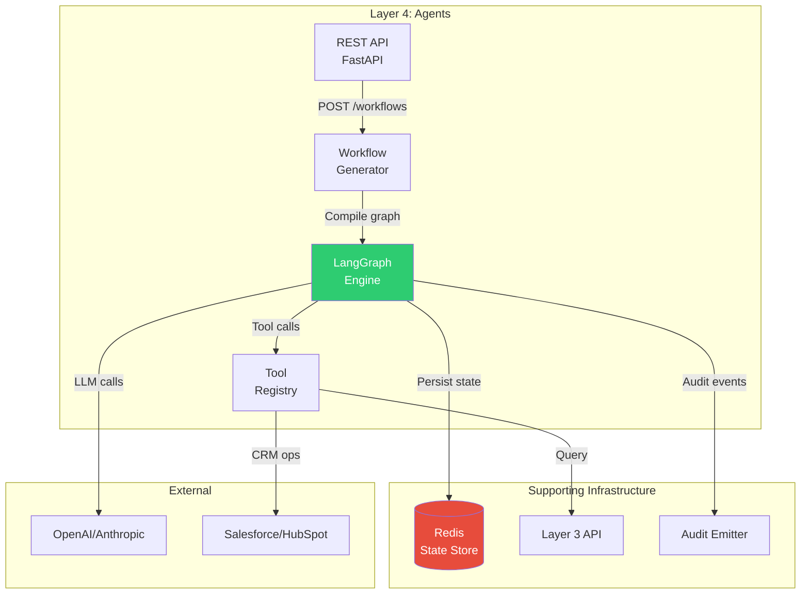

# ADR-005: LangGraph for Agent Orchestration

**Status:** ✅ Accepted

**Date:** 2025-03-15

**Deciders:** AI Engineering, Platform Team

---

## Context

Layer 4 (Agents) requires workflow orchestration for:
1. **Multi-step reasoning** (ROI calculation: extract → analyze → compute → format)
2. **Human-in-the-loop** (pause for approval, resume with feedback)
3. **Tool integration** (query knowledge graph, call external APIs)
4. **Error handling** (retry with backoff, fallbacks, circuit breakers)
5. **Observability** (trace execution, audit decisions)

We needed a framework that:
- Supports complex state machines
- Handles async operations naturally
- Provides checkpoint/resume capabilities
- Integrates with our existing Python stack
- Has production-grade observability

## Decision

We will use **LangGraph** for agent orchestration:

```
┌─────────────────────────────────────────────────────────┐
│  LangGraph State Machine                                 │
│                                                          │
│   ┌──────────┐    ┌──────────┐    ┌──────────┐       │
│   │  Start   │───►│  Plan    │───►│ Extract  │       │
│   └──────────┘    └──────────┘    └────┬─────┘       │
│                                          │            │
│   ┌──────────┐    ┌──────────┐    ┌────▼─────┐       │
│   │ Complete │◄───│  Format  │◄───│ Compute  │       │
│   └──────────┘    └──────────┘    └────┬─────┘       │
│                              ▲       │                │
│                              │  ┌─────▼─────┐         │
│                              └──┤  Review   │         │
│                                 └───────────┘         │
│                                      ▲                  │
│                                      │ Pause/Resume    │
└──────────────────────────────────────┼──────────────────┘
                                       │
                              Human Reviewer
```

**Key Capabilities:**
- **Nodes:** Python functions (LLM calls, tool execution, business logic)
- **Edges:** Conditional routing based on state
- **State:** Typed dictionary persisted between steps
- **Checkpoints:** Automatic persistence for resume
- **Streaming:** Real-time event emission

## Consequences

### Positive
- ✅ **State management:** Built-in checkpoint/resume
- ✅ **Observability:** LangSmith integration for tracing
- ✅ **Flexibility:** Any Python function as a node
- ✅ **Ecosystem:** LangChain tools, integrations, community
- ✅ **Streaming:** Native support for real-time progress updates

### Negative
- ❌ **Learning curve:** Team must learn graph concepts
- ❌ **Vendor dependency:** Tied to LangChain ecosystem
- ❌ **Performance overhead:** State serialization between steps
- ❌ **Debugging:** Complex graphs hard to trace mentally

### Neutral
- 🔄 **Versioning:** Workflow versions require migration strategy
- 🔄 **Testing:** Need to mock graph execution in unit tests

## Implementation

### Workflow Definition

```python
from langgraph.graph import StateGraph, END
from typing import TypedDict, Annotated
import operator

# State definition
class ROIWorkflowState(TypedDict):
    prospect_id: str
    extracted_data: dict
    analysis_result: dict
    roi_calculation: dict
    formatted_output: str
    human_feedback: str | None
    error: str | None

# Graph builder
workflow = StateGraph(ROIWorkflowState)

# Nodes
workflow.add_node("extract", extract_prospect_data)
workflow.add_node("analyze", analyze_value_drivers)
workflow.add_node("compute", calculate_roi)
workflow.add_node("format", format_business_case)
workflow.add_node("review", request_human_review)

# Edges
workflow.set_entry_point("extract")
workflow.add_edge("extract", "analyze")
workflow.add_edge("analyze", "compute")

# Conditional edge: high confidence → format, low → review
workflow.add_conditional_edges(
    "compute",
    lambda state: "format" if state["roi_calculation"]["confidence"] > 0.8 else "review",
    {"format": "format", "review": "review"}
)

workflow.add_edge("format", END)
workflow.add_edge("review", END)

# Compile with persistence
app = workflow.compile(checkpointer=RedisCheckpointer())
```

### Execution and Streaming

```python
# Start workflow
thread_id = str(uuid.uuid4())
config = {"configurable": {"thread_id": thread_id}}

# Stream events
for event in app.stream(initial_state, config, stream_mode="updates"):
    # Emit to client via SSE
    await emit_event({
        "event_type": "state_change",
        "node": event["node"],
        "state": event["state"]
    })

# Pause for human review (state persisted automatically)
# ... human provides feedback ...

# Resume from checkpoint
for event in app.stream(None, config, stream_mode="updates"):
    # Continues from where it left off
    pass
```

## Alternatives Considered

### Temporal / Cadence (Workflow Orchestration)
- **Pros:** Production-proven, durable execution, language-agnostic
- **Cons:** Separate infrastructure, DSL learning curve, not Python-native
- **Why rejected:** Wanted Python-native solution, avoiding additional infrastructure

### Airflow / Prefect (Data Pipeline)
- **Pros:** Mature scheduling, visualization, ecosystem
- **Cons:** Designed for batch, not interactive/agent workflows
- **Why rejected:** No support for human-in-the-loop or streaming

### Custom State Machine
- **Pros:** Full control, no dependencies
- **Cons:** Build checkpointing, observability, tooling from scratch
- **Why rejected:** LangGraph provides these out-of-the-box

### AWS Step Functions / Azure Logic Apps
- **Pros:** Managed service, visual designer
- **Cons:** Vendor lock-in, limited LLM integration, not portable
- **Why rejected:** Self-hosted requirement, need LLM-specific features

## Architecture Integration



## Production Considerations

| Concern | Mitigation |
|---------|-----------|
| State size | Limit state to < 1MB, use references |
| Checkpoint frequency | Every node (cost) vs. every N nodes (risk) |
| Timeout | 5-minute default, configurable per workflow |
| Concurrency | Limit concurrent workflows per tenant |
| Recovery | Automatic resume on worker restart |

## Related

- [Agent Framework](../../core-concepts/agent-framework.md) — How agents work
- [Layer 4 API](../../reference/layer4-agents-api.md) — Workflow management endpoints
- [Why LangGraph](../why-langgraph.md) — Deeper rationale

---

*Last updated: 2026-04-19 | Status: Accepted*
