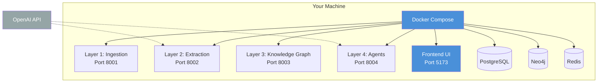

# Value Fabric Quickstart Guide

> **In this guide, you will:**
> - Set up a local Value Fabric instance in 15 minutes
> - Ingest your first document
> - Query the knowledge graph
> - Run your first agent workflow

---

## Prerequisites

Before starting, ensure you have:

| Requirement | Version | Verify Command |
|-------------|---------|----------------|
| Docker Desktop | 4.25+ | `docker --version` |
| Docker Compose | 2.23+ | `docker compose version` |
| Git | 2.40+ | `git --version` |
| Make | 3.81+ | `make --version` |
| OpenAI API Key | — | [Get one here](https://platform.openai.com/api-keys) |

**Estimated Time:** 15 minutes  
**Complexity:** Beginner

---

## Architecture Overview



**Data Flow:** Documents → L1 (Ingest) → L2 (Extract) → L3 (Store) → L4 (Agent Analysis)

---

## Step 1: Clone and Configure

```bash
# Clone the repository
git clone https://github.com/bmsull560/Fabric_4L.git
cd Fabric_4L

# Copy environment template
cp value-fabric/.env.example value-fabric/.env
```

Edit `value-fabric/.env` and add your credentials:

```bash
# Required: OpenAI API Key
OPENAI_API_KEY=sk-your-key-here

# Required: JWT Secret (generate with: openssl rand -hex 32)
JWT_SECRET=your-generated-secret-here

# Optional: Change ports if conflicts exist
L1_PORT=8001
L2_PORT=8002
L3_PORT=8003
L4_PORT=8004
```

---

## Step 2: Start Services

```bash
cd value-fabric

# Start all services in detached mode
docker compose up -d

# Expected output:
# [+] Running 9/9
#  ✔ Container fabric-l1   Started
#  ✔ Container fabric-l2   Started
#  ✔ Container fabric-l3   Started
#  ✔ Container fabric-l4   Started
#  ✔ Container fabric-db   Started
#  ✔ Container fabric-neo4j Started
#  ✔ Container fabric-redis Started
```

**Verification:**

```bash
# Check all services are healthy
docker compose ps

# Expected: All services show "healthy" or "running (0)"
```

---

## Step 3: Run Database Migrations

```bash
# From the value-fabric directory
make migrate

# Expected output:
# INFO  [alembic.runtime.migration] Context impl PostgresqlImpl
# INFO  [alembic.runtime.migration] Running upgrade  -> 001, create accounts tables
```

---

## Step 4: Verify Installation

```bash
# Run comprehensive verification
make verify

# Expected output:
# ✓ Layer 1: Healthy
# ✓ Layer 2: Healthy
# ✓ Layer 3: Healthy
# ✓ Layer 4: Healthy
# ✓ Database: Connected
# ✓ All tests passed
```

---

## Step 5: Ingest Your First Document

```bash
# Create a test ingestion job
curl -X POST http://localhost:8001/api/v1/ingestion/jobs \
  -H "Content-Type: application/json" \
  -H "Authorization: Bearer test-token" \
  -H "X-Tenant-ID: test-tenant" \
  -d '{
    "source_url": "https://example.com/sample-document.html",
    "source_type": "web",
    "priority": "normal"
  }'

# Expected response:
# {
#   "job_id": "550e8400-e29b-41d4-a716-446655440000",
#   "status": "pending",
#   "created_at": "2026-04-19T12:00:00Z"
# }
```

---

## Step 6: Open the UI

```bash
# Open in browser
open http://localhost:5173
# Or on Windows: start http://localhost:5173
# Or on Linux: xdg-open http://localhost:5173
```

You'll see the **Command Center** dashboard:

```
┌────────────────────────────────────────────────────────────┐
│  🏠 Command Center                    [User: admin]        │
├────────────────────────────────────────────────────────────┤
│                                                            │
│  📊 System Status: All Services Healthy                    │
│                                                            │
│  ┌─────────────────┐ ┌─────────────────┐ ┌─────────────────┐  │
│  │ 📄 New          │ │ 🔍 Browse       │ │ ⚙️ Configure    │  │
│  │ Ingestion       │ │ Knowledge       │ │ Settings        │  │
│  │                 │ │ Graph           │ │                 │  │
│  └─────────────────┘ └─────────────────┘ └─────────────────┘  │
│                                                            │
│  📈 Recent Activity                                        │
│  • Ingestion job completed (2 min ago)                     │
│  • 3 entities extracted                                      │
└────────────────────────────────────────────────────────────┘
```

---

## Step 7: Query the Knowledge Graph

```bash
# Search for extracted entities
curl "http://localhost:8003/api/v1/entities?query=sample" \
  -H "Authorization: Bearer test-token" \
  -H "X-Tenant-ID: test-tenant"

# Expected: List of entities matching "sample"
```

---

## Next Steps

| Goal | Next Document |
|------|---------------|
| Learn the architecture in depth | [Architecture Overview](../core-concepts/architecture.md) |
| Explore the API | [API Reference](../reference/api-reference.md) |
| Set up for development | [Local Development Setup](../how-to-guides/setup-local-dev.md) |
| Deploy to production | [Kubernetes Deployment](../how-to-guides/deploy-to-k8s.md) |

---

## Troubleshooting

### Issue: "Connection refused" on startup

**Symptoms:** `curl: (7) Failed to connect to localhost port 8001`

**Solution:**
```bash
# Check service status
docker compose ps

# If services are starting, wait 30 seconds for health checks
sleep 30

# If unhealthy, view logs
docker compose logs l1
```

### Issue: "Migration failed"

**Symptoms:** `alembic.util.exc.CommandError`

**Solution:**
```bash
# Reset and recreate databases
docker compose down -v
docker compose up -d
docker compose run --rm l1 alembic upgrade head
```

### Issue: "OpenAI API errors"

**Symptoms:** Extraction jobs fail with 401/429 errors

**Solution:** Verify your `OPENAI_API_KEY` in `.env` and restart:
```bash
docker compose down
docker compose up -d
```

See [Troubleshooting Index](../troubleshooting/index.md) for more solutions.

---

## Common Pitfalls

1. **Port Conflicts:** If ports 5173, 8001-8004 are in use, edit `.env` to change them
2. **Memory Limits:** Docker Desktop needs 8GB+ RAM allocated for all services
3. **Firewall Issues:** Ensure Docker has network access to pull images
4. **API Key Format:** Include the full `sk-` prefix in your OpenAI key

---

## Related Documentation

- [Prerequisites](./prerequisites.md) — Detailed requirement checklist
- [Installation](./installation.md) — Full installation with all options
- [Architecture Overview](../core-concepts/architecture.md) — Understanding the 4-layer system
- [API Reference](../reference/api-reference.md) — Complete endpoint documentation

---

*Last updated: 2026-04-19 | [Edit this page](https://github.com/bmsull560/Fabric_4L/edit/main/docs/getting-started/quickstart.md)*
