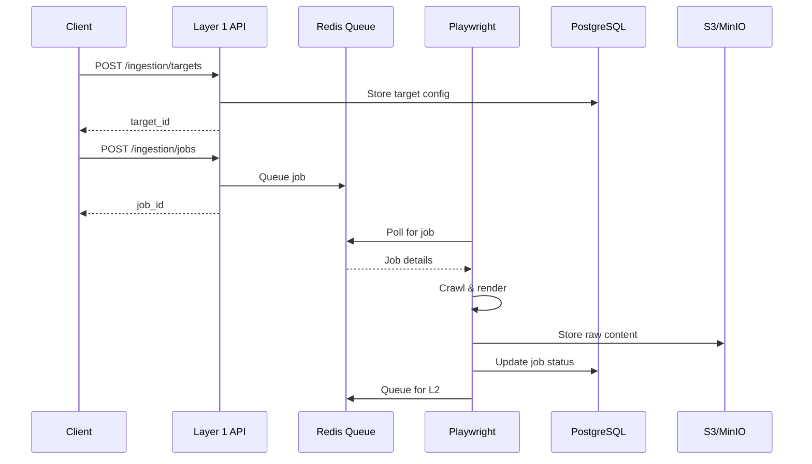

# Layer 1: Ingestion API

> **Base URL:** `http://localhost:8001` (local) / `https://l1.valuefabric.io` (production)  
> **Base Path:** `/api/v1/ingestion`  
> **Service:** Intelligent web data ingestion powered by Playwright, Redis, and PostgreSQL

---

## In this guide

- Create and manage scraping targets
- Start and monitor ingestion jobs
- Handle rate limits and retries
- Troubleshoot common issues

---

## Architecture Context



---

## Authentication

All endpoints require authentication. See [Authentication Guide](./authentication.md) for details.

```http
Authorization: Bearer <jwt_token>
X-Tenant-ID: <tenant_uuid>
```

---

## Endpoints Overview

| Method | Path | Description | Auth |
|--------|------|-------------|------|
| GET | `/api/v1/ingestion/targets` | List all scraping targets | Yes |
| POST | `/api/v1/ingestion/targets` | Create a new scraping target | Yes |
| GET | `/api/v1/ingestion/jobs` | List ingestion jobs | Yes |
| POST | `/api/v1/ingestion/jobs` | Start a new ingestion job | Yes |
| GET | `/api/v1/ingestion/jobs/{id}` | Get job status/details | Yes |

---

## Targets

### List Targets

```http
GET /api/v1/ingestion/targets HTTP/1.1
Host: l1.valuefabric.io
Authorization: Bearer <token>
X-Tenant-ID: <tenant>
```

**Response (200):**

```json
{
  "targets": [
    {
      "target_id": "550e8400-e29b-41d4-a716-446655440000",
      "url": "https://example.com",
      "schedule": "daily",
      "status": "active",
      "created_at": "2025-01-01T00:00:00Z"
    }
  ],
  "total": 1
}
```

### Create Target

```http
POST /api/v1/ingestion/targets HTTP/1.1
Host: l1.valuefabric.io
Authorization: Bearer <token>
X-Tenant-ID: <tenant>
Content-Type: application/json

{
  "url": "https://example.com",
  "schedule": "daily",
  "scrape_config": {
    "selectors": [".main-content"],
    "wait_for": "#loaded",
    "max_pages": 100
  }
}
```

**Request Schema:**

| Field | Type | Required | Description |
|-------|------|----------|-------------|
| `url` | string | Yes | Target URL to scrape |
| `schedule` | string | No | Cron expression or `daily`, `hourly`, `weekly` |
| `scrape_config.selectors` | array | No | CSS selectors to extract |
| `scrape_config.wait_for` | string | No | Element to wait for before extraction |
| `scrape_config.max_pages` | integer | No | Maximum pages per crawl (default: 100) |

**Response (201):**

```json
{
  "target_id": "550e8400-e29b-41d4-a716-446655440000",
  "url": "https://example.com",
  "schedule": "daily",
  "status": "active",
  "created_at": "2025-01-01T00:00:00Z"
}
```

---

## Jobs

### List Jobs

```http
GET /api/v1/ingestion/jobs?status=completed&limit=20 HTTP/1.1
Host: l1.valuefabric.io
Authorization: Bearer <token>
X-Tenant-ID: <tenant>
```

**Query Parameters:**

| Parameter | Type | Description |
|-----------|------|-------------|
| `status` | string | Filter by: `queued`, `running`, `completed`, `failed` |
| `target_id` | uuid | Filter by target |
| `limit` | integer | Max results (default: 20, max: 100) |
| `cursor` | string | Pagination cursor |

### Create Job

```http
POST /api/v1/ingestion/jobs HTTP/1.1
Host: l1.valuefabric.io
Authorization: Bearer <token>
X-Tenant-ID: <tenant>
Content-Type: application/json

{
  "target_id": "550e8400-e29b-41d4-a716-446655440000",
  "priority": "normal",
  "options": {
    "follow_links": true,
    "max_depth": 2
  }
}
```

**Request Schema:**

| Field | Type | Required | Description |
|-------|------|----------|-------------|
| `target_id` | uuid | Yes | Target to crawl |
| `priority` | string | No | `low`, `normal` (default), `high`, `urgent` |
| `options.follow_links` | boolean | No | Follow page links (default: true) |
| `options.max_depth` | integer | No | Link follow depth (default: 2) |

**Response (201):**

```json
{
  "job_id": "660e8400-e29b-41d4-a716-446655440001",
  "target_id": "550e8400-e29b-41d4-a716-446655440000",
  "status": "queued",
  "priority": "normal",
  "created_at": "2025-01-01T00:00:00Z",
  "estimated_start": "2025-01-01T00:00:30Z"
}
```

### Get Job Status

```http
GET /api/v1/ingestion/jobs/660e8400-e29b-41d4-a716-446655440001 HTTP/1.1
Host: l1.valuefabric.io
Authorization: Bearer <token>
X-Tenant-ID: <tenant>
```

**Response (200):**

```json
{
  "job_id": "660e8400-e29b-41d4-a716-446655440001",
  "target_id": "550e8400-e29b-41d4-a716-446655440000",
  "status": "completed",
  "priority": "normal",
  "created_at": "2025-01-01T00:00:00Z",
  "started_at": "2025-01-01T00:00:30Z",
  "completed_at": "2025-01-01T00:01:00Z",
  "pages_scraped": 12,
  "pages_failed": 0,
  "content_size_bytes": 524288,
  "errors": []
}
```

**Status Values:**

| Status | Description |
|--------|-------------|
| `queued` | Waiting for worker |
| `running` | Actively crawling |
| `completed` | Successfully finished |
| `failed` | Stopped with errors |
| `cancelled` | Manually stopped |

---

## Error Handling

### Common Errors

| Error Code | HTTP Status | Cause | Resolution |
|------------|-------------|-------|------------|
| `TARGET_NOT_FOUND` | 404 | Invalid target_id | Verify target exists |
| `INVALID_SCHEDULE` | 422 | Bad cron expression | Use valid cron or presets |
| `RATE_LIMITED` | 429 | Too many jobs | Implement backoff |
| `ROBOTS_TXT_BLOCKED` | 403 | robots.txt disallows | Check target permissions |

### Error Response Format

```json
{
  "error": {
    "code": "RATE_LIMITED",
    "message": "Too many ingestion jobs for tenant",
    "details": {
      "retry_after_seconds": 60,
      "current_jobs": 10,
      "max_jobs": 5
    }
  }
}
```

---

## SDK Examples

### Python

```python
from value_fabric import Client

client = Client(api_key="vf_live_...", tenant_id="...")

# Create target
target = client.ingestion.create_target(
    url="https://example.com",
    schedule="daily"
)

# Start job
job = client.ingestion.start_job(
    target_id=target.id,
    priority="high"
)

# Poll status
while True:
    status = client.ingestion.get_job(job.id)
    if status.status in ["completed", "failed"]:
        break
    time.sleep(5)
```

### cURL

```bash
# Create target
curl -X POST https://l1.valuefabric.io/api/v1/ingestion/targets \
  -H "Authorization: Bearer $TOKEN" \
  -H "X-Tenant-ID: $TENANT" \
  -H "Content-Type: application/json" \
  -d '{"url": "https://example.com", "schedule": "daily"}'

# Start job
curl -X POST https://l1.valuefabric.io/api/v1/ingestion/jobs \
  -H "Authorization: Bearer $TOKEN" \
  -H "X-Tenant-ID: $TENANT" \
  -H "Content-Type: application/json" \
  -d '{"target_id": "...", "priority": "high"}'

# Check status
curl https://l1.valuefabric.io/api/v1/ingestion/jobs/$JOB_ID \
  -H "Authorization: Bearer $TOKEN" \
  -H "X-Tenant-ID: $TENANT"
```

---

## Rate Limits

| Tier | Jobs/Min | Concurrent Jobs |
|------|----------|-----------------|
| Free | 6 | 2 |
| Pro | 60 | 10 |
| Enterprise | 600 | 50 |

---

## Troubleshooting

### Job Stuck in "queued"

**Symptoms:** Job stays queued for >5 minutes

**Checks:**
```bash
# Check Redis queue depth
docker compose exec redis redis-cli LLEN ingestion:pending

# Check worker status
docker compose ps l1-worker
```

**Resolution:**
- Workers may be at capacity; increase replicas
- Redis connection issue; check connectivity

### Pages Failing to Scrape

**Symptoms:** `pages_failed` > 0

**Common Causes:**
- JavaScript-rendered content (increase `wait_for`)
- robots.txt blocking (verify permissions)
- Rate limiting from target (add delays)

See [Troubleshooting Index](../troubleshooting/index.md) for more.

---

## Next Steps

- [Layer 2: Extraction API](./layer2-extraction-api.md) — Process scraped content
- [Layer 3: Knowledge Graph API](./layer3-knowledge-api.md) — Query extracted data
- [Architecture Overview](../core-concepts/architecture.md) — System design

---

*Last updated: 2026-04-19 | [Edit this page](https://github.com/bmsull560/Fabric_4L/edit/main/docs/reference/layer1-ingestion-api.md)*
