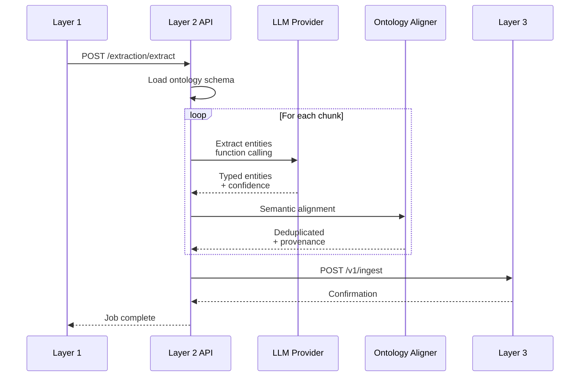

# Layer 2: Extraction API

> **Base URL:** `http://localhost:8002` (local) / `https://l2.valuefabric.io` (production)  
> **Base Path:** `/api/v1/extraction`  
> **Service:** Ontology-guided extraction using LLM + RDF/OWL

---

## In this guide

- Submit content for entity extraction
- Monitor extraction jobs
- Configure extraction options
- Handle ontology-guided extraction

---

## Architecture Context



---

## Authentication

```http
Authorization: Bearer <jwt_token>
X-Tenant-ID: <tenant_uuid>
```

---

## Endpoints Overview

| Method | Path | Description | Auth |
|--------|------|-------------|------|
| POST | `/api/v1/extraction/extract` | Submit content for extraction | Yes |
| GET | `/api/v1/extraction/status/{id}` | Get extraction job status | Yes |
| GET | `/api/v1/extraction/results/{id}` | Get extraction results | Yes |
| GET | `/api/v1/ontologies` | List available ontologies | Yes |

---

## Extraction

### Submit Extraction Job

```http
POST /api/v1/extraction/extract HTTP/1.1
Host: l2.valuefabric.io
Authorization: Bearer <token>
X-Tenant-ID: <tenant>
Content-Type: application/json

{
  "source_id": "550e8400-e29b-41d4-a716-446655440000",
  "content": "Acme Corp provides cloud-based inventory management...",
  "content_type": "text/plain",
  "ontology_id": "660e8400-e29b-41d4-a716-446655440001",
  "options": {
    "extract_entities": true,
    "extract_relationships": true,
    "min_confidence": 0.7,
    "entity_types": ["Capability", "UseCase", "Persona"]
  }
}
```

**Request Schema:**

| Field | Type | Required | Description |
|-------|------|----------|-------------|
| `source_id` | uuid | Yes | Source document identifier |
| `content` | string | Yes | Raw text/HTML to extract from |
| `content_type` | string | No | MIME type (default: `text/plain`) |
| `ontology_id` | uuid | No | Ontology schema to use |
| `options.extract_entities` | boolean | No | Extract entities (default: true) |
| `options.extract_relationships` | boolean | No | Extract relationships (default: true) |
| `options.min_confidence` | float | No | Minimum confidence threshold (0-1) |
| `options.entity_types` | array | No | Filter to specific entity types |

**Response (202 Accepted):**

```json
{
  "extraction_id": "770e8400-e29b-41d4-a716-446655440002",
  "status": "processing",
  "estimated_duration_seconds": 45,
  "queue_position": 3,
  "created_at": "2025-01-01T00:00:00Z"
}
```

### Get Extraction Status

```http
GET /api/v1/extraction/status/770e8400-e29b-41d4-a716-446655440002 HTTP/1.1
Host: l2.valuefabric.io
Authorization: Bearer <token>
X-Tenant-ID: <tenant>
```

**Response (200):**

```json
{
  "extraction_id": "770e8400-e29b-41d4-a716-446655440002",
  "status": "completed",
  "progress": {
    "chunks_total": 5,
    "chunks_processed": 5,
    "entities_found": 12,
    "relationships_found": 8
  },
  "started_at": "2025-01-01T00:00:00Z",
  "completed_at": "2025-01-01T00:00:45Z",
  "results_url": "/api/v1/extraction/results/770e8400-e29b-41d4-a716-446655440002"
}
```

**Status Values:**

| Status | Description |
|--------|-------------|
| `queued` | Waiting for LLM capacity |
| `processing` | LLM extraction in progress |
| `completed` | Successfully extracted |
| `failed` | Extraction error |
| `partial` | Completed with some failures |

### Get Extraction Results

```http
GET /api/v1/extraction/results/770e8400-e29b-41d4-a716-446655440002 HTTP/1.1
Host: l2.valuefabric.io
Authorization: Bearer <token>
X-Tenant-ID: <tenant>
```

**Response (200):**

```json
{
  "extraction_id": "770e8400-e29b-41d4-a716-446655440002",
  "entities": [
    {
      "entity_id": "880e8400-e29b-41d4-a716-446655440003",
      "type": "Capability",
      "label": "Cloud Inventory Management",
      "confidence": 0.92,
      "provenance": {
        "source_text": "Acme Corp provides cloud-based inventory management",
        "char_start": 0,
        "char_end": 45
      }
    }
  ],
  "relationships": [
    {
      "relationship_id": "990e8400-e29b-41d4-a716-446655440004",
      "source_id": "880e8400-e29b-41d4-a716-446655440003",
      "target_id": "880e8400-e29b-41d4-a716-446655440005",
      "type": "enables",
      "confidence": 0.85
    }
  ],
  "ontology_id": "660e8400-e29b-41d4-a716-446655440001",
  "ingested_to_l3": true
}
```

---

## Ontologies

### List Ontologies

```http
GET /api/v1/ontologies HTTP/1.1
Host: l2.valuefabric.io
Authorization: Bearer <token>
X-Tenant-ID: <tenant>
```

**Response (200):**

```json
{
  "ontologies": [
    {
      "ontology_id": "660e8400-e29b-41d4-a716-446655440001",
      "name": "Value Fabric Core",
      "version": "1.2.0",
      "entity_types": ["Capability", "UseCase", "Persona", "ValueDriver"],
      "is_default": true
    },
    {
      "ontology_id": "660e8400-e29b-41d4-a716-446655440002",
      "name": "Software Domain Pack",
      "version": "2.0.0",
      "entity_types": ["Feature", "Integration", "PricingTier"],
      "is_default": false
    }
  ]
}
```

---

## Entity Taxonomy

```
┌─────────────────────────────────────────────────────┐
│                    ENTITY TYPES                      │
├─────────────────────────────────────────────────────┤
│                                                      │
│  Capability ──enables──► UseCase                       │
│      │                   │                           │
│      │                   ▼                           │
│      │              Persona ──benefits_from──► ValueDriver
│      │                                               │
│      └──────► Feature (in domain packs)              │
│                                                      │
│  Confidence: 0.0 - 1.0                               │
│  Provenance: Source text + position                  │
│                                                      │
└─────────────────────────────────────────────────────┘
```

---

## Error Handling

| Error Code | HTTP Status | Cause | Resolution |
|------------|-------------|-------|------------|
| `ONTOLOGY_NOT_FOUND` | 404 | Invalid ontology_id | Use valid ontology |
| `CONTENT_TOO_LARGE` | 413 | Content > 1MB | Split into chunks |
| `LLM_RATE_LIMIT` | 429 | Provider throttling | Retry with backoff |
| `EXTRACTION_FAILED` | 500 | LLM error | Check options, retry |

---

## SDK Examples

### Python

```python
from value_fabric import Client

client = Client(api_key="vf_live_...", tenant_id="...")

# Extract entities
extraction = client.extraction.extract(
    content="Acme Corp provides cloud-based inventory...",
    ontology_id="660e8400-...",
    options={
        "min_confidence": 0.8,
        "entity_types": ["Capability", "UseCase"]
    }
)

# Wait for completion
results = client.extraction.wait_for_results(
    extraction.extraction_id,
    timeout=120
)

# Process entities
for entity in results.entities:
    print(f"{entity.type}: {entity.label} ({entity.confidence:.2f})")
```

---

## Troubleshooting

### Low Confidence Scores

**Symptoms:** Entities with confidence < 0.5

**Solutions:**
- Use domain-specific ontology
- Provide cleaner input text
- Adjust `min_confidence` threshold
- Check entity type mappings

### LLM Rate Limiting

**Symptoms:** `429 LLM_RATE_LIMIT` errors

**Solutions:**
- Implement exponential backoff
- Batch multiple extractions
- Use lower `priority` for bulk jobs
- Contact provider for quota increase

---

## Next Steps

- [Layer 3: Knowledge Graph API](./layer3-knowledge-api.md) — Query extracted entities
- [Ontology System](../core-concepts/ontology-system.md) — Understand entity types
- [Author Value Pack](../how-to-guides/author-value-pack.md) — Create custom ontologies

---

*Last updated: 2026-04-19 | [Edit this page](https://github.com/bmsull560/Fabric_4L/edit/main/docs/reference/layer2-extraction-api.md)*
