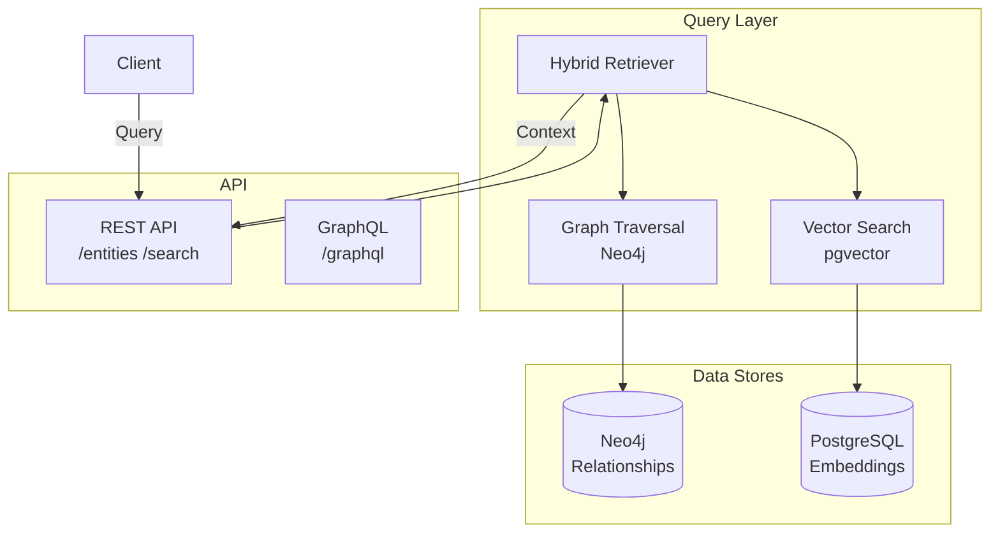

# Layer 3: Knowledge Graph API

> **Base URL:** `http://localhost:8003` (local) / `https://l3.valuefabric.io` (production)  
> **Base Path:** `/v1`  
> **Service:** Knowledge graph backed by Neo4j + pgvector hybrid search

---

## In this guide

- Query entities and relationships
- Perform hybrid semantic + graph search
- Manage value trees and formulas
- Use GraphRAG for context retrieval

---

## Architecture Context



---

## Authentication

```http
Authorization: Bearer <jwt_token>
X-Tenant-ID: <tenant_uuid>
```

## Backup export scope and governance

- Backup generation defaults to **tenant-scoped exports** and requires a tenant identifier from authenticated context.
- Tenant-scoped graph extraction applies tenant filters to both nodes and relationships.
- Cross-tenant global exports are a separate **platform-admin only** mode and must pass governance/RBAC authorization.
- Every global export must emit an immutable audit event before data extraction proceeds.

---

## Endpoints Overview

| Method | Path | Description | Auth |
|--------|------|-------------|------|
| GET | `/v1/entities` | Search entities | Yes |
| GET | `/v1/entities/{id}` | Get entity by ID | Yes |
| GET | `/v1/graph/subgraph` | Query subgraph | Yes |
| POST | `/v1/search/hybrid` | Hybrid semantic search | Yes |
| GET | `/v1/value-trees/{id}` | Get value tree | Yes |
| GET | `/v1/formulas` | List formulas | Yes |
| POST | `/v1/formulas/evaluate` | Evaluate formula | Yes |

---

## Entities

### Search Entities

```http
GET /v1/entities?query=inventory+management&types=Capability&limit=10 HTTP/1.1
Host: l3.valuefabric.io
Authorization: Bearer <token>
X-Tenant-ID: <tenant>
```

**Query Parameters:**

| Parameter | Type | Description |
|-----------|------|-------------|
| `query` | string | Search query (semantic) |
| `types` | array | Filter by entity types |
| `min_confidence` | float | Minimum confidence (0-1) |
| `limit` | integer | Max results (default: 20) |
| `cursor` | string | Pagination cursor |

**Response (200):**

```json
{
  "entities": [
    {
      "id": "880e8400-e29b-41d4-a716-446655440003",
      "type": "Capability",
      "label": "Cloud Inventory Management",
      "confidence": 0.92,
      "embedding": null,
      "properties": {
        "description": "Real-time inventory tracking",
        "source": "extraction"
      },
      "created_at": "2025-01-01T00:00:00Z"
    }
  ],
  "pagination": {
    "limit": 10,
    "cursor": "...",
    "has_more": true
  }
}
```

### Get Entity by ID

```http
GET /v1/entities/880e8400-e29b-41d4-a716-446655440003 HTTP/1.1
Host: l3.valuefabric.io
Authorization: Bearer <token>
X-Tenant-ID: <tenant>
```

**Response (200):**

```json
{
  "id": "880e8400-e29b-41d4-a716-446655440003",
  "type": "Capability",
  "label": "Cloud Inventory Management",
  "confidence": 0.92,
  "properties": {
    "description": "Real-time inventory tracking across warehouses",
    "source": "extraction",
    "extraction_id": "770e8400-..."
  },
  "relationships": {
    "outgoing": [
      {
        "relationship_id": "990e8400-...",
        "target_id": "880e8400-...",
        "target_label": "Manufacturing Use Case",
        "type": "enables",
        "confidence": 0.85
      }
    ],
    "incoming": [...]
  },
  "context": {
    "neighbors": [...],
    "paths": [...]
  }
}
```

---

## Graph Queries

### Get Subgraph

```http
GET /v1/graph/subgraph?center_entity_id=880e8400-e29b-41d4-a716-446655440003&depth=2&limit=50 HTTP/1.1
Host: l3.valuefabric.io
Authorization: Bearer <token>
X-Tenant-ID: <tenant>
```

**Query Parameters:**

| Parameter | Type | Description |
|-----------|------|-------------|
| `center_entity_id` | uuid | Entity to expand from |
| `depth` | integer | Traversal depth (1-3, default: 2) |
| `limit` | integer | Max nodes (default: 100) |
| `relationship_types` | array | Filter relationship types |

**Response (200):**

```json
{
  "nodes": [
    {
      "id": "880e8400-e29b-41d4-a716-446655440003",
      "label": "Cloud Inventory Management",
      "type": "Capability"
    },
    {
      "id": "880e8400-e29b-41d4-a716-446655440005",
      "label": "Manufacturing Use Case",
      "type": "UseCase"
    }
  ],
  "edges": [
    {
      "source": "880e8400-e29b-41d4-a716-446655440003",
      "target": "880e8400-e29b-41d4-a716-446655440005",
      "type": "enables",
      "confidence": 0.85
    }
  ],
  "stats": {
    "total_nodes": 2,
    "total_edges": 1,
    "depth": 2
  }
}
```

---

## Hybrid Search

```http
POST /v1/search/hybrid HTTP/1.1
Host: l3.valuefabric.io
Authorization: Bearer <token>
X-Tenant-ID: <tenant>
Content-Type: application/json

{
  "query": "cost reduction strategies for manufacturing",
  "filters": {
    "entity_types": ["Capability", "UseCase", "Formula"],
    "min_confidence": 0.7
  },
  "options": {
    "semantic_weight": 0.6,
    "graph_weight": 0.4,
    "include_paths": true
  },
  "limit": 20
}
```

**Request Schema:**

| Field | Type | Required | Description |
|-------|------|----------|-------------|
| `query` | string | Yes | Natural language query |
| `filters.entity_types` | array | No | Filter by types |
| `filters.min_confidence` | float | No | Min confidence threshold |
| `options.semantic_weight` | float | No | Vector search weight (0-1) |
| `options.graph_weight` | float | No | Graph search weight (0-1) |
| `options.include_paths` | boolean | No | Include relationship paths |

**Response (200):**

```json
{
  "results": [
    {
      "entity": {
        "id": "880e8400-e29b-41d4-a716-446655440003",
        "type": "Capability",
        "label": "Operational Efficiency",
        "confidence": 0.92
      },
      "scores": {
        "semantic": 0.89,
        "graph": 0.75,
        "combined": 0.83
      },
      "paths": [
        {
          "nodes": [...],
          "edges": [...]
        }
      ]
    }
  ],
  "query_analysis": {
    "entities_mentioned": ["cost reduction", "manufacturing"],
    "intents": ["find_capability", "compare_options"]
  }
}
```

---

## Value Trees

### Get Value Tree

```http
GET /v1/value-trees/880e8400-e29b-41d4-a716-446655440003 HTTP/1.1
Host: l3.valuefabric.io
Authorization: Bearer <token>
X-Tenant-ID: <tenant>
```

**Response (200):**

```json
{
  "entity_id": "880e8400-e29b-41d4-a716-446655440003",
  "tree": {
    "root": {
      "id": "880e8400-...",
      "label": "Cloud Inventory Management",
      "value": 1250000
    },
    "branches": [
      {
        "path": ["Efficiency", "Labor Reduction"],
        "value": 450000,
        "confidence": 0.88
      }
    ]
  },
  "summary": {
    "total_value": 1250000,
    "confidence": 0.85,
    "formula_count": 3
  }
}
```

---

## Formulas

### List Formulas

```http
GET /v1/formulas?entity_id=880e8400-e29b-41d4-a716-446655440003 HTTP/1.1
Host: l3.valuefabric.io
Authorization: Bearer <token>
X-Tenant-ID: <tenant>
```

### Evaluate Formula

```http
POST /v1/formulas/evaluate HTTP/1.1
Host: l3.valuefabric.io
Authorization: Bearer <token>
X-Tenant-ID: <tenant>
Content-Type: application/json

{
  "formula_id": "formula-001",
  "variables": {
    "headcount": 150,
    "avg_salary": 75000,
    "efficiency_gain": 0.15
  }
}
```

**Response (200):**

```json
{
  "formula_id": "formula-001",
  "result": 1687500,
  "currency": "USD",
  "breakdown": {
    "labor_savings": 1687500,
    "implementation_cost": -400000
  },
  "confidence": 0.82
}
```

---

## Error Handling

| Error Code | HTTP Status | Cause | Resolution |
|------------|-------------|-------|------------|
| `ENTITY_NOT_FOUND` | 404 | Invalid entity_id | Verify ID exists |
| `GRAPH_TOO_DEEP` | 400 | Depth > 3 | Reduce depth parameter |
| `SEARCH_TIMEOUT` | 504 | Query too slow | Add filters, reduce limit |
| `INVALID_FORMULA` | 422 | Formula syntax error | Check formula definition |

---

## SDK Examples

### Python

```python
from value_fabric import Client

client = Client(api_key="vf_live_...", tenant_id="...")

# Hybrid search
results = client.knowledge.search_hybrid(
    query="cost reduction strategies",
    filters={"entity_types": ["Capability"]},
    options={"semantic_weight": 0.7}
)

# Get subgraph
subgraph = client.knowledge.get_subgraph(
    center_entity_id="880e8400-...",
    depth=2
)

# Evaluate formula
value = client.knowledge.evaluate_formula(
    formula_id="formula-001",
    variables={"headcount": 150}
)
```

---

## Troubleshooting

### Slow Queries

**Symptoms:** Search takes >2 seconds

**Solutions:**
- Add entity type filters
- Reduce search limit
- Check database indexes
- Review query complexity

See [Slow Queries Troubleshooting](../troubleshooting/slow-queries.md)

### Missing Entities

**Symptoms:** Expected entities not found

**Solutions:**
- Check extraction completed
- Verify confidence thresholds
- Confirm tenant isolation
- Review ontology mapping

---

## Next Steps

- [Layer 4: Agents API](./layer4-agents-api.md) — Workflow orchestration
- [Ontology System](../core-concepts/ontology-system.md) — Entity types explained
- [Graph Explorer Guide](../how-to-guides/use-graph-explorer.md) — Visual querying

---

*Last updated: 2026-04-19 | [Edit this page](https://github.com/bmsull560/Fabric_4L/edit/main/docs/reference/layer3-knowledge-api.md)*
