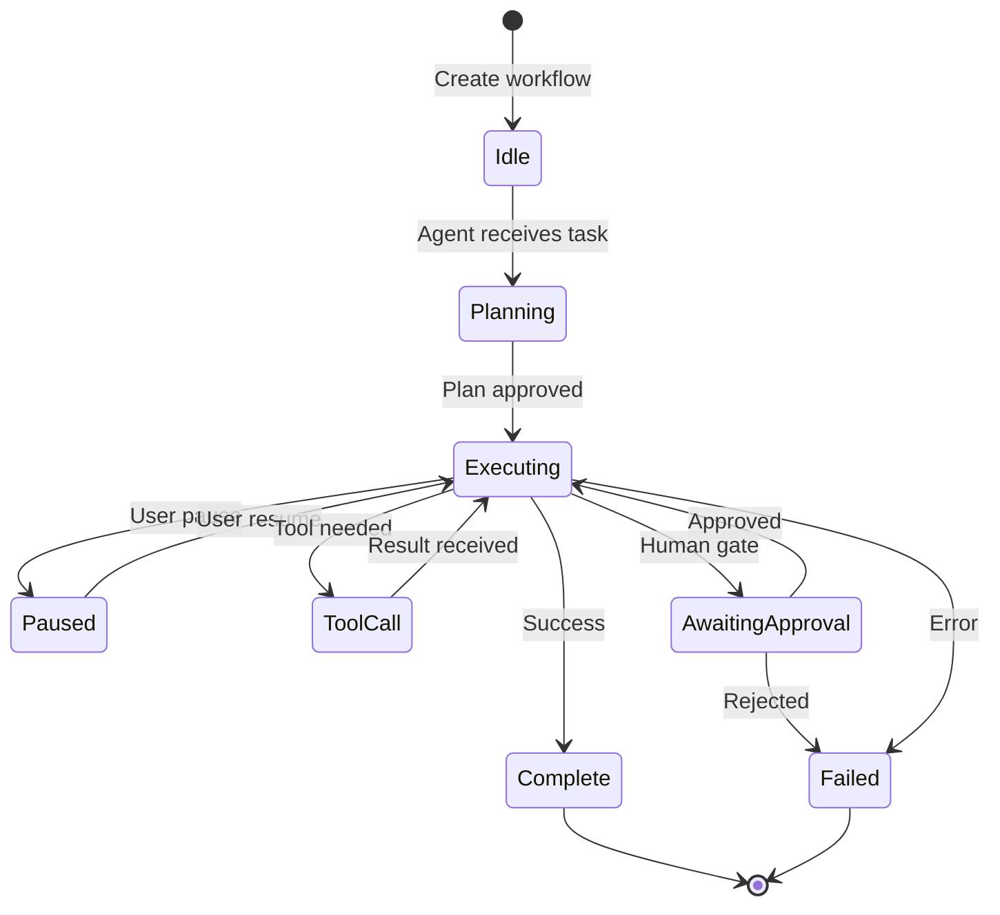

# Layer 4: Agents & Workflow API

> **Base URL:** `http://localhost:8004` (local) / `https://l4.valuefabric.io` (production)  
> **Base Path:** `/api/v1`  
> **Service:** Agentic engine with LangGraph orchestration

---

## In this guide

- Create and manage agent workflows
- Pause, resume, and cancel workflows
- Stream real-time events
- Use analysis and business case tools

---

## Architecture Context



---

## Authentication

```http
Authorization: Bearer <jwt_token>
X-Tenant-ID: <tenant_uuid>
```

---

## Endpoints Overview

| Method | Path | Description | Auth |
|--------|------|-------------|------|
| POST | `/api/v1/workflows` | Create workflow | Yes |
| GET | `/api/v1/workflows/{id}` | Get workflow status | Yes |
| GET | `/api/v1/workflows/{id}/events` | Stream events (SSE) | Yes |
| POST | `/api/v1/workflows/{id}/pause` | Pause workflow | Yes |
| POST | `/api/v1/workflows/{id}/resume` | Resume workflow | Yes |
| DELETE | `/api/v1/workflows/{id}` | Cancel workflow | Yes |
| POST | `/api/v1/analysis/roi` | ROI analysis | Yes |
| POST | `/api/v1/cases` | Generate business case | Yes |
| GET | `/api/v1/tools` | List available tools | Yes |

---

## Workflows

### Create Workflow

```http
POST /api/v1/workflows HTTP/1.1
Host: l4.valuefabric.io
Authorization: Bearer <token>
X-Tenant-ID: <tenant>
Content-Type: application/json

{
  "workflow_type": "roi_calculator",
  "tenant_id": "550e8400-e29b-41d4-a716-446655440000",
  "user_id": "user-123",
  "inputs": {
    "prospect_id": "prospect-456",
    "value_driver_ids": ["vd-001", "vd-002"],
    "industry_vertical": "manufacturing"
  },
  "priority": "NORMAL",
  "options": {
    "auto_start": true,
    "timeout_seconds": 300
  }
}
```

**Workflow Types:**

| Type | Description | Typical Duration |
|------|-------------|------------------|
| `roi_calculator` | Calculate return on investment | 30-60s |
| `whitespace_analysis` | Identify capability gaps | 45-90s |
| `business_case` | Generate full business case | 60-120s |
| `orchestrator` | Multi-step orchestration | 2-5min |

**Priority Levels:**

| Priority | Queue Position | Resource Allocation |
|----------|---------------|---------------------|
| `LOW` | Standard | 1x |
| `NORMAL` | Standard | 1x (default) |
| `HIGH` | Front of queue | 2x |
| `URGENT` | Immediate | 4x |

**Response (201):**

```json
{
  "workflow_instance_id": "wf-550e8400-e29b-41d4-a716-446655440001",
  "workflow_type": "roi_calculator",
  "status": "running",
  "current_state": "calculating",
  "current_node": "roi_compute",
  "progress_percentage": 0,
  "estimated_duration_seconds": 45,
  "created_at": "2025-01-01T00:00:00Z"
}
```

### Get Workflow Status

```http
GET /api/v1/workflows/wf-550e8400-e29b-41d4-a716-446655440001 HTTP/1.1
Host: l4.valuefabric.io
Authorization: Bearer <token>
X-Tenant-ID: <tenant>
```

**Response (200):**

```json
{
  "workflow_instance_id": "wf-550e8400-e29b-41d4-a716-446655440001",
  "workflow_type": "roi_calculator",
  "status": "running",
  "current_state": "calculating",
  "current_node": "roi_compute",
  "progress_percentage": 65,
  "started_at": "2025-01-01T00:00:00Z",
  "estimated_completion": "2025-01-01T00:00:45Z",
  "error_count": 0,
  "has_output": false,
  "results": null
}
```

**Status Values:**

| Status | Description | Actionable |
|--------|-------------|------------|
| `pending` | Waiting to start | Wait |
| `running` | Actively processing | Monitor |
| `paused` | User paused | Resume/Cancel |
| `awaiting_approval` | Human gate | Approve/Reject |
| `completed` | Successfully finished | Retrieve results |
| `failed` | Stopped with errors | Retry/Cancel |
| `cancelled` | Manually stopped | Create new |

### Stream Events (SSE)

```http
GET /api/v1/workflows/wf-550e8400-e29b-41d4-a716-446655440001/events HTTP/1.1
Host: l4.valuefabric.io
Authorization: Bearer <token>
X-Tenant-ID: <tenant>
Accept: text/event-stream
```

**Event Format:**

```
event: state_change
data: {"event_id": "evt-001", "event_type": "state_change", "timestamp": "2025-01-01T00:00:05Z", "message": "Transitioned to roi_compute", "payload": {"node": "roi_compute"}}

event: progress
data: {"event_id": "evt-002", "event_type": "progress", "timestamp": "2025-01-01T00:00:10Z", "progress_percentage": 25}

event: complete
data: {"event_id": "evt-003", "event_type": "complete", "timestamp": "2025-01-01T00:00:45Z", "results_url": "/api/v1/workflows/wf-.../result"}
```

### Pause Workflow

```http
POST /api/v1/workflows/wf-550e8400-e29b-41d4-a716-446655440001/pause HTTP/1.1
Host: l4.valuefabric.io
Authorization: Bearer <token>
X-Tenant-ID: <tenant>
Content-Type: application/json

{
  "user_id": "user-123",
  "reason": "Awaiting manager approval",
  "tenant_id": "550e8400-e29b-41d4-a716-446655440000"
}
```

**Response (200):**

```json
{
  "workflow_instance_id": "wf-550e8400-e29b-41d4-a716-446655440001",
  "status": "paused",
  "paused_at": "2025-01-01T00:02:00Z",
  "current_node": "human_review",
  "pause_reason": "Awaiting manager approval"
}
```

### Resume Workflow

```http
POST /api/v1/workflows/wf-550e8400-e29b-41d4-a716-446655440001/resume HTTP/1.1
Host: l4.valuefabric.io
Authorization: Bearer <token>
X-Tenant-ID: <tenant>
Content-Type: application/json

{
  "user_id": "user-123",
  "resume_data": {"approval_granted": true},
  "tenant_id": "550e8400-e29b-41d4-a716-446655440000"
}
```

---

## Analysis Tools

### ROI Analysis

```http
POST /api/v1/analysis/roi HTTP/1.1
Host: l4.valuefabric.io
Authorization: Bearer <token>
X-Tenant-ID: <tenant>
Content-Type: application/json

{
  "prospect_id": "prospect-456",
  "value_driver_ids": ["vd-001", "vd-002", "vd-003"],
  "prospect_data": {
    "headcount": 500,
    "revenue": 50000000,
    "industry": "manufacturing"
  },
  "industry_vertical": "manufacturing",
  "company_size": "enterprise"
}
```

**Response (200):**

```json
{
  "prospect_id": "prospect-456",
  "aggregated_roi": {
    "total_value": 2500000,
    "net_present_value": 2100000,
    "payback_months": 6,
    "roi_percentage": 340
  },
  "detailed_results": [
    {
      "value_driver_id": "vd-001",
      "value": 1200000,
      "confidence": 0.88
    }
  ],
  "benchmark_comparison": {
    "industry_average": 1800000,
    "percentile": 85
  }
}
```

### Generate Business Case

```http
POST /api/v1/cases HTTP/1.1
Host: l4.valuefabric.io
Authorization: Bearer <token>
X-Tenant-ID: <tenant>
Content-Type: application/json

{
  "prospect_id": "prospect-456",
  "opportunity_id": "opp-789",
  "sections": ["executive_summary", "roi_analysis", "implementation_plan", "risk_assessment"],
  "output_format": "pdf",
  "branding": {
    "primary_color": "#0066CC",
    "logo_url": "https://..."
  }
}
```

**Response (200):**

```json
{
  "case_id": "case-abc-123",
  "title": "Business Case — Acme Manufacturing",
  "summary": "Implementing Value Fabric capabilities yields $2.5M NPV...",
  "total_value": 2500000,
  "implementation_cost": 750000,
  "roi_ratio": 3.33,
  "payback_months": 6,
  "confidence_score": 0.88,
  "status": "generated",
  "created_at": "2025-01-01T00:00:00Z",
  "document_url": "/api/v1/cases/case-abc-123/download",
  "page_count": 12,
  "file_size_bytes": 245760
}
```

---

## Tools

### List Available Tools

```http
GET /api/v1/tools HTTP/1.1
Host: l4.valuefabric.io
Authorization: Bearer <token>
X-Tenant-ID: <tenant>
```

**Response (200):**

```json
{
  "tools": [
    {
      "name": "query_knowledge_graph",
      "description": "Search the knowledge graph for entities and relationships",
      "parameters": {
        "query": {"type": "string", "required": true},
        "limit": {"type": "integer", "required": false}
      }
    },
    {
      "name": "calculate_roi",
      "description": "Calculate return on investment",
      "parameters": {
        "investment": {"type": "number", "required": true},
        "returns": {"type": "number", "required": true}
      }
    }
  ]
}
```

---

## Error Handling

| Error Code | HTTP Status | Cause | Resolution |
|------------|-------------|-------|------------|
| `WORKFLOW_NOT_FOUND` | 404 | Invalid workflow_id | Verify ID |
| `INVALID_STATE_TRANSITION` | 409 | Can't pause completed | Check status |
| `AGENT_ERROR` | 500 | LLM/tool failure | Review logs, retry |
| `TIMEOUT` | 504 | Workflow exceeded timeout | Increase timeout |

---

## SDK Examples

### Python with Streaming

```python
from value_fabric import Client
import json

client = Client(api_key="vf_live_...", tenant_id="...")

# Create workflow
workflow = client.workflows.create(
    workflow_type="roi_calculator",
    inputs={"prospect_id": "prospect-456"},
    priority="HIGH"
)

# Stream events
for event in client.workflows.stream_events(workflow.id):
    print(f"[{event.event_type}] {event.message}")
    
    if event.event_type == "complete":
        # Get results
        result = client.workflows.get_result(workflow.id)
        print(f"ROI: {result.aggregated_roi.total_value}")
        break
    
    elif event.event_type == "awaiting_approval":
        # Pause for human review
        input("Press Enter to approve and continue...")
        client.workflows.resume(workflow.id, resume_data={"approved": True})
```

---

## Troubleshooting

### Workflow Stuck in "running"

**Symptoms:** Progress not updating for >2 minutes

**Checks:**
```bash
# Check agent logs
docker compose logs l4 | grep "workflow_id"

# Verify LLM connectivity
curl https://api.openai.com/v1/models -H "Authorization: Bearer $KEY"
```

See [Workflow Stalled Troubleshooting](../troubleshooting/workflow-stalled.md)

### High Error Count

**Symptoms:** `error_count` > 0 in status

**Common Causes:**
- LLM rate limiting
- Invalid tool parameters
- Missing knowledge graph context

---

## Next Steps

- [Agent Framework](../core-concepts/agent-framework.md) — How agents work
- [Troubleshooting Workflows](../troubleshooting/workflow-stalled.md) — Debug issues
- [Knowledge Graph API](./layer3-knowledge-api.md) — Query context

---

*Last updated: 2026-04-19 | [Edit this page](https://github.com/bmsull560/Fabric_4L/edit/main/docs/reference/layer4-agents-api.md)*
