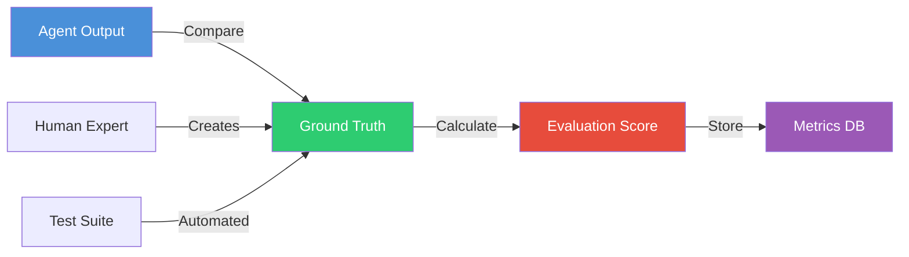

# Layer 5: Ground Truth & Evaluation API

> **Base URL:** `http://localhost:8005` (local) / `https://l5.valuefabric.io` (production)  
> **Base Path:** `/api/v1`  
> **Service:** Ground-truth store and evaluation API for validating agent outputs

---

## In this guide

- Create and manage ground truth records
- Run evaluations against agent outputs
- Track evaluation metrics over time
- Benchmark agent performance

---

## Architecture Context



---

## Authentication

```http
Authorization: Bearer <jwt_token>
X-Tenant-ID: <tenant_uuid>
```

---

## Endpoints Overview

| Method | Path | Description | Auth |
|--------|------|-------------|------|
| GET | `/api/v1/truths` | List ground truth records | Yes |
| POST | `/api/v1/truths` | Create ground truth | Yes |
| GET | `/api/v1/truths/{id}` | Get truth record | Yes |
| PUT | `/api/v1/truths/{id}` | Update truth | Yes |
| DELETE | `/api/v1/truths/{id}` | Delete truth | Yes |
| POST | `/api/v1/evaluations` | Run evaluation | Yes |
| GET | `/api/v1/evaluations/{id}` | Get evaluation result | Yes |
| GET | `/api/v1/benchmarks` | List benchmarks | Yes |

---

## Ground Truth Records

### Create Ground Truth

```http
POST /api/v1/truths HTTP/1.1
Host: l5.valuefabric.io
Authorization: Bearer <token>
X-Tenant-ID: <tenant>
Content-Type: application/json

{
  "entity_id": "550e8400-e29b-41d4-a716-446655440000",
  "entity_type": "formula",
  "expected_value": {
    "result": 1250000,
    "currency": "USD",
    "breakdown": {
      "labor_savings": 1450000,
      "implementation_cost": -200000
    }
  },
  "source": "manual",
  "source_details": {
    "expert_name": "Jane Smith",
    "expert_title": "Senior Financial Analyst",
    "verification_date": "2025-01-01"
  },
  "notes": "Validated against actual customer implementation",
  "tags": ["roi", "manufacturing", "verified"]
}
```

**Source Types:**

| Source | Description | Trust Level |
|--------|-------------|-------------|
| `manual` | Human expert verification | Highest |
| `automated` | Automated test suite | High |
| `customer` | Customer-reported actual | Highest |
| `benchmark` | Industry benchmark | Medium |

**Response (201):**

```json
{
  "truth_id": "truth-660e8400-e29b-41d4-a716-446655440001",
  "entity_id": "550e8400-e29b-41d4-a716-446655440000",
  "entity_type": "formula",
  "status": "active",
  "created_at": "2025-01-01T00:00:00Z",
  "created_by": "user-123",
  "version": 1
}
```

### List Ground Truth Records

```http
GET /api/v1/truths?entity_type=formula&tags=verified&limit=20 HTTP/1.1
Host: l5.valuefabric.io
Authorization: Bearer <token>
X-Tenant-ID: <tenant>
```

**Response (200):**

```json
{
  "truths": [
    {
      "truth_id": "truth-660e8400-...",
      "entity_id": "550e8400-...",
      "entity_type": "formula",
      "source": "manual",
      "tags": ["roi", "verified"],
      "created_at": "2025-01-01T00:00:00Z"
    }
  ],
  "total": 150,
  "filter_counts": {
    "by_source": {
      "manual": 80,
      "automated": 50,
      "customer": 20
    }
  }
}
```

---

## Evaluations

### Run Evaluation

```http
POST /api/v1/evaluations HTTP/1.1
Host: l5.valuefabric.io
Authorization: Bearer <token>
X-Tenant-ID: <tenant>
Content-Type: application/json

{
  "evaluation_type": "accuracy",
  "agent_output_id": "output-770e8400-e29b-41d4-a716-446655440002",
  "truth_ids": ["truth-660e8400-e29b-41d4-a716-446655440001"],
  "options": {
    "tolerance_percentage": 5.0,
    "strict_mode": false,
    "compare_fields": ["result", "breakdown.labor_savings"]
  }
}
```

**Evaluation Types:**

| Type | Description | Use Case |
|------|-------------|----------|
| `accuracy` | Value comparison with tolerance | ROI calculations |
| `exact_match` | String/structure exact match | Entity extraction |
| `semantic` | Semantic similarity | Text generation |
| `composite` | Multiple criteria combined | Business cases |

**Response (200):**

```json
{
  "evaluation_id": "eval-880e8400-e29b-41d4-a716-446655440003",
  "evaluation_type": "accuracy",
  "agent_output_id": "output-770e8400-...",
  "score": 0.94,
  "passed": true,
  "threshold": 0.90,
  "details": {
    "comparisons": [
      {
        "field": "result",
        "expected": 1250000,
        "actual": 1200000,
        "difference_percentage": -4.0,
        "passed": true
      }
    ],
    "explanation": "Within 5% tolerance threshold"
  },
  "truth_references": [
    {
      "truth_id": "truth-660e8400-...",
      "entity_id": "550e8400-..."
    }
  ],
  "created_at": "2025-01-01T00:00:00Z"
}
```

### Get Evaluation Results

```http
GET /api/v1/evaluations/eval-880e8400-e29b-41d4-a716-446655440003 HTTP/1.1
Host: l5.valuefabric.io
Authorization: Bearer <token>
X-Tenant-ID: <tenant>
```

---

## Benchmarks

### List Benchmarks

```http
GET /api/v1/benchmarks?status=active HTTP/1.1
Host: l5.valuefabric.io
Authorization: Bearer <token>
X-Tenant-ID: <tenant>
```

**Response (200):**

```json
{
  "benchmarks": [
    {
      "benchmark_id": "bench-990e8400-...",
      "name": "ROI Calculator v2.1",
      "description": "Standard test suite for ROI calculations",
      "version": "2.1.0",
      "test_cases": 50,
      "passing_threshold": 0.90,
      "status": "active",
      "last_run": "2025-01-01T00:00:00Z",
      "average_score": 0.94
    }
  ]
}
```

### Run Benchmark

```http
POST /api/v1/benchmarks/bench-990e8400-.../run HTTP/1.1
Host: l5.valuefabric.io
Authorization: Bearer <token>
X-Tenant-ID: <tenant>
Content-Type: application/json

{
  "agent_version": "v2.3.1",
  "options": {
    "parallel": true,
    "max_concurrency": 5
  }
}
```

---

## Metrics Dashboard

### Get Evaluation Metrics

```http
GET /api/v1/metrics/evaluations?time_range=30d&group_by=agent_version HTTP/1.1
Host: l5.valuefabric.io
Authorization: Bearer <token>
X-Tenant-ID: <tenant>
```

**Response (200):**

```json
{
  "time_range": "30d",
  "metrics": {
    "total_evaluations": 1250,
    "pass_rate": 0.92,
    "average_score": 0.89,
    "by_agent_version": {
      "v2.3.0": {"count": 500, "pass_rate": 0.90, "avg_score": 0.87},
      "v2.3.1": {"count": 750, "pass_rate": 0.94, "avg_score": 0.91}
    },
    "trend": {
      "direction": "improving",
      "change_percentage": 4.5
    }
  }
}
```

---

## Error Handling

| Error Code | HTTP Status | Cause | Resolution |
|------------|-------------|-------|------------|
| `TRUTH_NOT_FOUND` | 404 | Invalid truth_id | Verify ID |
| `EVALUATION_FAILED` | 500 | Comparison error | Check data types |
| `INSUFFICIENT_TRUTH` | 422 | No truth for entity | Create ground truth |
| `BENCHMARK_NOT_FOUND` | 404 | Invalid benchmark_id | Verify ID |

---

## SDK Examples

### Python

```python
from value_fabric import Client

client = Client(api_key="vf_live_...", tenant_id="...")

# Create ground truth
truth = client.ground_truth.create(
    entity_id="formula-001",
    entity_type="formula",
    expected_value={"result": 1250000},
    source="manual",
    notes="Verified by finance team"
)

# Run evaluation
eval_result = client.evaluations.run(
    agent_output_id="output-001",
    truth_ids=[truth.truth_id],
    evaluation_type="accuracy",
    options={"tolerance_percentage": 5.0}
)

print(f"Score: {eval_result.score:.2f}, Passed: {eval_result.passed}")

# Get metrics over time
metrics = client.evaluations.get_metrics(time_range="30d")
print(f"Pass rate: {metrics.pass_rate:.1%}")
```

---

## Best Practices

### Ground Truth Creation

1. **Multiple Sources**: Combine manual + automated + customer data
2. **Version Control**: Update truth records when formulas change
3. **Tagging**: Use consistent tags for filtering
4. **Documentation**: Include verification details in notes

### Evaluation Strategy

1. **Tolerance Levels**: Set realistic thresholds (5-10% for ROI)
2. **Regular Benchmarks**: Run weekly against test suites
3. **Trend Monitoring**: Track scores over time
4. **Failure Analysis**: Investigate all failed evaluations

---

## Next Steps

- [Layer 4: Agents API](./layer4-agents-api.md) — Run agent workflows
- [Evaluation Framework](../core-concepts/evaluation-framework.md) — How evaluation works
- [Manage Ground Truth](../how-to-guides/manage-ground-truth.md) — Best practices

---

*Last updated: 2026-04-19 | [Edit this page](https://github.com/bmsull560/Fabric_4L/edit/main/docs/reference/layer5-ground-truth-api.md)*
