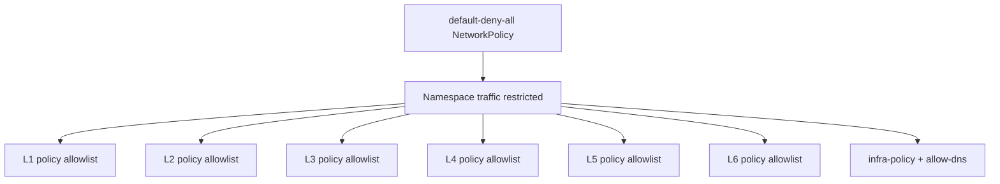
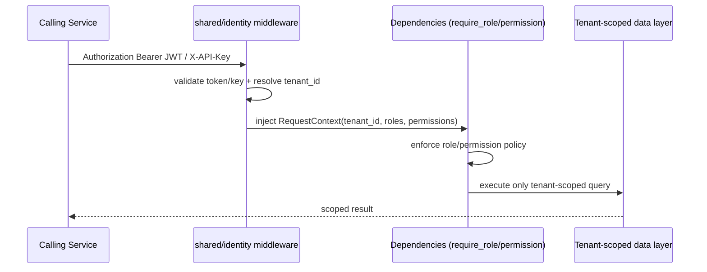

# Value Fabric Threat Model (Tenant-Boundary Focus)

## Scope and assumptions

This threat model covers cross-tenant isolation and service trust boundaries across:

- L1 ingestion
- L2 extraction
- L3 knowledge
- L4 agents
- L5 ground-truth
- L6 benchmarks
- shared identity/audit controls

Primary assets:

1. Tenant-scoped data (documents, facts, traces, eval outcomes)
2. Identity material (JWT/API keys, role/permission claims)
3. Service trust channel state (mTLS network path + auth headers)
4. Audit evidence and release gate evidence

---

## Data-flow diagrams (tenant boundaries L1-L6)

### 1) End-to-end tenant data flow

```mermaid
flowchart LR
    U[Tenant User / API Client]\nJWT or API key --> L4[L4 Agents API]

    subgraph TrustBoundaryA[Identity boundary]
      ID[shared/identity\nGovernanceMiddleware]
    end

    L4 --> ID

    subgraph TrustBoundaryB[Tenant-scoped services]
      L1[L1 Ingestion]
      L2[L2 Extraction]
      L3[L3 Knowledge Graph]
      L5[L5 Ground Truth]
      L6[L6 Benchmarks]
    end

    ID -->|tenant_id, roles, permissions| L1
    ID -->|tenant_id, roles, permissions| L2
    ID -->|tenant_id, roles, permissions| L3
    ID -->|tenant_id, roles, permissions| L5
    ID -->|tenant_id, roles, permissions| L6

    L1 -->|tenant-tagged content| L2
    L2 -->|ontology entities + relations| L3
    L4 -->|retrieval/query| L3
    L4 -->|eval requests| L5
    L6 -->|benchmark/eval traces| L5

    L1 -.audit events.-> A[(Append-only Audit)]
    L2 -.audit events.-> A
    L3 -.audit events.-> A
    L4 -.audit events.-> A
    L5 -.audit events.-> A
    L6 -.audit events.-> A
```

### 2) Kubernetes network trust boundary (deny-by-default)



### 3) Service-to-service auth decision flow



---

## STRIDE threats mapped to controls

| STRIDE | Tenant-boundary threat | Existing control(s) | Verification evidence |
|---|---|---|---|
| **S**poofing | Forged caller identity between services or user/client impersonation | JWT verification + API-key validation in `shared/identity/middleware.py`; required role/permission checks in `shared/identity/dependencies.py`; minimum-secret policy in L4 settings. | Zero-trust gate parses/auth-checks these files and records pass/fail. |
| **T**ampering | Cross-tenant data mutation (altering another tenant's records) | Tenant-scoped SQL/Cypher helpers in `shared/identity/isolation.py`; middleware-resolved tenant context used by handlers. | Zero-trust gate validates tenant-scoping primitives exist and tests enforce usage expectations. |
| **R**epudiation | Actor denies sensitive change or cross-tenant access attempt | Append-only audit package and typed audit events in `shared/audit/`. | Zero-trust gate verifies audit module presence + evidence artifact links. |
| **I**nformation disclosure | Read path leaks data across tenants (query, cache, graph traversal) | `tenant_cache_key` namespacing + tenant predicates in scoped query builders; auth middleware attaches tenant context only after verification. | Cross-tenant negative tests in zero-trust checks (synthetic tenant A→B attempt must fail). |
| **D**enial of service | Unbounded requests exhaust shared resources and impact other tenants | Per-tenant rate limiting controls (`shared/identity/rate_limiting.py`, L4 resilience). | Gate asserts controls are present and emits policy/control audit JSON. |
| **E**levation of privilege | Service account or tenant user escalates role/permission | Explicit role hierarchy + `require_permission/require_role` dependencies; no anonymous privileged paths. | Gate scans for permission dependency usage and reports missing controls. |

---

## Control-to-code/workflow map

| Control family | Code/workflow control | Source of truth |
|---|---|---|
| Identity verification | Governance middleware accepts only supported auth mechanisms and validates identity claims | `packages/shared/src/value_fabric/shared/identity/middleware.py` |
| Authorization | Route-level policy via `require_role` / `require_permission` helpers | `packages/shared/src/value_fabric/shared/identity/dependencies.py` |
| Tenant isolation in data plane | Tenant-scoped SQL/Cypher/query/cache primitives | `packages/shared/src/value_fabric/shared/identity/isolation.py` |
| Network segmentation | Kubernetes default deny + per-layer allowlist NetworkPolicies | `k8s/base/network-policies/` |
| Auditability | Append-only audit event model and emitter | `packages/shared/src/value_fabric/shared/audit/` |
| Continuous assurance | CI/nightly zero-trust validation workflow with artifacts | `.github/workflows/zero-trust-validation.yml` |

---

## Residual risks and follow-ups

1. Dynamic/behavioral tenant-escape tests should run in an ephemeral cluster with live traffic policies.
2. Service-to-service mTLS attestation should be added to evidence once mesh-level cert rotation checks are available.
3. Release branch protection must mark **Zero Trust Validation / zero-trust-gate** as required before production promotion.
