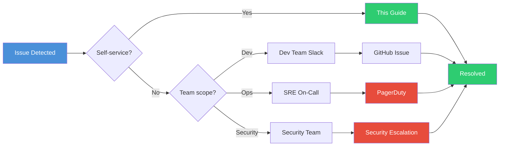

# Troubleshooting Guide

> **In this guide, you will:**
> - Diagnose common Value Fabric issues
> - Follow decision trees to identify root causes
> - Find resolution steps for your specific problem

---

## Quick Diagnosis

What's happening?

```mermaid
flowchart TD
    A[What symptom are you seeing?] --> B{Service unavailable?}
    A --> C{Data problems?}
    A --> D{Authentication failing?}
    A --> E{Performance issues?}
    A --> F{Workflow errors?}
    
    B --> B1[503/Connection refused]
    B --> B2[Container crash loops]
    B --> B3[High error rates]
    
    C --> C1[Missing data]
    C --> C2[Stale results]
    C --> C3[Wrong entities]
    
    D --> D1[401 Unauthorized]
    D --> D2[403 Forbidden]
    D --> D3[Token expired]
    
    E --> E1[Slow queries]
    E --> E2[High memory/CPU]
    E --> E3[Timeout errors]
    
    F --> F1[Stalled workflows]
    F --> F2[Agent errors]
    F --> F3[Incorrect results]
    
    B1 --> B_DOC[/troubleshooting/service-down]
    B2 --> B_DOC
    B3 --> B_DOC
    
    C1 --> C_DOC[/troubleshooting/database-connection]
    C2 --> C_DOC
    C3 --> C_DOC
    
    D1 --> D_DOC[/troubleshooting/authentication-errors]
    D2 --> D_DOC
    D3 --> D_DOC
    
    E1 --> E_DOC[/troubleshooting/slow-queries]
    E2 --> E_DOC
    E3 --> E_DOC
    
    F1 --> F_DOC[/troubleshooting/workflow-stalled]
    F2 --> F_DOC
    F3 --> F_DOC
    
    style A fill:#4a90d9,color:white
    style B fill:#2ecc71,color:white
    style C fill:#2ecc71,color:white
    style D fill:#2ecc71,color:white
    style E fill:#2ecc71,color:white
    style F fill:#2ecc71,color:white
    style B_DOC fill:#e74c3c,color:white
    style C_DOC fill:#e74c3c,color:white
    style D_DOC fill:#e74c3c,color:white
    style E_DOC fill:#e74c3c,color:white
    style F_DOC fill:#e74c3c,color:white
```

---

## Common Issues

### 🔴 Service Unavailable (503/Connection Refused)

**Symptoms:**
- `curl: (7) Failed to connect`
- Browser shows "This site can't be reached"
- Docker compose shows unhealthy containers

**Quick Checks:**

```bash
# 1. Check service status
docker compose ps

# 2. View recent logs
docker compose logs --tail=50 l1

# 3. Check resource usage
docker stats --no-stream
```

**Solutions:**
- [Service Down Recovery](./service-down.md) — Complete recovery procedures
- [Database Connection Issues](./database-connection.md) — PostgreSQL/Neo4j problems
- [High Resource Usage](./high-resource-usage.md) — CPU/Memory diagnostics

---

### 🔴 Authentication Errors (401/403)

**Symptoms:**
- API returns `{"error": "Unauthorized"}`
- JWT validation failures
- SSO redirect loops

**Quick Checks:**

```bash
# Test JWT validity
curl -H "Authorization: Bearer YOUR_TOKEN" \
  http://localhost:8004/api/v1/health

# Check token expiration
echo "YOUR_TOKEN" | base64 -d 2>/dev/null | jq '.exp'
```

**Solutions:**
- [Authentication Errors](./authentication-errors.md) — JWT, API keys, SSO
- [SSO Configuration](../how-to-guides/configure-sso.md) — OIDC/SAML setup

---

### 🟡 Data Issues

**Symptoms:**
- Entities not appearing in knowledge graph
- Search returns no results
- Extracted data looks wrong

**Quick Checks:**

```bash
# Check Neo4j connection
docker compose exec neo4j cypher-shell -u neo4j -p password \
  "MATCH (n) RETURN count(n) as nodes"

# Verify PostgreSQL connectivity
docker compose exec postgres psql -U fabric -c "\dt"
```

**Solutions:**
- [Database Connection Issues](./database-connection.md)
- [Stale Ground Truth](./stale-ground-truth.md) — Data freshness problems
- [Extraction Quality](./extraction-quality.md) — LLM extraction issues

---

### 🟡 Performance Issues

**Symptoms:**
- Slow page loads (>3s)
- Query timeouts
- High memory/CPU usage

**Quick Checks:**

```bash
# Monitor in real-time
watch -n 2 'docker stats --no-stream'

# Check slow queries
docker compose exec postgres psql -U fabric -c "
  SELECT query, mean_exec_time 
  FROM pg_stat_statements 
  ORDER BY mean_exec_time DESC 
  LIMIT 5;
"
```

**Solutions:**
- [Slow Queries](./slow-queries.md) — Database optimization
- [High Resource Usage](./high-resource-usage.md) — Container diagnostics

---

### 🟡 Workflow Issues

**Symptoms:**
- Workflows stuck in "running" state
- Agent errors in logs
- Incorrect analysis results

**Quick Checks:**

```bash
# Check workflow status
curl http://localhost:8004/api/v1/workflows \
  -H "Authorization: Bearer TOKEN" \
  -H "X-Tenant-ID: TENANT"

# View agent logs
docker compose logs l4 | grep -i "error\|exception"
```

**Solutions:**
- [Workflow Stalled](./workflow-stalled.md) — Pause/resume issues
- [Agent Errors](./agent-errors.md) — LLM and tool failures

---

## Diagnostic Commands

### System Health Dashboard

```bash
# One-line health check
echo "=== Value Fabric Health Check ===" && \
docker compose ps && \
echo -e "\n=== API Health ===" && \
curl -s http://localhost:8001/health && echo "" && \
curl -s http://localhost:8002/health && echo "" && \
curl -s http://localhost:8003/health && echo "" && \
curl -s http://localhost:8004/health && echo "" && \
echo -e "\n=== Database Connections ===" && \
docker compose exec -T postgres pg_isready -U fabric && \
docker compose exec -T neo4j cypher-shell -u neo4j -p password \
  "CALL dbms.components() YIELD name, status RETURN name, status" 2>/dev/null
```

### Log Analysis

```bash
# Find all errors in last hour
docker compose logs --since=1h | grep -E "ERROR|Exception|Traceback"

# Follow logs for specific service
docker compose logs -f l3

# Export logs for analysis
docker compose logs --since=24h > value-fabric-logs-$(date +%Y%m%d).txt
```

---

## Error Code Reference

| Error Code | Meaning | Solution |
|------------|---------|----------|
| `401 UNAUTHORIZED` | Invalid/missing JWT | [Auth Errors](./authentication-errors.md) |
| `403 FORBIDDEN` | Valid JWT but insufficient permissions | Check role assignments |
| `404 NOT_FOUND` | Resource doesn't exist | Verify IDs and paths |
| `422 VALIDATION_ERROR` | Request body invalid | Check API reference |
| `429 RATE_LIMITED` | Too many requests | Implement backoff |
| `500 INTERNAL_ERROR` | Server-side error | Check service logs |
| `503 UNAVAILABLE` | Service down or overloaded | [Service Down](./service-down.md) |

---

## Layer-Specific Diagnostics

### Layer 1 (Ingestion)

```bash
# Check queue depth
docker compose exec redis redis-cli LLEN ingestion:pending

# View recent jobs
curl http://localhost:8001/api/v1/ingestion/jobs?limit=5 \
  -H "Authorization: Bearer TOKEN"
```

### Layer 2 (Extraction)

```bash
# Check extraction metrics
curl http://localhost:8002/metrics | grep extraction

# View LLM call latency
docker compose logs l2 | grep "llm_latency"
```

### Layer 3 (Knowledge Graph)

```bash
# Neo4j diagnostics
docker compose exec neo4j cypher-shell -u neo4j -p password "
  CALL dbms.components() YIELD name, status, edition
  RETURN name, status, edition
"

# Check vector index
docker compose exec postgres psql -U fabric -c "
  SELECT * FROM pg_indexes 
  WHERE tablename = 'entity_embeddings'
"
```

### Layer 4 (Agents)

```bash
# Active workflows
curl http://localhost:8004/api/v1/workflows?status=running \
  -H "Authorization: Bearer TOKEN"

# Agent performance metrics
curl http://localhost:8004/metrics | grep workflow
```

---

## Getting Help

### Before Opening an Issue

1. **Collect diagnostics:**
   ```bash
   # Save system state
   ./scripts/diagnostics-collector.sh
   ```

2. **Check existing issues:**
   - Search [GitHub Issues](https://github.com/bmsull560/Fabric_4L/issues)
   - Check closed issues with same error message

3. **Gather context:**
   - Recent changes (deployments, config updates)
   - Error messages (copy exact text)
   - Environment details (OS, Docker version)

### Information to Include

| Required | Helpful | Optional |
|----------|---------|----------|
| Error message | Log snippet | Architecture diagram |
| Layer affected | Recent changes | Load metrics |
| Environment | Configuration | Screenshot |

---

## Escalation Path



---

## Prevention

### Monitoring Setup

- [Operational KPIs](../operations/operational-kpis-scorecard.md) — Key metrics to track
- [Alerting Rules](../../monitoring/alerting/rules.yml) — When to get notified
- [SLO Dashboard](../operations/SLOs.md) — Service level objectives

### Health Checks

```bash
# Add to crontab for proactive monitoring
*/5 * * * * cd /path/to/Fabric_4L && ./scripts/health-check.sh || alert
```

---

## Related Documentation

- [Runbooks](../operations/runbooks/) — Step-by-step operational procedures
- [Operational Commands](../operations/COMMAND_REFERENCE.md) — Common CLI commands
- [API Reference](../reference/api-reference.md) — Endpoint details and examples
- [Architecture Overview](../core-concepts/architecture.md) — System understanding

---

*Last updated: 2026-04-19 | [Edit this page](https://github.com/bmsull560/Fabric_4L/edit/main/docs/troubleshooting/index.md)*
