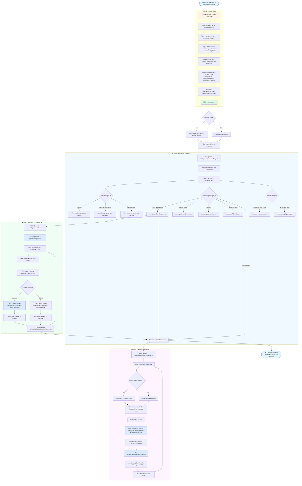

# Core User Workflow - Value Fabric

This document maps the complete end-to-end user journey from prospect input through intelligence generation, hypothesis development, and value model building.

## Workflow Diagram



## Phase Details

### Phase 1: Prospect Input

**Route**: `/workflow/prospect`  
**Component**: `ProspectSetup` → `ProspectPromptBuilder`

**User Actions**:

1. Input company name, domain, and industry
2. Add buying context, why now, and known initiative
3. Specify stakeholders (economic buyer, champion, evaluator, compliance/legal)
4. List business pain points, current friction, and desired outcomes
5. Select deliverable type (account_brief, discovery_prep, value_hypotheses, executive_summary)
6. Configure analysis mode (Fast/Balanced/Deep) and enrichment depth (light/standard/deep)
7. Toggle flags: use uploaded files, prior account context, web enrichment, compliance-sensitive mode
8. Click Submit button

**System Actions**:
- Parse structured prompt text into draft object
- Call `onCreateSetup` with `ProspectSetupPromptPayload`
- Create account via `POST /api/v1/accounts` if new
- Extract `accountId` from response
- Call `onNavigateToWorkspace("/workspace", accountId)`
- Navigate to `/intelligence/:accountId/signals`

**Preconditions**:
- User is authenticated
- User has permission to create accounts

**Data Flow**:
```
ProspectSetupPromptPayload → useCreateAccount.mutateAsync() → Account { id, name, industry, stage } → accountId → navigation
```

### Phase 2: Intelligence Workspace

**Route**: `/intelligence/:accountId/:tabId`  
**Component**: `IntelligenceWorkspace`

**Available Tabs** (from `workspaceTabRegistry.ts`):

**Input Category**:

- **Signals** - Raw market signals and triggers
- **Account Enrichment** - Firmographics and tech stack
- **Stakeholders** - Buyer personas and priorities
- **Alternatives** (stub) - Competitor comparison
- **Solution Cost** (stub) - Pricing inputs

**Reasoning Category**:

- **Value Ontology** (stub) - Map to value ontology
- **Value Hypotheses** - AI-generated value hypotheses
- **Value Drivers** - Map signals to business value drivers
- **Evidence** - Verified evidence points
- **ROI Calculator** - Interactive ROI calculator
- **Value Model** - Quantitative value model

**Output Category**:

- **Executive Value Case** - Written narrative and messaging
- **Realization Plan** - Step-by-step realization plan

**User Actions**:
- Click tab to navigate between intelligence areas
- View account context in header
- Track progress via progress rail
- Interact with right rail for agent assistance

**System Actions**:
- Load tab-specific data via React Query
- Display tab component based on route
- Maintain account context via `AccountContextSync`
- Stream agent events via `useAgentEvents`

**Preconditions**:
- Account exists
- User has permission to view account intelligence

**Data Flow**:
```
Route param :tabId → getTabOrDefault() → lazy load tab component → fetch data via hooks → render tab content
```

### Phase 3: Hypothesis Generation

**Route**: `/intelligence/:accountId/hypotheses`  
**Component**: `HypothesesTab`

**User Actions**:
1. Click "Generate Hypotheses" button
2. View generated hypotheses with confidence scores (0-100%)
3. Select hypothesis to view details
4. View signal→product mapping
5. View linked evidence items
6. Click Validate or Reject buttons
7. Filter by status (all/draft/validated/rejected/converted)

**System Actions**:
- Call `useGenerateHypotheses.mutate({ account_id, max_hypotheses: 20 })`
- Call `POST /api/v1/value-hypotheses/generate`
- Display hypotheses list with status badges
- Call `useValidateHypothesis.mutate({ hypothesisId, data: { status } })`
- Call `POST /api/v1/value-hypotheses/:id/validate`
- Update hypothesis status in UI

**Preconditions**:
- Account has enrichment data
- Account has signals detected
- Product portfolio is configured

**Data Flow**:
```
Generate button → POST /api/v1/value-hypotheses/generate → ValueHypothesis[] → display in list
Validate button → POST /api/v1/value-hypotheses/:id/validate → updated status → refresh list
```

**API Contract**:
```typescript
// Generate hypotheses
POST /api/v1/value-hypotheses/generate
Request: { account_id: string, max_hypotheses: number }
Response: { hypotheses: ValueHypothesis[] }

// Validate hypothesis
POST /api/v1/value-hypotheses/:id/validate
Request: { status: "validated" | "rejected" | "converted", validation_notes?: string }
Response: { id: string, status: string, updated_at: string }
```

### Phase 4: Value Model Building

**Route**: `/intelligence/:accountId/value-model` or `/studio/:accountId/value-model`  
**Component**: `ValueModelTab`

**User Actions**:
1. View value breakdown table with scenarios
2. Select scenario (conservative/expected/optimistic)
3. Toggle "Include strategic value" checkbox
4. View metrics: total annual value, hard savings, strategic value, value lines count
5. Click "Calculate ROI" button
6. View ROI summary: NPV, IRR, payback period, 3-year ROI
7. View industry benchmarks: avg ROI, avg payback, avg NPV
8. Click "Variables" to edit inputs

**System Actions**:
- Load value lines from workspace case via `useWorkspaceTabQuery`
- Call `useCalculateROI.mutate({ deal_size, annual_benefit, implementation_cost, discount_rate, time_horizon_years })`
- Call `POST /api/v1/roi/calculate`
- Display ROI results in summary card
- Call `useIndustryBenchmarks(account?.industry)`
- Call `GET /api/v1/roi/benchmarks/:industry`
- Display benchmarks in comparison card

**Preconditions**:
- Value lines exist in workspace case
- Account industry is set
- ROI calculator service is available

**Data Flow**:
```
Value lines from workspace → Calculate ROI button → POST /api/v1/roi/calculate → ROI result → display summary
Industry from account → GET /api/v1/roi/benchmarks/:industry → benchmarks → display comparison
```

**API Contract**:
```typescript
// Calculate ROI
POST /api/v1/roi/calculate
Request: {
  deal_size: number,
  annual_benefit: number,
  implementation_cost: number,
  discount_rate: number,
  time_horizon_years: number,
  account_id?: string
}
Response: {
  npv: number,
  irr: number,
  payback_months: number,
  total_roi_pct: number,
  scenario_results: ScenarioResult[]
}

// Get industry benchmarks
GET /api/v1/roi/benchmarks/:industry
Response: {
  industry: string,
  sample_size: number,
  avg_roi_pct: number,
  avg_payback_months: number,
  avg_npv: number
}
```

## Component Interaction Map

### Frontend Components

```
ProspectSetup (workflow/pages/ProspectSetup.tsx)
  ├── ProspectPromptBuilder (components/workspace/ProspectPromptBuilder.tsx)
  │   ├── Company selection dropdown
  │   ├── Structured prompt textarea
  │   ├── Mode selector (Fast/Balanced/Deep)
  │   ├── Deliverable selector
  │   ├── Settings popover
  │   └── Submit button
  └── onCreateSetup callback
      └── useCreateAccount hook
          └── POST /api/v1/accounts

IntelligenceWorkspace (features/intelligence-workspace/IntelligenceWorkspace.tsx)
  ├── WorkspaceHeader
  ├── WorkspaceProgressRail
  ├── IntelligenceWorkspaceTabs
  │   └── workspaceTabRegistry.ts (13 tabs)
  └── WorkspaceTabFrame
      └── Tab component (lazy loaded)

HypothesesTab (pages/intelligence/HypothesesTab.tsx)
  ├── useAccountHypotheses hook
  │   └── GET /api/v1/value-hypotheses/account/:id
  ├── useGenerateHypotheses hook
  │   └── POST /api/v1/value-hypotheses/generate
  ├── useValidateHypothesis hook
  │   └── POST /api/v1/value-hypotheses/:id/validate
  └── HypothesisCard components

ValueModelTab (pages/studio/ValueModelTab.tsx)
  ├── useWorkspaceTabQuery hook
  │   └── GET /api/v1/workspace/cases/:caseId/tabs/value-model
  ├── useCalculateROI hook (DIL)
  │   └── POST /api/v1/roi/calculate
  ├── useIndustryBenchmarks hook (DIL)
  │   └── GET /api/v1/roi/benchmarks/:industry
  └── Value breakdown table
```

### Backend Services

```
Layer 4: Agentic Workflow Engine (port 8004)
  ├── Value Hypothesis Engine
  │   ├── POST /v1/value-hypotheses/generate
  │   ├── GET /v1/value-hypotheses/account/:id
  │   └── POST /v1/value-hypotheses/:id/validate
  └── Workspace Intelligence Service
      └── POST /v1/workspace/cases/:caseId/intelligence

Data Intelligence Layer (DIL)
  ├── ROI Calculator Service (L3)
  │   ├── POST /api/v1/roi/calculate
  │   ├── GET /api/v1/roi/benchmarks/:industry
  │   └── GET /api/v1/roi/templates
  └── Value Hypothesis Engine (L4)
      ├── POST /api/v1/value-hypotheses/generate
      ├── GET /api/v1/value-hypotheses/account/:id
      └── POST /api/v1/value-hypotheses/:id/validate

Layer 3: Knowledge Graph (port 8003)
  ├── Product Portfolio Graph
  │   ├── GET /api/v1/products
  │   └── POST /api/v1/products/match-signals
  └── Evidence Library
      ├── GET /api/v1/evidence
      └── GET /api/v1/evidence/by-product/:id
```

### Data Stores

```
PostgreSQL (Layer 1, 2, 4, 5, 6)
  ├── accounts table (prospect data)
  ├── workspace_cases table (value model data)
  ├── value_hypotheses table (hypotheses)
  └── roi_calculations table (ROI results)

Neo4j (Layer 3)
  ├── :Product nodes
  ├── :Capability nodes
  ├── :Signal nodes
  ├── :ValueDriver nodes
  ├── :Evidence nodes
  └── Relationships: ENABLES, DRIVES, CONTRIBUTES_TO
```

## Related Documentation

- [Data Intelligence Layer Architecture](../../value-fabric/docs/data-intelligence-layer.md)
- [System Architecture Overview](../../docs/architecture/system-overview.md)
- [Three-Tier UX Model](../../specs/three_tier_ux_model.md)
- [API Reference](../../docs/API_REFERENCE.md)
